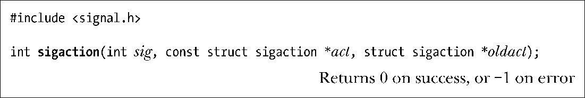
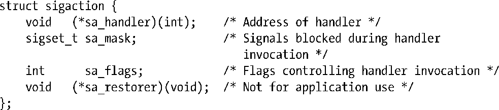

### 20.13　改变信号处置：sigaction ()

除去 signal()之外，sigaction()系统调用是设置信号处置的另一选择。虽然sigaction()的用法比之signal()更为复杂，但作为回报，也更具灵活性。尤其是，sigaction()允许在获取信号处置的同时无需将其改变，并且，还可设置各种属性对调用信号处理器程序时的行为施以更加精准的控制。此外，如22.7节所述，在建立信号处理器程序时，sigaction()较之signal()函数可移植性更佳。

sig参数标识想要获取或改变的信号编号。该参数可以是除去SIGKILL和SIGSTOP之外的任何信号。

act参数是一枚指针，指向描述信号新处置的数据结构。如果仅对信号的现有处置感兴趣，那么可将该参数指定为NULL。oldact参数是指向同一结构类型的指针，用来返回之前信号处置的相关信息。如果无意获取此类信息，那么可将该参数指定为NULL。act和oldact所指向的结构类型如下所示：

> sigaction结构实际要比此处所展示的更为复杂，更多细节请参见21.4节。

sa_handler字段对应于signal()的handler参数。其所指定的值为信号处理器函数的地址，亦或是常量SIG_IGN、SIG_DFL之一。仅当sa_handler是信号处理程序的地址时，亦即sa_handler的取值在SIG_IGN和SIG_DFL之外，才会对sa_mask和sa_flags字段（稍后讨论）加以处理。余下的字段sa_restorer，则不适用于应用程序（SUSv3未予规定）。

> sa_restorer字段仅供内部使用，用以确保当信号处理器程序完成后，会去调用专用的sigreturn()系统调用，借此来恢复进程的执行上下文，以便于进程从信号处理器中断的位置继续执行。这一用法的实例可见诸于glibc源文件sysdeps/unix/sysv/linux/i386/ sigaction.c中。

sa_mask字段定义了一组信号，在调用由sa_handler所定义的处理器程序时将阻塞该组信号。当调用信号处理器程序时，会在调用信号处理器之前，将该组信号中当前未处于进程掩码之列的任何信号自动添加到进程掩码中。这些信号将保留在进程掩码中，直至信号处理器函数返回，届时将自动删除这些信号。利用sa_mask字段可指定一组信号，不允许它们中断此处理器程序的执行。此外，引发对处理器程序调用的信号将自动添加到进程信号掩码中。这意味着，当正在执行处理器程序时，如果同一个信号实例第二次抵达，信号处理器程序将不会递归中断自己。由于不会对遭阻塞的信号进行排队处理，如果在处理器程序执行过程中重复产生这些信号中的任何信号，（稍后）对信号的传递将是一次性的。

sa_flags字段是一个位掩码，指定用于控制信号处理过程的各种选项。该字段包含的位如下（可以相或（|））。

##### SA_NOCLDSTOP

若sig为SIGCHLD信号，则当因接受一信号而停止或恢复某一子进程时，将不会产生此信号。参见26.3.2节。

##### SA_NOCLDWAIT

（始于Linux 2.6）若sig为SIGCHLD信号，则当子进程终止时不会将其转化为僵尸。更多细节参见26.3.3节。

##### SA_NODEFER

捕获该信号时，不会在执行处理器程序时将该信号自动添加到进程掩码中。SA_NOMASK历史上曾是SA_NODEFER的代名词。之所以建议使用后者，是因为SUSv3将其纳入规范。

##### SA_ONSTACK

针对此信号调用处理器函数时，使用了由sigaltstack()安装的备选栈。参见21.3节。

##### SA_RESETHAND

当捕获该信号时，会在调用处理器函数之前将信号处置重置为默认值（即SIG_DFL）（默认情况下，信号处理器函数保持建立状态，直至进一步调用sigaction()将其显式解除。）SA_ONESHOT历史上曾是SA_RESETHAND的代名词，之所以建议使用后者，是因为SUSv3将其纳入规范。

##### SA_RESTART

自动重启由信号处理器程序中断的系统调用。参见21.5节。

##### SA_SIGINFO

调用信号处理器程序时携带了额外参数，其中提供了关于信号的深入信息。对该标志的描述参见21.4节。

SUSv3定义了上述所有选项。

程序清单21-1展现了对sigaction()的使用。

