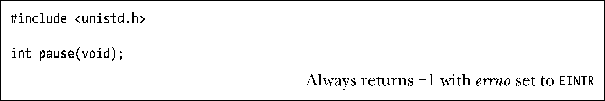

### 20.14　等待信号：pause()

调用pause()将暂停进程的执行，直至信号处理器函数中断该调用为止（或者直至一个未处理信号终止进程为止）。

处理信号时，pause()遭到中断，并总是返回−1，并将errno置为EINTR。（21.5节描述了关于EINTR错误的更多信息。）

程序清单20-2提供了应用pause()的一例子。

在22.9节、22.10节及22.11节中，可以看到程序等待信号时暂停执行的各种其他方式。

