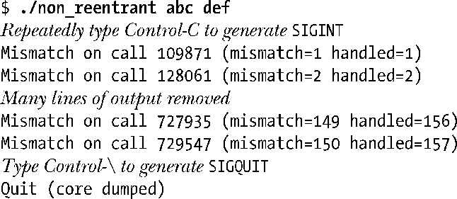
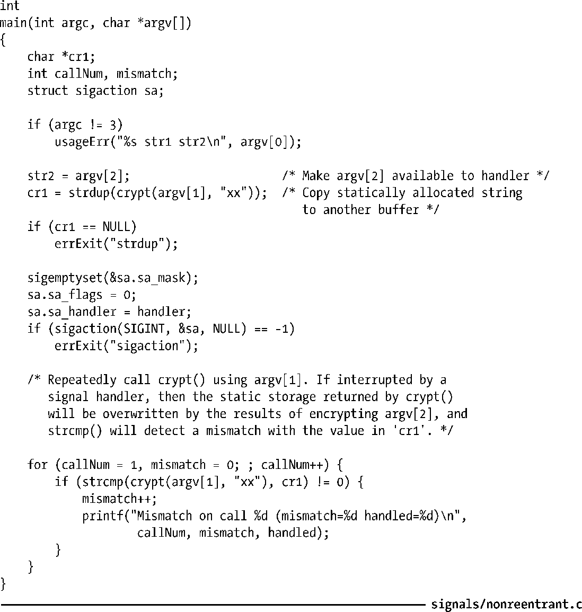
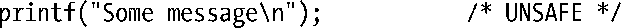

### 21.1.2　可重入函数和异步信号安全函数

在信号处理器函数中，并非所有系统调用以及库函数均可予以安全调用。要了解来龙去脉，就需要解释一下以下两种概念：可重入（reentrant）函数和异步信号安全（async-signal-safe）函数。

#### 可重入和非可重入函数

要解释可重入函数为何物，首先需要区分单线程程序和多线程程序。典型UNIX程序都具有一条执行线程，贯穿程序始终，CPU围绕单条执行逻辑来处理指令。而对于多线程程序而言，同一进程却存在多条独立、并发的执行逻辑流。

第29章将会展示如何显式创建一个包含多条执行线程的程序。不过，多执行线程的概念与使用了信号处理器函数的程序也有关联。因为信号处理器函数可能会在任一时点异步中断程序的执行，从而在同一个进程中实际形成了两条（即主程序和信号处理器函数）独立（虽然不是并发）的执行线程。

如果同一个进程的多条线程可以同时安全地调用某一函数，那么该函数就是可重入的。此处，“安全”意味着，无论其他线程调用该函数的执行状态如何，函数均可产生预期结果。

> SUSv3对可重入函数的定义是：函数由两条或多条线程调用时，即便是交叉执行，其效果也与各线程以未定义①顺序依次调用时一致。

更新全局变量或静态数据结构的函数可能是不可重入的。（只用到本地变量的函数肯定是可重入的。）如果对函数的两个调用（例如：分别由两条执行线程发起）同时试图更新同一全局变量或数据类型，那么二者很可能会相互干扰并产生不正确的结果。例如，假设某线程正在为一链表数据结构添加一个新的链表项，而另一线程也正试图更新同一链表。由于为链表添加新项涉及对多枚指针的更新，一旦另一线程中断这些步骤并修改了相同的指针，结果就会产生混乱。

在C语言标准函数库中，这种可能性非常普遍。例如，7.1.3节所提及的malloc()和free()就维护有一个针对已释放内存块的链表，用于从堆中重新分配内存。如果主程序在调用 malloc()期间为一个同样调用malloc()的信号处理器函数所中断，那么该链表可能会遭到破坏。因此，malloc()函数族以及使用它们的其他库函数都是不可重入的。

还有一些函数库之所以不可重入，是因为它们使用了经静态分配的内存来返回信息。此类函数（本书其他地方也有论及）的例子包括 crypt()、getpwnam()、gethostbyname()以及getservbyname()。如果信号处理器用到了这类函数，那么将会覆盖主程序中上次调用同一函数所返回的信息（反之亦然）。

将静态数据结构用于内部记账的函数也是不可重入的。其中最明显的例子就是stdio函数库成员（printf()、scanf()等），它们会为缓冲区 I/O 更新内部数据结构。所以，如果在信号处理器函数中调用了printf()，而主程序又在调用printf()或其他stdio函数期间遭到了处理器函数的中断，那么有时就会看到奇怪的输出，甚至导致程序崩溃或者数据的损坏。

即使并未使用不可重入的库函数，可重入问题依然不容忽视。如果信号处理器函数和主程序都要更新由程序员自定义的全局性数据结构，那么对于主程序而言，这种信号处理器函数就是不可重入的。

如果函数是不可重入的，那么其手册页通常会或明或暗地给出提示。对于其中那些使用或返回静态分配变量的函数，需要特别留意。

#### 示例程序

程序清单21-1展示了函数crypt()（8.5节）不可重入的本来面目。该程序接受两个字符串作为命令行参数，执行步骤如下。

**1．** 调用crypt()加密第1个命令行参数中的字符串，并使用strdup()将结果复制到独立缓冲区中。

**2．** 为SIGINT信号（按下Ctrl-C产生）创建处理器函数。处理器函数调用crypt()加密第2个命令行参数所提供的字符串。

**3．** 进入无限for循环，使用crypt()加密第1个命令行参数中的字符串，并检查其返回字符串与第1步保存的结果是否一致。

在不产生信号的情况下，第3步中的检查结果将总是匹配。然而，一旦收到SIGINT信号，而主程序又恰在for循环内的crypt()调用之后，字符串的匹配检查之前遭到信号处理器函数的中断，这时就会发生字符串不匹配的情况。程序运行结果如下：

由对上述输出mismatch和handled值的比较可知，在大多数情况下，处理器函数会在main()中的crypt()调用与字符串比较之间去覆盖静态分配的缓冲区。

程序清单21-1：在main()以及信号处理函数中调用不可重入的函数

#### 标准的异步信号安全函数

异步信号安全的函数是指当从信号处理器函数调用时，可以保证其实现是安全的。如果某一函数是可重入的，又或者信号处理器函数无法将其中断时，就称该函数是异步信号安全的。

表21-1所列为各种标准要求实现为异步信号安全的函数。其中，名称后未跟v2或v3字符串的函数是由POSIX.1-1990规定为异步信号安全的。带有v2标记的函数由susv2加入，带有v3标记的则由susv3加入。个别UNIX实现可能会将其他某些函数实现为异步信号安全的，但所有符合标准的UNIX实现都必须保证至少表中这些函数是异步信号安全的（假设由实现来提供这些函数，Linux并未实现所有这些函数）。

SUSv4对表21-1做了如下修改。

+ 移除如下函数：fpathconf()、pathconf()和sysconf()。
+ 添加如下函数：execl()、execv()、faccessat()、fchmodat()、fchownat()、fexecve()、fstatat()、futimens()、linkat()、mkdirat()、mkfifoat()、mknod()、mknodat()、openat()、readlinkat()、renameat()、symlinkat()、unlinkat()、utimensat()和utimes()。

<b class="my_markdown">表21-1：POSIX.1-1990、SUSv2和SUSv3规定为异步信号安全的函数</b>

| _Exit() (v3) | getpid() | sigdelset() |
| :-----  | :-----  | :-----  | :-----  | :-----  |
| _exit() | getppid() | sigemptyset() |
| abort() (v3) | getsockname() (v3) | sigfillset() |
| accept() (v3) | getsockopt() (v3) | sigismember() |
| access() | getuid() | signal() (v2) |
| aio_error() (v2) | kill() | sigpause() (v2) |
| aio_return() (v2) | link() | sigpending() |
| aio_suspend() (v2) | listen() (v3) | sigprocmask() |
| alarm() | lseek() | sigqueue() (v2) |
| bind() (v3) | lstat() (v3) | sigset() (v2) |
| cfgetispeed() | mkdir() | sigsuspend() |
| cfgetospeed() | mkfifo() | sleep() |
| cfsetispeed() | open() | socket() (v3) |
| cfsetospeed() | pathconf() | sockatmark() (v3) |
| chdir() | pause() | socketpair() (v3) |
| chmod() | pipe() | stat() |
| chown() | poll() (v3) | symlink() (v3) |
| clock_gettime() (v2) | posix_trace_event() (v3) | sysconf() |
| close() | pselect() (v3) | tcdrain() |
| connect() (v3) | raise() (v2) | tcflow() |
| creat() | read() | tcflush() |
| dup() | readlink() (v3) | tcgetattr() |
| dup2() | recv() (v3) | tcgetpgrp() |
| execle() | recvfrom() (v3) | tcsendbreak() |
| execve() | recvmsg() (v3) | tcsetattr() |
| fchmod() (v3) | rename() | tcsetpgrp() |
| fchown() (v3) | rmdir() | time() |
| fcntl() | select() (v3) | timer_getoverrun() (v2) |
| fdatasync() (v2) | sem_post() (v2) | timer_gettime() (v2) |
| fork() | send() (v3) | timer_settime() (v2) |
| fpathconf() (v2) | sendmsg() (v3) | times() |
| fstat() | sendto() (v3) | umask() |
| fsync() (v2) | setgid() | uname() |
| ftruncate() (v3) | setpgid() | unlink() |
| getegid() | setsid() | utime() |
| geteuid() | setsockopt() (v3) | wait() |
| getgid() | setuid() | waitpid() |
| getgroups() | shutdown() (v3) | write() |
| getpeername() (v3) | sigaction() |
| getpgrp() | sigaddset() |

SUSv3强调，表21-1之外的所有函数对于信号而言都是不安全的，但同时指出，仅当信号处理器函数中断了不安全函数的执行，且处理器函数自身也调用了这个不安全函数时，该函数才是不安全的。换言之，编写信号处理器函数有如下两种选择。

+ 确保信号处理器函数代码本身是可重入的，且只调用异步信号安全的函数。
+ 当主程序执行不安全函数或是去操作信号处理器函数也可能更新的全局数据结构时，阻塞信号的传递。

第2种方法的问题是，在一个复杂程序中，要想确保主程序对不安全函数的调用不为信号处理器函数所中断，这有些困难。出于这一原因，通常就将上述规则简化为在信号处理器函数中绝不调用不安全的函数。

> 如果使用同一处理器函数来处理多个不同信号，或者在调用sigaction()时设置了SA_NODEFER标志，那么处理器函数就有可能中断自己。因此，处理器函数如果更新了全局（或静态）变量，即便主程序不使用这些变量，那么它们依然可能是不可重入的。

#### 信号处理器函数内部对errno的使用

由于可能会更新errno，调用表21-1中函数依然会导致信号处理器函数不可重入，因为它们可能会覆盖之前由主程序调用函数时所设置的errno值。有一种变通方法，即当信号处理器函数使用了表21-1所列函数时，可在其入口处保存errno值，并在其出口处恢复errno的旧有值，请看下面的例子：

#### 在本书示例程序中使用不安全函数

虽然printf()不是异步信号安全的函数，但却频频现身于本书各种示例的信号处理器函数中。之所以如此，是因为在展示对信号处理器的调用，以及显示处理器相关变量的内容时，printf()都不失为一种简明而又便捷的方式。出于类似原因，在信号处理器函数中偶尔也会用到其他一些不安全函数，包括其他的stdio函数以及strsignal()。

真正的应用程序应当避免在信号处理器函数中调用非异步信号安全的函数。为了明确这一点，每当示例的信号处理器调用这些函数时，代码注释中都会注明这一用法是不安全的。

