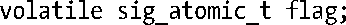

### 21.1.3　全局变量和sig_atomic_t数据类型

尽管存在可重入问题，有时仍需要在主程序和信号处理器函数之间共享全局变量。信号处理器函数可能会随时修改全局变量——只要主程序能够正确处理这种可能性，共享全局变量就是安全的。例如，一种常见的设计是，信号处理器函数只做一件事情，设置全局标志。主程序则会周期性地检查这一标志，并采取相应动作来响应信号传递（同时清除标志）。当信号处理器函数以此方式来访问全局变量时，应该总是在声明变量时使用volatile关键字，从而防止编译器将其优化到寄存器中。

对全局变量的读写可能不止一条机器指令，而信号处理器函数就可能会在这些指令序列之间将主程序中断（也将此类变量访问称为非原子操作）。因此，C语言标准以及SUSv3定义了一种整型数据类型sig_atomic_t，意在保证读写操作的原子性。因此，所有在主程序与信号处理器函数之间共享的全局变量都应声明如下：

程序清单22-5提供了使用sig_atomic_t数据类型的一个例子。

注意，C语言的递增（++）和递减（--）操作符并不在sig_atomic_t所提供的保障范围之内。这些操作在某些硬件架构上可能不是原子操作（更多细节请参考30.1节）。在使用sig_atomic_t变量时唯一所能做的就是在信号处理器中进行设置，在主程序中进行检查（反之亦可）。

C99和SUSv3规定，实现应当（在<stdint.h>中）定义两个常量SIG_ATOMIC_MIN和SIG_ATOMIC_MAX，用于规定可赋给sig_atomic_t类型的值范围。标准要求，如果将sig_atomic_t表示为有符号值，其范围至少应该在-127～127之间，如果作为无符号值，则应该在0～255之间。在Linux中，这两个常量分别等于有符号32位整型数的负、正极限值。

