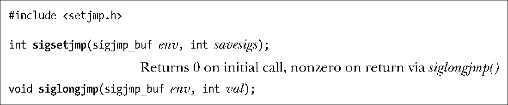
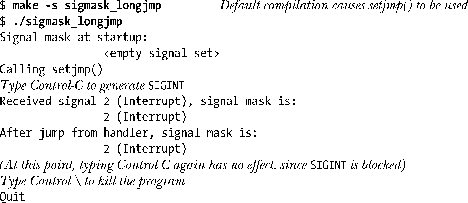
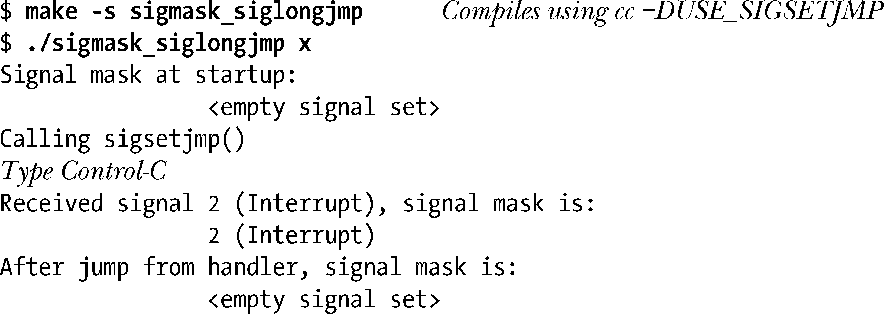
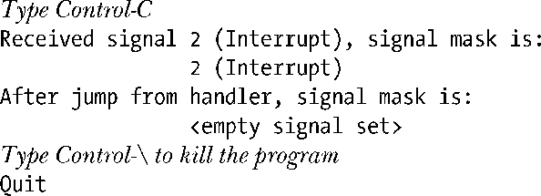
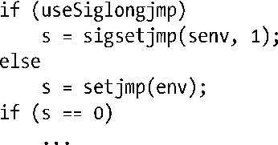
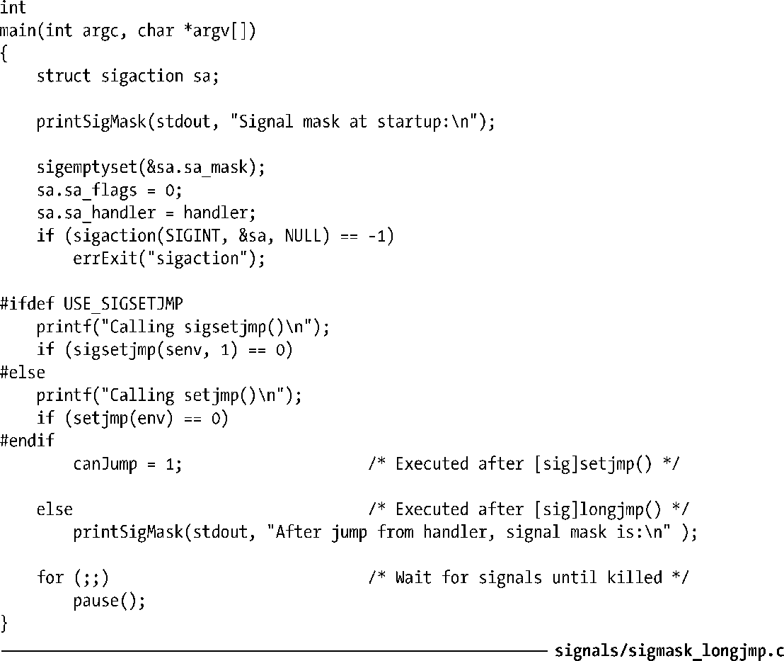

### 21.2.1　在信号处理器函数中执行非本地跳转

6.8节曾论及使用setjmp()和longjmp()来执行非本地跳转，以便从一个函数跳转至该函数的某个调用者。在信号处理器函数中也可以使用这种技术。这也是因硬件异常（例如内存访问错误）而导致信号传递之后的一条恢复途径，允许将信号捕获并把控制返回到程序中某个特定位置。例如，一旦收到SIGINT信号（通常由键入Ctrl-C产生），shell执行一个非本地跳转，将控制返回到主输入循环中（以便读取下一条命令）。

然而，使用标准longjmp()函数从处理器函数中退出存在一个问题。之前曾经提及，在进入信号处理器函数时，内核会自动将引发调用的信号以及由act.sa_mask所指定的任意信号添加到进程的信号掩码中，并在处理器函数正常返回时再将它们从掩码中清除。

如果使用longjmp()来退出信号处理器函数，那么信号掩码会发生什么情况呢？这取决于特定UNIX实现的血统。在System V一脉中，longjmp()不会将信号掩码恢复，亦即在离开处理器函数时不会对遭阻塞的信号解除阻塞。Linux遵循System V的这一特性。（这通常并非所希望的行为，因为引发对信号处理器调用的信号仍将保持阻塞状态。）在源于BSD一脉的实现中，setjmp()将信号掩码保存在其env参数中，而信号掩码的保存值由longjmp()恢复。（继承自BSD的实现还提供另外两个拥有System V语义的函数：_setjmp()和_longjmp()。）换言之，使用longjmp()来退出信号处理器函数将有损于程序的可移植性。

> 如果编译程序时定义了_BSD_SOURCE特性检测宏，那么（glibc的）setjmp()将遵循BSD语义。

鉴于两大UNIX流派之间的差异，POSIX.1-1990选择不对setjmp()和longjmp()的信号掩码处理进行规范，而是定义了一对新函数：sigsetjmp()和siglongjmp()，针对执行非本地跳转时的信号掩码进行显式控制。

函数sigsetjmp()和siglongjmp()的操作与setjmp()和longjmp()类似。唯一的区别是参数env的类型不同（是sigjmp_buf而不是jmp_buf），并且sigsetjmp()多出一个参数savesigs。如果指定savesigs为非0，那么会将调用sigsetjmp()时进程的当前信号掩码保存于env中，之后通过指定相同env参数的siglongjmp()调用进行恢复。如果savesigs为0，则不会保存和恢复进程的信号掩码。

函数longjmp()和siglongjmp()都不在表21-1所列异步信号安全函数的范围之内。因为与在信号处理器中调用这些函数一样，在执行非本地跳转之后去调用任何非异步信号安全的函数也需要冒同样的风险。此外，如果信号处理器函数中断了正在更新数据结构的主程序，那么执行非本地跳转退出处理器函数后，这种不完整的更新动作很可能会将数据结构置于不一致状态。规避这一问题的一种技术是在程序对敏感数据进行更新时，借助于sigprocmask()临时将信号阻塞起来。

#### 示例程序

程序清单 21-2 展示了两种类型的非本地跳转在处理信号掩码上的差异。该程序为SIGINT创建处理器函数，并允许选择setjmp()+longjmp()组合或者sigsetjmp()+siglongjmp()组合的方式来退出信号处理器函数，具体采用何种函数组合则取决于程序编译时是否对宏USE_SIGSETJMP进行了定义。程序会分别在进入信号处理器函数时，以及非本地跳转将控制从信号处理器交还给主程序后，显示信号掩码的当前设置。

如果利用longjmp()来退出信号处理器函数，其结果如下：

由程序输出结果可知，信号处理器函数调用longjmp()之后的信号掩码设置与进入处理器函数时保持一致。

> 上述shell会话中构建程序所使用的makefile由随本书发布的源码提供。选项-s告知make程序不要显示正在执行的命令。使用该选项意在避免对会话日志的显示产生干扰。（[Mecklenbug, 2005]对GNU make程序做了说明。）

如果编译同一源文件来创建利用siglongjmp()退出信号处理器函数的程序，则结果如下：

在这里，没有将SIGINT信号阻塞，因为siglongjmp()恢复了原来的信号掩码。接着，再次按下Ctrl-C，会再次调用该信号处理器函数。

由上述输出可知，siglongjmp()将信号掩码恢复到调用sigsetjmp()时的值（即一个空信号集）。

程序清单21-2还展示了信号处理器函数执行非本地跳转时的一种实用技术。信号随时可能产生，所以有可能发生于segsetjmp()（或setjmp()）设置跳转目标之前。为杜绝这种可能（这将导致处理器函数使用未初始化的env缓冲区来执行非本地跳转），程序启用了守卫变量canJump，来表征env缓冲区的初始化与否。如果canJump不为真（false），处理器函数将不执行跳转而直接返回。另一种方法是调整程序代码，在创建信号处理器函数之前去调用sigsetjmp()（或setjmp()）。不过对于复杂的程序而言，苛求这样的步骤执行顺序可能会有困难，而使用守卫变量也许会更简单一些。

注意，在编写程序清单21-2程序时使用#ifdef是使其编码风格符合标准的最简单的手段。特别是当无法用下面的运行时检查代码来取代#ifdef时。

这一做法有违规范，因为SUSv3不允许在赋值语句（6.8节）中调用setjmp()和sigsetjmp()。

程序清单21-2：在信号处理器函数中执行非本地跳转

