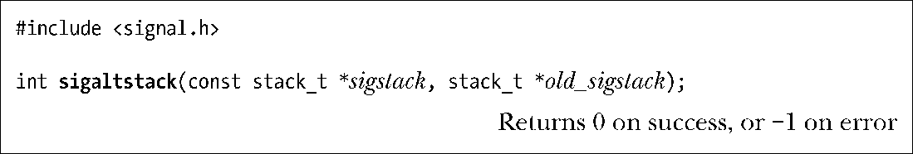
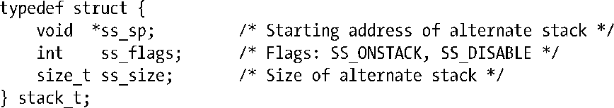
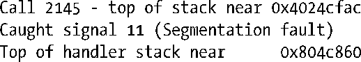
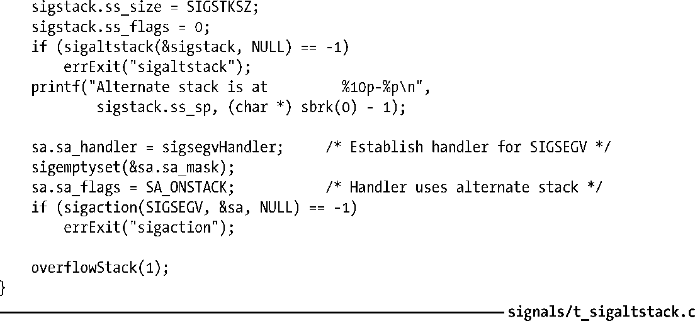

### 21.3　在备选栈中处理信号：sigaltstack()

在调用信号处理器函数时，内核通常会在进程栈中为其创建一帧。不过，如果进程对栈的扩展突破了对栈大小的限制时，这种做法就不大可行了。例如，栈的增长过大，以至于会触及到一片映射内存（48.5 节）或者向上增长的堆，又或者栈的大小已经直逼RLIMIT_STACK（36.3节）资源限制，这些都会造成这种情况的发生。

当进程对栈的扩展试图突破其上限时，内核将为该进程产生SIGSEGV信号。不过，因为栈空间已然耗尽，内核也就无法为进程已经安装的SIGSEGV处理器函数创建栈帧。结果是，处理器函数得不到调用，而进程也就终止了（SIGSEGV的默认动作）。

如果希望在这种情况下确保对SIGSEGV信号处理器函数的调用，就需要做如下工作。

**1．** 分配一块被称为“备选信号栈”的内存区域，作为信号处理器函数的栈帧。

**2．** 调用sigaltstack()，告之内核该备选信号栈的存在。

**3．** 在创建信号处理器函数时指定SA_ONSTACK标志，亦即通知内核在备选栈上为处理器函数创建栈帧。

利用系统调用 sigaltstack()，既可以创建一个备选信号栈，也可以将已创建备选信号栈的相关信息返回。

参数sigstack所指向的数据结构描述了新备选信号栈的位置及属性。参数old_sigstack指向的结构则用于返回上一备选信号栈的相关信息（如果存在）。两个参数之一均可为NULL。例如，将参数sigstack设为NULL可以发现现有备选信号栈，并且不用将其改变。不为NULL时，这些参数所指向的数据结构类型如下：

字段ss_sp和ss_size分别指定了备选信号栈的位置和大小。在实际使用信号栈时，内核会将ss_sp值自动对齐为与硬件架构相适宜的地址边界。

备选信号栈通常既可以静态分配，也可以在堆上动态分配。SUSv3规定将常量SIGSTKSZ作为划分备选栈大小的典型值，而将MINSSIGSTKSZ作为调用信号处理器函数所需的最小值。在Linux/x86-32系统上，分别将这两个值定义为8192和2048。

内核不会重新划分备选栈的大小。如果栈溢出了分配给它的空间，就会产生混乱（例如，写变量超出了对栈的限制）。这通常不是一个问题，因为一般情况下会利用备选栈来处理标准栈溢出的特殊情况，常常只在这个栈上分配为数不多的几帧。SIGSEGV处理器函数的工作不是在执行清理动作后终止进程，就是使用非本地跳转解开标准栈。

ss_flags可以包含如下值之一：

##### SS_ONSTACK

如果在获取已创建备选信号栈的当前信息时该标志已然置位，就表明进程正在备选信号栈上执行。当进程已经在备选信号栈上运行时，试图调用sigaltstack()来创建一个新的备选信号栈将会产生一个错误（EPERM）。

##### SS_DISABLE

在old_sigstack中返回，表示当前不存在已创建的备选信号栈。如果在sigstack中指定，则会禁用当前已创建的备选信号栈。

程序清单21-3演示了备选信号栈的创建和使用。在创建一个新的备选信号栈以及SIGSEGV的信号处理器函数之后，程序将调用一个无限递归函数，这会导致栈溢出，同时系统会向进程发送SIGSEGV信号。运行该程序的结果如下。

在这一shell会话中，命令ulimit负责移除shell之前可能设置的任何RLIMIT_STACK资源限制。36.3节会解释这种资源限制。

程序清单21-3：使用sigaltstack()

