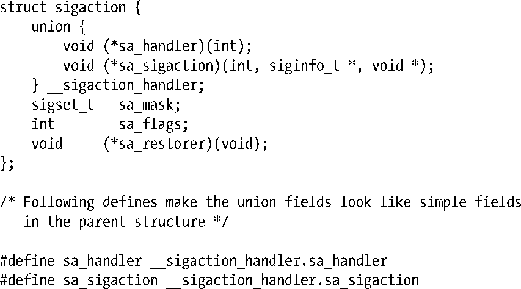
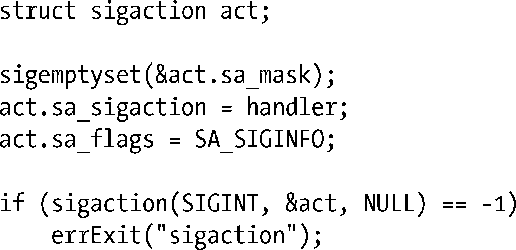
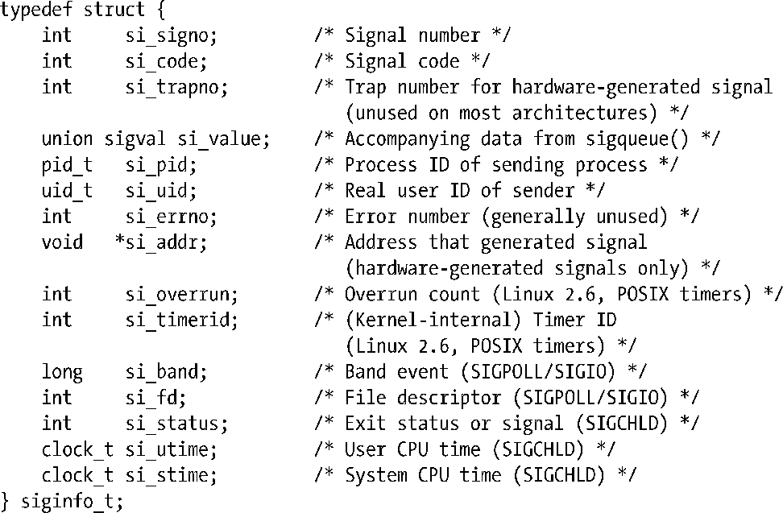

### 21.4　SA_SIGINFO标志

如果在使用sigaction()创建处理器函数时设置了SA_SIGINFO标志，那么在收到信号时处理器函数可以获取该信号的一些附加信息。为获取这一信息，需要将处理器函数声明如下：

如同标准信号处理器函数一样，第1个参数sig表示信号编号。第2个参数siginfo是用于提供信号附加信息的一个结构。该结构会与最后一个参数ucontext一起，在下面做详细说明。

因为上述信号处理器函数的原型不同于标准处理器函数，依照C语言的类型规则，将无法利用sigaction结构的sa_handler字段来指定处理器函数地址。此时需要使用另一个字段：sa_sigaction。换言之，sigaction结构比20.13节所展示的要稍微复杂一些。其完整定义如下：

结构sigaction使用联合体来合并sa_sigaction和sa_handler。（大部分其他UNIX实现也采用相同的方式。）之所以使用联合体，是因为对sigaction()的特定调用只会用到其中的一个字段。（不过，如果天真地认为可以彼此独立地设置sa_handler和sa_sigaction，就有可能导致一些奇怪的bug。可能的原因是在为不同的信号创建处理器函数时，多次对sigaction()的调用复用了同一个sigaction结构。）

这里是使用SA_SIGINFO创建信号处理器函数的一个例子：

至于使用SA_SIGINFO标志的完整例子，请参考程序清单22-3和程序清单23-5。

#### 结构siginfo_t

在以SA_SIGINFO标志创建的信号处理器函数中，结构siginfo_t是其第2个参数，格式如下：

要获取<signal.h>对siginfo_t的声明，必须将特性测试宏_POSIX_C_SOURCE的值定义为大于或等于199309。

如同大部分UNIX实现一样，在Linux系统中，siginfo_t结构的很多字段都是联合体，因为对每个信号而言，并非所有字段都有必要。（参考<bits/siginfo.h>中的细节。）

一旦进入信号处理器函数，对结构siginfo_t中字段的设置如下。

##### si_signo

需要为所有信号设置。内含引发处理器函数调用的信号编号——与处理器函数sig参数的值相同。

##### si_code

需要为所有信号设置。如表21-2所示，所含代码提供了关于信号来源的深入信息。

##### si_value

该字段包含调用sigqueue()发送信号时的伴随数据。22.8.1节将讨论sigqueue()。

##### si_pid

对于经由kill()或sigqueue()发送的信号，该字段保存了发送进程的进程ID。

##### si_uid

对于经由kill()或sigqueue()发送的信号，该字段保存了发送进程的真实用户ID。系统之所以提供真实用户ID，是因为其信息量比之有效用户ID更为丰富。回忆20.5节所述关于信号发送的权限规则，如果有效用户ID授予发送者发送信号的权力，那么发送方的用户ID必须要么为0（特权级用户），要么与接收进程的真实用户ID或者保存设置用户ID（saved set-user-ID)相同。这时，接收者了解发送者的真实用户ID就很有用，因为它有可能不同于有效用户ID（例如，如果发送者是一个set-user-ID程序）。

##### si_errno

如果将该字段置为非0值，则其所包含为一错误号（类似errno），标志信号的产生原因。Linux通常不使用该字段。

##### si_addr

仅针对由硬件产生的SIGBUG、SIGSEGV、SIGILL和SIGFPE信号设置该字段。对于SIGBUS和SIGSEGV而言，该字段内含引发无效内存引用的地址。对于SIGILL和SIGFPE信号，则包含导致信号产生的程序指令地址。

以下各字段均属非标准的Linux扩展，仅当POSIX定时器（23.6节）到期而产生信号传递时设置：

##### si_timerid

内含供内核内部使用的ID，用以标识定时器。

##### si_overrun

设置该字段为定时器的溢出次数。

仅当收到SIGIO信号（63.3节）时，才会设置下面两个字段。

##### si_band

该字段包含与I/O事件相关的“带事件”值。（直到glibc 2.3.2，si_band的类型都是int型。）

##### si_fd

该字段包含与I/O事件相关的文件描述符编号。SUSv3并未定义这一字段，不过许多其他实现都予以了支持。

仅当收到SIGCHLD信号（26.3节）时，才会对以下各字段进行设置。

##### si_status

该字段包含子进程的退出状态（当si_code=CLD_EXITED时）或者发给子进程的信号编号（即26.1.3节所述终止或停止子进程的信号编号）。

##### si_utime

该字段包含子进程使用的用户CPU时间。在版本2.6以前，以及2.6.27以后的内核版本中，对该字段的度量以系统时钟滴答除以sysconf（_SC_CLK_TCK）的返回值作为基本单位。而在版本2.6.27之前的2.6内核中则存在bug，该字段在报告时间时采用的度量单位为（可由用户配置的）jiffy（10.6节）。SUSv3没有定义该字段，但许多其他实现都予以支持。

##### si_stime

该字段包含了子进程使用的系统CPU时间。可参考对si_utime的描述。同样，SUSv3并未定义该字段，不过许多其他实现都予以支持。

si_code字段提供了关于信号来源的更多信息，其值如表21-2所示。表中第2列列出的信号特有值（特别是由硬件产生的4种信号：SIGBUS、SIGSEGV、SIGILL和SIGFPE）不会悉数现身于所有的UNIX实现以及硬件架构之上——尽管Linux定义了所有常量，而且SUSv3也定义了其中的大部分。

关于表21-2中所示各值，还需注意以下几点附加说明。

+ 值SI_KERNEL和SI_SIGIO为Linux所特有，既未获SUSv3定义，也未获其他UNIX实现支持。
+ SI_SIGIO仅在Linux2.2中用到。自内核2.4起，Linux转而采用表中的POLL_*常量。

<b class="my_markdown">表21-2：结构siginfo_t中si_code字段返回值一览表</b>

| 信　　号 | si_code的值 | 信 号 来 源 |
| :-----  | :-----  | :-----  | :-----  | :-----  |
| 任意（所有） | SI_ASYNCIO | 异步I/O（AIO）操作已经完成 |
| SI_KERNEL | 从内核发送（例如，来自于终端驱动程序的信号） |
| SI_MESGQ | 消息到达POSIX消息队列（自Linux 2.6.6） |
| SI_QUEUE | 利用sigqueue()从用户进程发出的实时信号 |
| SI_SIGIO | SIGIO信号（仅Linux 2.2支持） |
| SI_TIMER | POSIX（实时）定时器到期 |
| SI_TKILL | 调用tkill()或tgkill()的用户进程（自Linux 2.4.19） |
| SI_USER | 调用kill()或raise()的用户进程 |
| SIGBUS | BUS_ADRALN | 无效的地址对齐 |
| BUS_ADRERR | 不存在的物理地址 |
| BUS_MCEERR_AO | 硬件内存错误，动作为可选（自Linux 2.6.32） |
| BUS_MCEERR_AR | 硬件内存错误，动作为必需（自Linux 2.6.32） |
| BUS_OBJERR | 对象特有的硬件错误 |
| SIGCHLD | CLD_CONTINUED | 因SIGCONT信号，子进程得以继续执行（自Linux 2.6.9） |
| CLD_DUMPED | 子进程异常终止，并产生核心转储 |
| CLD_EXITED | 子进程退出 |
| CLD_KILLED | 子进程异常终止，且不产生核心转储 |
| CLD_STOPPED | 子进程停止 |
| CLD_TRAPPED | 受到跟踪的子进程停止 |
| SIGFPE | FPE_FLTDIV | 浮点除0 |
| FPE_FLTINV | 无效的浮点操作 |
| FPE_FLTOVF | 浮点溢出 |
| FPE_FLTRES | 浮点结果不精确 |
| FPE_FLTUND | 浮点下溢 |
| FPE_INTDIV | 整型除0 |
| FPE_INTOVF | 整型溢出 |
| FPE_SUB | 下标超出范围 |
| SIGILL | ILL_BADSTK | 内部栈错误 |
| ILL_COPROC | 协处理器错误 |
| ILL_ILLADR | 非法地址模式 |
| ILL_ILLOPC | 非法操作码 |
| ILL_ILLOPN | 非法操作数 |
| ILL_ILLTRP | 非法陷入 |
| ILL_PRVOPC | 特权级操作码 |
| ILL_PRVREG | 特权级寄存器 |
| SIGPOLL/SIGIO | POLL_ERR | I/O错误 |
| POLL_HUP | 设备断开 |
| POLL_IN | 输入数据有效 |
| POLL_MSG | 输入消息有效 |
| POLL_OUT | 输出缓冲区有效 |
| POLL_PRI | 高优先级输入有效 |
| SIGSEGV | SEGV_ACCERR | 映射对象的无效权限 |
| SEGV_MAPERR | 未映射为对象的地址 |
| SIGTRAP | TRAP_BRANCH | 进程分支陷入 |
| TRAP_BRKPT | 进程断点 |
| TRAP_HWBKPT | 硬件断点/监测点 |
| TRAP_TRACE | 进程跟踪陷入 |

> SUSv4定义了功用与psignal()（20.8节）相仿的psiginfo()函数。函数psiginfo()带有两个参数，分别是指向siginfo_t结构的指针和一个消息字符串。该函数在标准错误设备上输出字符串消息，接着显示描述于 siginfo_t 结构中的信号信息。glibc 自 2.10 版开始提供psiginfo()函数。glibc实现会显示信号的描述信息及来源（根据si_code字段所示），对于某些信号，还会列出siginfo_t结构中的其他字段。函数psiginfo()是SUSv4中的新丁，并非所有系统都予以支持。

#### 参数ucontext

以SA_SIGINFO标志所创建的信号处理器函数，其最后一个参数是ucontext，一个指向ucontext_t类型结构（定义于<ucontext.h>）的指针。（因为SUSv3并未规定该参数的任何细节，所以将其定义为void类型指针。）该结构提供了所谓的用户上下文信息，用于描述调用信号处理器函数前的进程状态，其中包括上一个进程信号掩码以及寄存器的保存值，例如程序计数器（cp）和栈指针寄存器（sp）。信号处理器函数很少用到此类信息，所以此处也略而不论。

> 使用结构ucontext_t的其他函数有getcontext()、makecontext()、setcontext()和swapcontext()，分别对应的功能是允许进程去接收、创建、改变以及交换执行上下文。（这些操作有点类似于setjmp()和longjmp()，但更为通用。）可以使用这些函数来实现协程（coroutines），令进程的执行线程在两个（或多个）函数之间交替。SUSv3规定了这些函数，但将它们标记为已废止。SUSv4则将其删去，并建议使用POSIX线程来重写旧有的应用程序。glibc手册页提供了关于这些函数的深入信息。

