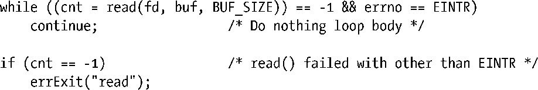
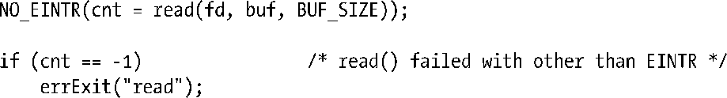
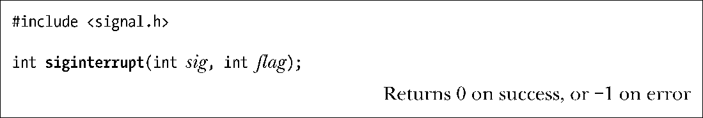

### 21.5　系统调用的中断和重启

考虑如下场景。

**1．** 为某信号创建处理器函数。

**2．** 发起一个阻塞的系统调用（blocking system call），例如，从终端设备调用的read()就会阻塞到有数据输入为止。

**3．** 当系统调用遭到阻塞时，之前创建了处理器函数的信号传递了过来，随即引发对处理器函数的调用。

信号处理器返回后又会发生什么？默认情况下，系统调用失败，并将errno置为EINTR。这是一种有用的特性。23.3节将会描述如何使用定时器（会产生SIGALRM信号）来设置像read()之类阻塞系统调用的超时。

不过，更为常见的情况是希望遭到中断的系统调用得以继续运行。为此，可在系统调用遭信号处理器中断的事件中，利用如下代码来手动重启系统调用。

如果需要频繁使用上述代码，那么定义成如下宏会很方便：

使用该宏，可以将早先对read()的调用改写如下 ：

> GNU C库提供了一个（非标准）宏，其作用与定义于<unistd.h>中的NO_EINTR()相同。该宏名为TEMP_FAILURE_RETRY()，定义特性测试宏_GNU_SOURCE后即可使用。

即使采用了类似NO_EINTR()这样的宏，让信号处理器来中断系统调用还是颇为不便，因为只要有意重启阻塞的调用，就需要为每个阻塞的系统调用添加代码。反之，可以调用指定了SA_RESTART标志的sigaction()来创建信号处理器函数，从而令内核代表进程自动重启系统调用，还无需处理系统调用可能返回的EINTR错误。

标志SA_RESTART是针对每个信号的设置。换言之，允许某些信号的处理器函数中断阻塞的系统调用，而其他系统调用则可以自动重启。

#### SA_RESTART标志对哪些系统调用（和库函数）有效

不幸的是，并非所有的系统调用都可以通过指定SA_RESTART来达到自动重启的目的。究其原因，有部分历史因素。

+ 4.2BSD引入了重启系统调用的概念，包括中断对wait()和waitpid()的调用，以及如下I/O系统调用：read()、readv()、write()和阻塞的ioctl()操作。I/O系统调用都是可中断的，所以只有在操作“慢速（slow）”设备时，才可以利用SA_RESTART标志来自动重启调用。慢速设备包括终端（terminal）、管道（pipe）、FIFO以及套接字（socket）。对于这些文件类型，各种I/O操作都有可能堵塞。（相比之下，磁盘文件并未沦入慢速设备之列，因为借助于缓冲区高速缓存，磁盘I/O请求一般都可以立即得到满足。当出现磁盘I/O请求时，内核会令该进程休眠，直至完成I/O动作为止。）
+ 其他大量阻塞的系统调用则继承自System V，在其初始设计中并未提供重启系统调用的功能。

在Linux中，如果采用SA_RESTART标志来创建系统处理器函数，则如下阻塞的系统调用（以及构建于其上的库函数）在遭到中断时是可以自动重启的。

+ 用来等待子进程（26.1节）的系统调用：wait()、waitpid()、wait3()、wait4()和waitid()。
+ 访问慢速设备时的I/O系统调用：read()、readv()、write()、writev()和ioctl()。如果在收到信号时已经传递了部分数据，那么还是会中断输入输出系统调用，但会返回成功状态：一个整型值，表示已成功传递数据的字节数。
+ 系统调用open()，在可能阻塞的情况下（例如，如44.7节所述，在打开FIFO时）。
+ 用于套接字的各种系统调用：accept()、accept4()、connect()、send()、sendmsg()、sendto()、recv()、recvfrom()和recvmsg()。（在Linux中，如果使用setsockopt()来设置超时，这些系统调用就不会自动重启。更多细节请参考signal(7)手册页。）
+ 对POSIX消息队列进行I/O操作的系统调用：mq_receive()、mq_timedreceive()、mq_send()和mq_timedsend()。
+ 用于设置文件锁的系统调用和库函数：flock()、fcntl()和lockf()。
+ Linux特有系统调用futex()的FUTEX_WAIT操作。
+ 用于递减POSIX信号量的sem_wait()和sem_timedwait()函数。（在一些UNIX实现上，如果设置了SA_RESTART标志，sem_wait()就会重启。）
+ 用于同步POSIX线程的函数：pthread_mutex_lock()、pthread_mutex_trylock()、pthread_mutex_timedlock()、pthread_cond_wait()和pthread_cond_timedwait()。

内核2.6.22之前，不管是否设置了SA_RESTART标志，futex()、sem_wait()和sem_timedwait()遭到中断时总是产生EINTR错误。

以下阻塞的系统调用（以及构建于其上的库函数）则绝不会自动重启（即便指定了SA_RESTART）。

+ poll()、ppoll()、select()和pselect()这些I/O多路复用调用。（SUSv3明文规定，无论设置SA_RESTART标志与否，都不对select()和pselect()遭处理器函数中断时的行为进行定义。）
+ Linux特有的epoll_wait()和epoll_pwait()系统调用。
+ Linux特有的io_getevents()系统调用。
+ 操作System V消息队列和信号量的阻塞系统调用：semop()、semtimedop()、msgrcv()和msgsnd()。（虽然System V原本并未提供自动重启系统调用的功能，但在某些UNIX实现上，如果设置了SA_RESTART标志，这些系统调用还是会自动重启。）
+ 对inotify文件描述符发起的read()调用。
+ 用于将进程挂起指定时间的系统调用和库函数：sleep()、nanosleep()和clock_nanosleep()。
+ 特意设计用来等待某一信号到达的系统调用：pause()、sigsuspend()、sigtimedwait()和sigwaitinfo()。

#### 为信号修改SA_RESTART标志

函数siginterrupt()用于改变信号的SA_RESTART设置。

若参数flag为真（1），则针对信号sig的处理器函数将会中断阻塞的系统调用的执行。如果flag为假（0），那么在执行了sig的处理器函数之后，会自动重启阻塞的系统调用。

函数siginterrupt()的工作原理是：调用sigaction()获取信号当前处置的副本，调整自结构oldact中返回的SA_RESTART标志，接着再次调用sigaction()来更新信号处置。

SUSv4标记sigterrupt()为已废止，并推荐使用sigaction()加以替代。

#### 对于某些Linux系统调用，未处理的停止信号会产生EINTR错误

在Linux上，即使没有信号处理器函数，某些阻塞的系统调用也会产生EINTR错误。如果系统调用遭到阻塞，并且进程因信号（SIGSTOP、SIGTSTP、SIGTTIN或SIGTTOU）而停止，之后又因收到SIGCONT信号而恢复执行时，就会发生这种情况。

以下系统调用和函数具有这一行为：epoll_pwait()、epoll_wait()、对inotify文件描述符执行的read()调用、semop()、semtimedop()、sigtimedwait()和sigwaitinfo()。

内核2.6.24之前，poll()也曾存在这种行为，2.6.22之前的sem_wait()、sem_timedwait()、futex(FUTEX_WAIT)，2.6.9之前的msgrcv()和msgsnd()，以及Linux 2.4及其之前的nanosleep()也同样如此。

在Linux 2.4及其之前的版本中，也可以以这种方式来中断sleep()，但是不会返回错误值，而是返回休眠所剩余的秒数。

这种行为的结果是，如果程序可能因信号而停止和重启，那么就需要添加代码来重新启动这些系统调用，即便该程序并未为停止信号设置处理器函数。

