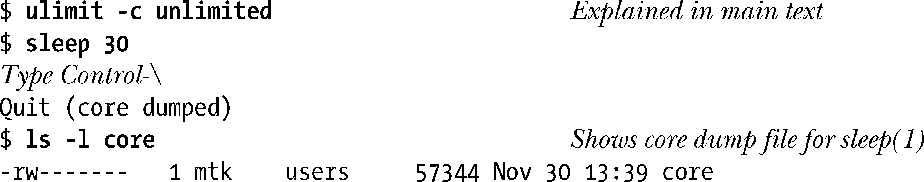

### 22.1　核心转储文件

特定信号会引发进程创建一个核心转储文件并终止运行（参考表20-1）。所谓核心转储是内含进程终止时内存映像的一个文件。（术语core源于一种老迈的内存技术。）将该内存映像加载到调试器中，即可查明信号到达时程序代码和数据的状态。

引发程序生成核心转储文件的方式之一是键入退出字符（通常为Control-\），从而生成SIGQUIT信号。

本例中，当检测出子进程（运行sleep命令的进程）为SIGQUIT信号所杀，并生成核心转储文件时，shell会显示“Quit（core dump）”消息。

核心转储文件创建于进程的工作目录中，名为core。这是核心转储文件的默认位置和名称。稍后，将解释如何改变这些默认值。

> 借助于许多实现所提供的工具（例如FreeBSD和Solaris中的gcore），可获取某一正在运行进程的核心转储文件。Linux系统也有类似功能，使用gdb去连接（attach）一个正在运行的进程，然后运行gcore命令。

#### 不产生核心转储文件的情况

以下情况不会产生核心转储文件。

+ 进程对于核心转储文件没有写权限。造成这种情况的原因有进程对将要创建核心转储文件的所在目录可能没有写权限，或者是因为存在同名（且不可写，亦或非常规类型，例如，目录或符号链接）的文件。
+ 存在一个同名、可写的普通文件，但指向该文件的（硬）链接数超过一个。
+ 将要创建核心转储文件的所在目录并不存在。
+ 把进程“核心转储文件大小”这一资源限制置为0。36.3节将就这一限制（RLIMIT_CORE）进行详细讨论。上例就使用了ulimit命令（C shell中为limit命令）来取消对核心转储文件大小的任何限制。
+ 将进程“可创建文件的大小”这一资源限制设置为 0。36.3 节将描述这一限制（RLIMIT_FSIZE）。
+ 对进程正在执行的二进制可执行文件没有读权限。这样①就防止了用户借助于核心转储文件来获取本无法读取的程序代码。
+ 以只读方式挂载当前工作目录所在的文件系统，或者文件系统空间已满，又或者i-node资源耗尽。还有一种情况，即用户已经达到其在该文件系统上的配额限制。
+ Set-user-ID（set-group-ID）程序在由非文件属主（或属组）执行时，不会产生核心转储文件。这可以防止恶意用户将一个安全程序的内存转储出来，再针对诸如密码之类的敏感信息进行刺探。

> 借助于Linux专有系统调用prctl()的PR_SET_DUMPABLE操作，可以为进程设置dumpable标志。当非文件属主（或属组）运行set-user-ID（set-group-ID）程序时，如设置该标志即可生成核心转储文件。PR_SET_DUMPABLE操作始见于Linux 2.4，更多详细信息参见prctl(2)手册页。另外，始于内核版本2.6.13，针对set-user-ID和set-group-ID进程是否产生核心转储文件，/proc/sys/fs/suid_dumpable文件开始提供系统级控制。详情参见proc(5)手册页。

始于内核版本2.6.23，利用Linux特有的/proc/PID/coredump_filter，可以对写入核心转储文件的内存映射类型（第49章将解释内存映射）施以进程级控制。该文件中的值是一个4位掩码，分别对应于4种类型的内存映射：私有匿名映射、私有文件映射、共享匿名映射以及共享文件映射。文件默认值提供了传统的Linux行为：仅对私有匿名映射和共享匿名映射进行转储。详情参见core(5)手册页。

#### 为核心转储文件命名：/proc/sys/kernel/core_pattern

从Linux版本2.6开始，可以根据Linux特有的/proc/sys/kernel/core_pattern文件所包含的格式化字符串来控制对系统上生成的所有核心转储文件的命名。默认情况下，该文件所含字符串为core。特权级用户可以将该文件内容定义为包含表22-1所列的任一格式说明符，待实际命名时再以表中右列所示相应值加以替换。此外，允许字符串中包含斜线（/）。换言之，处在控制范围之内的，不仅包括核心文件的名称，还包括核心文件的所在（绝对或相对）目录。替换所有格式说明符后，由此生成的路径名字符串长度至多可达128个字符（Linux 2.6.19之前为64个字符），超出部分将予以截断。

Linux从内核版本2.6.19开始支持core_pattern文件的另一种语法。如果该文件包含一个以管道符（|）为首的字符串，那么会将该文件的剩余字符串视为一个程序，其可选参数可包含表22-1所示的%说明符——当进程转储核心文件时，将执行该程序。并且会将核心转储至该程序的标准输入，而非一个文件。详情请参考core(5)手册页。

> 其他一些UNIX实现也提供了类似于core_pattern的机制。例如，在BSD一派中，会将程序名追加到文件名尾部，形如core.progname。Solaris提供了一个工具（coreadm），允许由用户来选择核心转储文件的名称和存放目录。

<b class="my_markdown">表22-1：服务于/proc/sys/kernel/core_pattern的文件说明符</b>

| 说　明　符 | 替　代　为 |
| :-----  | :-----  | :-----  | :-----  |
| %c | 对核心文件大小的资源软限制（字节数；始于Linux 2.6.24） |
| %e | 可执行文件名（不含路径前缀） |
| %g | 遭转储进程的实际组ID |
| %h | 主机系统的名称 |
| %p | 遭转储进程的进程ID |
| %s | 导致进程终止的信号编号 |
| %t | 转储时间，始于Epoch，以秒为单位 |
| %u | 遭转储进程的实际用户ID |
| %% | 单个%字符 |

