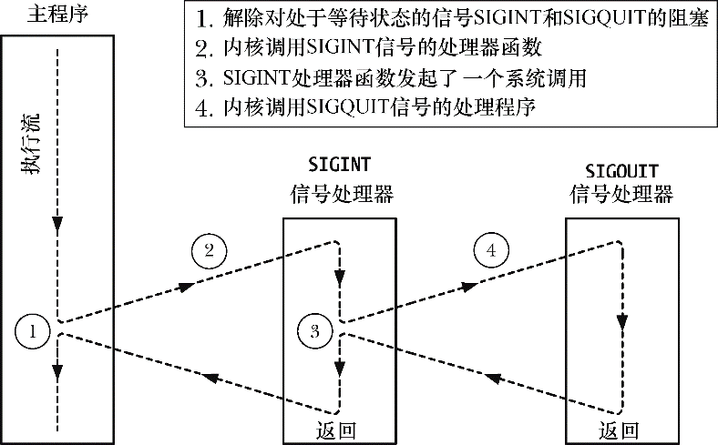

### 22.6　信号传递的时机与顺序

本节的主题有二。其一，具体于何时去传递一个处于等待状态的信号；其二，对于多个遭到阻塞，且处于等待状态的信号一旦同时解除阻塞，将会发生什么情况？

#### 何时传递一个信号？

如22.5节所述，同步产生的信号会立即传递。例如，硬件异常会触发一个即时信号，而当进程使用raise()向自身发送信号时，信号会在raise()调用返回前就已经发出。

当异步产生一个信号时，即使并未将其阻塞，在信号产生和实际传递之间仍可能会存在一个（瞬时）延迟。在此期间，信号处于等待状态。这是因为内核将等待信号传递给进程的时机是，该进程正在执行，且发生由内核态到用户态的下一次切换时。实际上，这意味着在以下时刻才会传递信号。

+ 进程在前度超时后，再度获得调度时（即，在一个时间片的开始处）。
+ 系统调用完成时（信号的传递可能引起正在阻塞的系统调用过早完成）。

#### 解除对多个信号的阻塞时，信号的传递顺序

如果进程使用sigprocmask()解除了对多个等待信号的阻塞，那么所有这些信号会立即传递给该进程。

就目前的Linux实现而言，Linux内核按照信号编号的升序来传递信号。例如，如果对处于等待状态的信号SIGINT（信号编号为2）和SIGQUIT（信号编号为3）同时解除阻塞，那么无论这两个信号的产生次序如何，SIGINT都将先于SIGQUIT而传递。

然而，也不能对传递（标准）信号的特定顺序产生任何依赖，因为SUSv3规定，多个信号的传递顺序由系统实现决定。（该条款仅适用于标准信号。如22.8节所述，实时信号的相关标准规定，对于解除阻塞的实时信号而言，其传递顺序必须得到保障。）

当多个解除了阻塞的信号正在等待传递时，如果在信号处理器函数执行期间发生了内核态和用户态之间的切换，那么将中断此处理器函数的执行，转而去调用第二个信号处理器函数（如此递进），如图22-1所示。

<b class="my_markdown">图22-1：对多个解除阻塞信号的传递</b>

