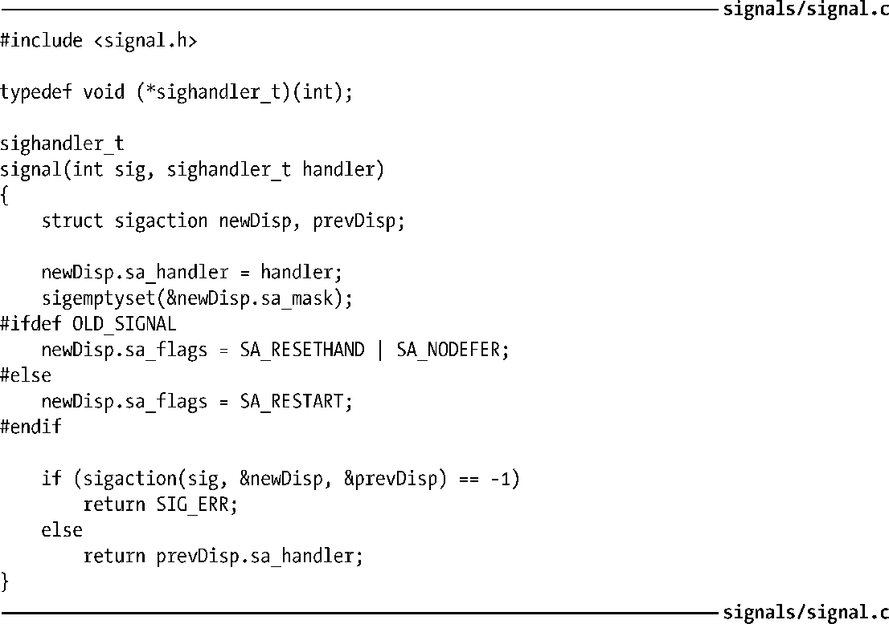
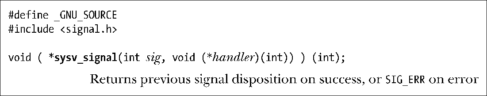

### 22.7　signal()的实现及可移植性

本节展示了如何使用sigaction()来实现signal()。实现虽然简单明了，但还需要顾及这一事实，由于历史沿革和UNIX实现之间的差异，signal()曾具有各种不同的语义。尤其是，信号的早期实现并不可靠，这意味着：

+ 刚一进入信号处理器，会将信号处置重置为其默认行为。（这对应于20.13节描述的SA_RESETHAND标志。）要想在同一信号“再度光临”时再次调用该信号处理器函数，程序员必须在信号处理器内部调用signal()，以显式重建处理器函数。这种情况存在一个问题：在进入信号处理器和重建处理器之间存在一个短暂的窗口期，而如果同一信号在此期间再度来袭，那么将只能按照其默认处置来进行处理。
+ 在信号处理器执行期间，不会对新产生的信号进行阻塞。（这对应于20.12节描述的SA_NODEFER标志。）这意味着，如果在某一信号处理器函数执行期间，同类信号再度光顾，那么将对该处理器函数进行递归调用。假定一串信号中彼此的时间间隔足够短，那么对处理器函数的递归调用将可能导致堆栈溢出。

除了不可靠之外，早期的UNIX实现并未提供系统调用的自动重启功能（即，21.5节所述SA_RESTART标志的相关行为）。

4.2BSD针对可靠信号的实现纠正了这些限制，其他一些UNIX实现也纷纷效仿。然而，时至今日，这些早期语义依然存在于System V的signal()实现之中。更有甚者，诸如SUSv3和C99之类的当代标准对signal()的这些方面也有意不予规范。

整合上述信息，对signal()的实现如程序清单22-1所示。该实现默认将提供信号的现代语义。如果编译时带有–DOLD_SIGNAL选项，那么将提供早期的不可靠信号语义，且不能启用系统调用的自动重启功能。

程序清单22-1：signal()的实现之一

#### glibc的一些细节

随着时间推移，glibc对signal()库函数的实现也历经变化。较新版本（glibc 2及更高版本）的函数库默认提供现代语义。而老版本则提供早期的不可靠（System V-兼容）语义。

> Linux内核将signal()实现为系统调用，并提供较老的、不可靠语义。然而，glibc库则利用sigaction()实现了signal()库函数，从而将signal()系统调用旁路。

如果执意在现代glibc版本中使用不可靠信号语义，那么可以显式以（非标准的）sysv_signal()函数来替代对signal()的调用。

sysv_signal()函数的参数与signal()函数相同。

若编译程序时并未定义_BSD_SOURCE特性测试宏，则glibc会隐式将所有signal()调用重新定义为sysv_signal()调用，亦即启用signal()的不可靠语义。默认情况下会定义_BSD_SOURCE，但是（除非显式定义了_BSD_SOURCE）如果编译程序时定义了诸如_SVID_SOURCE或_XOPEN_SOURCE之类的其他特性测试宏，那么对_BSD_SOURCE的默认定义将会失效。

#### sigaction()是建立信号处理器的首选API

鉴于上述System V与BSD之间（以及glibc新老版本之间）的可移植性问题，应当坚持使用sigaction()而非signal()来建立信号处理器，这不失为一种稳妥之举。本书剩下部分都将遵循这一做法。（另一种选择是，编写类似于程序清单22-1的signal()版本，精确设定所需要的标志，供应用程序内部使用。）不过，还应注意，使用signal()将信号处置设置为SIG_IGN或者SIG_DFL的手法具有良好的可移植性（程序也更为简短），所以也很常用。

