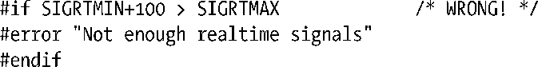
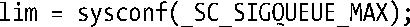

### 22.8　实时信号

定义于POSIX.1b中的实时信号，意在弥补对标准信号的诸多限制。较之于标准信号，其优势如下所示。

+ 实时信号的信号范围有所扩大，可应用于应用程序自定义的目的。而标准信号中可供应用随意使用的信号仅有两个：SIGUSR1和SIGUSR2。
+ 对实时信号所采取的是队列化管理。如果将某一实时信号的多个实例发送给一进程，那么将会多次传递信号。相反，如果某一标准信号已经在等待某一进程，而此时即使再次向该进程发送此信号的实例，信号也只会传递一次。
+ 当发送一个实时信号时，可为信号指定伴随数据（一整型数或者指针值），供接收进程的信号处理器获取。
+ 不同实时信号的传递顺序得到保障。如果有多个不同的实时信号处于等待状态，那么将率先传递具有最小编号的信号。换言之，信号的编号越小，其优先级越高。如果是同一类型的多个信号在排队，那么信号（以及伴随数据）的传递顺序与信号发送来时的顺序保持一致。

SUSv3要求，实现所提供的各种实时信号不得少于_POSIX_RTSIG_MAX（定义为8）个。Linux内核则定义了32个不同的实时信号，编号范围为 32～63。<signal.h>头文件所定义的RTSIG_MAX常量则表征实时信号的可用数量，而此外所定义的常量SIGRTMIN和SIGRTMAX则分别表示可用实时信号编号的最小值和最大值。

> 采用LinuxThreads线程实现的系统将SIGRTMIN定义为35（而非32），这是因为LinuxThreads内部使用了前三个实时信号。而采用NPTL线程实现的系统则将SIGRTMIN定义为34，因为NPTL内部使用了前两个实时信号。

对实时信号的区分方式有别于标准信号，不再依赖于所定义常量的不同。然而，程序员不应将实时信号编号的整型值在应用程序代码中写死，因为实时信号的范围因UNIX实现的不同而各异。与之相反，指代实时信号编号则可以采用SIGRTMIN+x的形式。例如，表达式（SIGRTMIN + 1）就表示第二个实时信号。

注意，SUSv3并未要求SIGRTMAX和SIGRTMIN是简单的整数值。可以将其定义为函数（就像Linux中那样）。这也意味着，不能编写如下代码以供预处理器处理：

相反，必须在运行时执行等效检查。

#### 对排队实时信号的数量限制

排队的实时信号（及其相关数据）需要内核维护相应的数据结构，用于罗列每个进程的排队信号。由于这些数据结构会消耗内核内存，故而内核对排队实时信号的数量设置了限制。

SUSv3允许实现为每个进程中可排队的（各类）实时信号数量设置上限，并要求其不得少于_POSIX_SIGQUEUE_MAX（定义为32）。实现可借助于对SIGQUEUE_MAX常量的定义来表示其所允许的排队实时信号数量。发起如下调用也能获得这一信息：

若系统使用的glibc库版本在2.4之前，则该调用返回−1。从glibc 2.4开始，其返回值由内核版本决定。在Linux 2.6.8之前，调用将返回Linux专有文件/proc/sys/kernel/rtsig-max中的值。该文件所定义为针对所有进程中可能排队的实时信号总数的系统级限制。默认值为1024，不过特权级进程可以对其进行修改。至于当前的排队实时信号总数，可以从Linux专有的/proc/sys/kernel/rtsig-nr文件中读取。

从版本 2.6.8 开始，Linux取消了这些/proc 文件。取而代之的是资源限制RLIMIT_SIGPENDING（36.3节）。针对某个特定实际用户ID下辖的所有进程，该限制限定了其可排队的信号总数。sysconf()调用从glibc2.10版本开始返回RLIMIT_SIGPENDING限制。（至于正在等待某一进程的实时信号数量，可以从Linux专有文件/proc/PID/status中的SigQ字段读取。）

#### 使用实时信号

为了能让一对进程收发实时信号，SUSv3提出以下几点要求。

+ 发送进程使用sigqueue()系统调用来发送信号及其伴随数据。

> 使用kill()、killpg()和raise()调用也能发送实时信号。然而，至于系统是否会对利用此类接口所发送的信号进行排队处理，SUSv3规定，由具体实现决定。这些接口在Linux中会对实时信号进行排队，但在其他许多UNIX实现中，情况则不然。

+ 要为该信号建立了一个处理器函数，接收进程应以SA_SIGINFO标志发起对sigaction()的调用。因此，调用信号处理器时就会附带额外参数，其中之一是实时信号的伴随数据。

> 在Linux中，即使接收进程在建立信号处理器时并未指定SA_SIGINFO标志，也能对实时信号进行队列化管理（但在这种情况下，将不可能获得信号的伴随数据）。然而，SUSv3也不要求实现确保这一行为，所以依赖这一点将有损于应用的可移植性。

