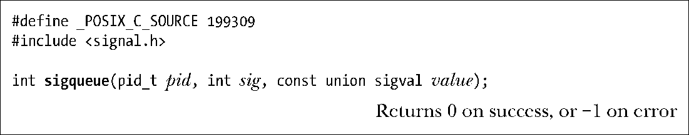
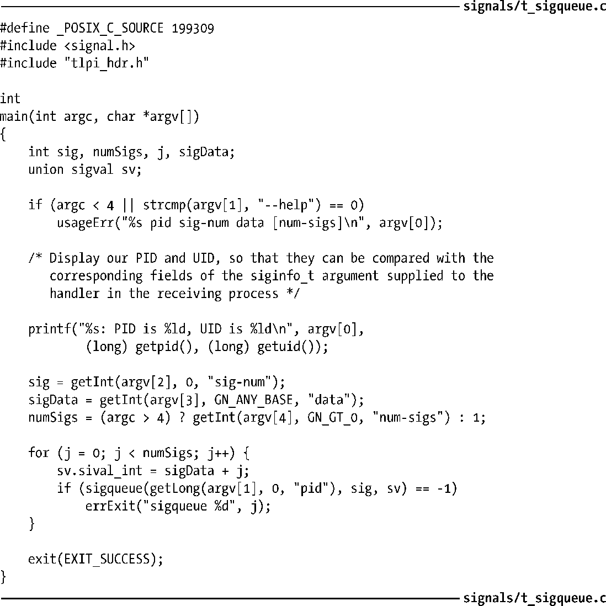
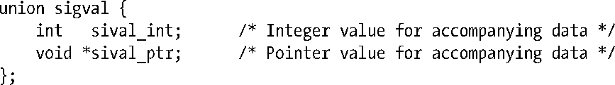

### 22.8.1　发送实时信号

系统调用sigqueue()将由sig指定的实时信号发送给由pid指定的进程。

使用sigqueue()发送信号所需要的权限与kill()（参见20.5节）的要求一致。也可以发送空信号（即信号0），其语义与kill()中的含义相同。（不同于kill()，sigqueue()不能通过将pid指定为负值而向整个进程组发送信号。）

程序清单22-2：使用sigqueue()发送实时信号

参数value指定了信号的伴随数据，具有以下形式：

对该参数的解释则取决于应用程序，由其选择对联合体（union)中的sival_int属性还是sival_ptr属性进行设置。sigqueue()中很少使用sival_ptr，因为指针的作用范围在进程内部，对于另一进程几乎没有意义。该字段得以一展身手之处，应该是在使用sigval联合体的其他函数中，诸如23.6节的POSIX计时器和52.6节的POSIX消息队列通知。

> 包括Linux在内的几个UNIX实现定义了与union sigval同义的数据类型sigval_t。然而，该类型既未获得SUSv3接纳，也没有得到其他实现的支持。对可移植性有所要求的应用程序应当避免使用。

一旦触及对排队信号的数量限制，sigqueue()调用将会失败。同时将errno置为EAGAIN，以示需要再次发送该信号（在当前队列中某些信号传递之后的某一时间点）。

程序清单22-2提供了sigqueue()的应用示例。该程序最多接受4个参数，其中前3项为必填项：目标进程ID、信号编号以及伴随实时信号的整型值。如果需要为指定信号发送多个实例，那么可以用可选的第4个参数来指定实例数量。在这种情况下，会为每个信号的伴随整型值依次加1。22.8.2节将展示该程序的用法。

