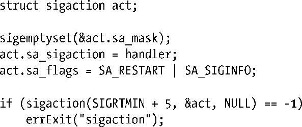
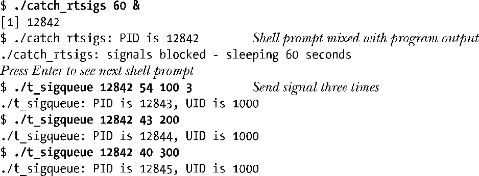
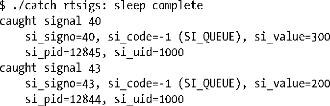
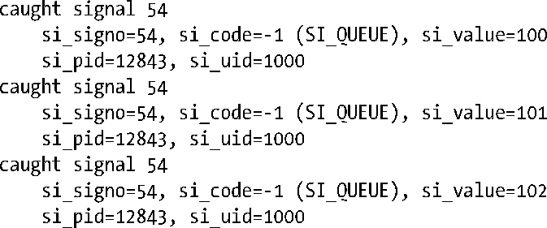
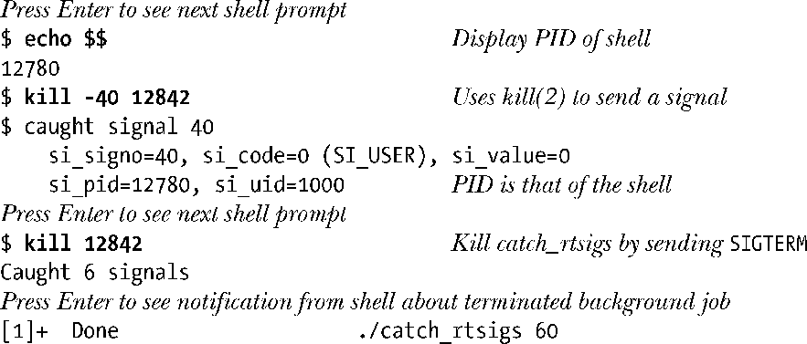
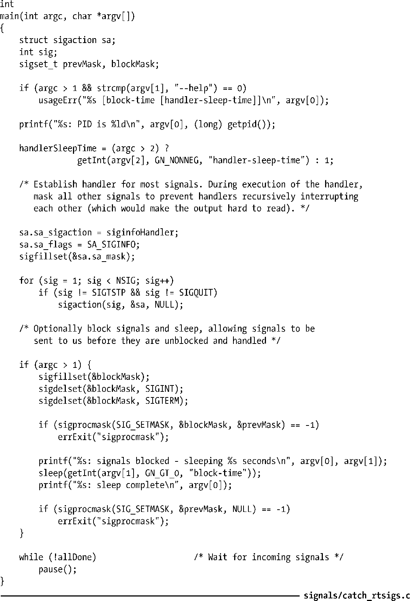

### 22.8.2　处理实时信号

可以像标准信号一样，使用常规（单参数）信号处理器来处理实时信号。此外，也可以用带有3个参数的信号处理器函数来处理实时信号，其建立则会用到SA_SIGINFO标志（参见21.4节）。以下为使用SA_SIGINFO标志为第六个实时信号建立处理器函数的代码示例：

一旦采用了SA_SIGINFO标志，传递给信号处理器函数的第二个参数将是一个siginfo_t结构，内含实时信号的附加信息。21.4节详细描述了这一数据结构。对于一个实时信号而言，会在siginfo_t结构中设置如下字段。

+ si_signo字段，其值与传递给信号处理器函数的第一个参数相同。
+ si_code字段表示信号来源，内容为表21-2中所示各值之一。对于通过sigqueue()发送的实时信号来说，该字段值总是为SI_QUEUE。
+ si_value字段所含数据，由进程于使用sigqueue()发送信号时在value参数（sigval union）中指定。正如前文指出，对该数据的解释由应用程序决定。（若信号由kill()发送，则si_value字段所含信息无效。）
+ si_pid和si_uid字段分别包含信号发送进程的进程ID和实际用户ID。

程序清单22-3提供了处理实时信号的一个例子。该程序捕获信号，并针对传递给信号处理器函数的siginfo_t结构，一一显示其中的各个字段值。该程序可接收两个整型命令行参数，均为可选项。如果提供了第一个参数，那么主程序将阻塞所有信号并进入休眠，休眠秒数由该参数指定。在此期间，将对进程的实时信号进行排队处理，并可观察解除对信号阻塞时所发生的情况。第二个参数指定了信号处理器函数在返回前所应休眠的秒数。指定一个非0值（默认为1秒）将有助于放缓程序的执行，便于看清处理多个信号时所发生的情况。

可以将程序清单22-3中程序与程序清单22-2中程序（t_sigqueue.c）结合起来探索实时信号的行为，正如以下shell会话日志所示：

最终，catch_rtsigs程序结束休眠，随着信号处理器捕获到各种信号而一一显示消息。（之所以看到shell提示符和程序的下一行输出混杂在一起，是因为catch_rtsigs程序正在后台输出信息。）可以看出，实时信号在传递时遵循低编号优先的原则，并且在传递给处理器函数的siginfo_t结构中包含了发送进程的进程ID和用户ID。

接下来的输出由同一实时信号的3个实例产生。由si_value值可知，这些信号的传递顺序与发送顺序相同。

继续使用shell的kill命令向程序catch_rtsigs发送信号。一如既往，处理器函数接收到的siginfo_t结构中包含了发送进程的进程ID和用户ID，但此时的si_code值为SI_USER。

程序清单22-3：处理实时信号

