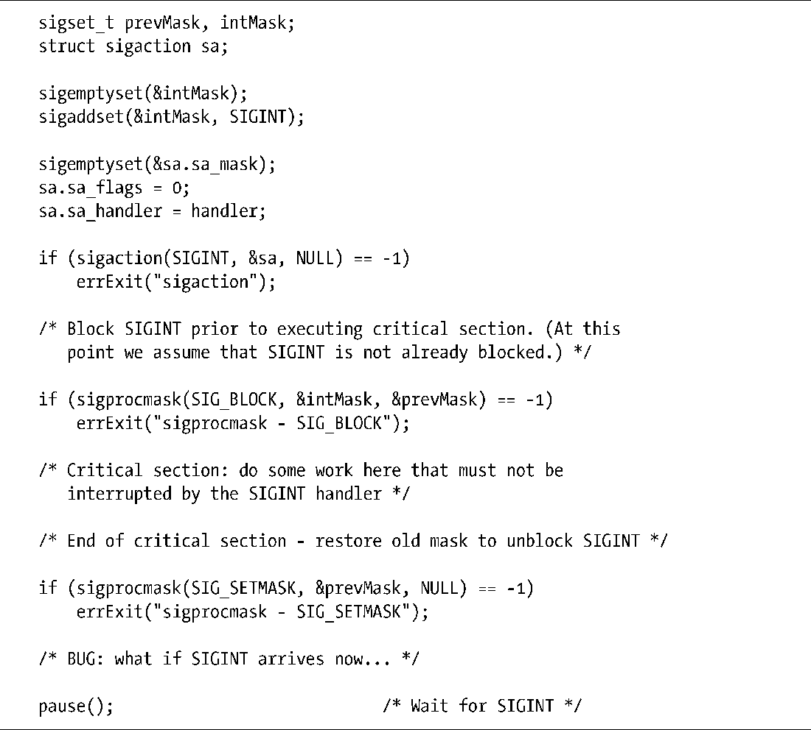
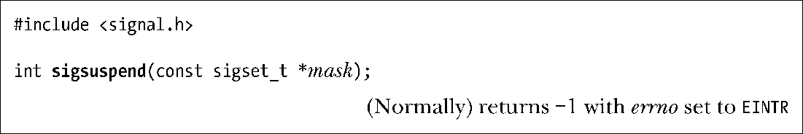
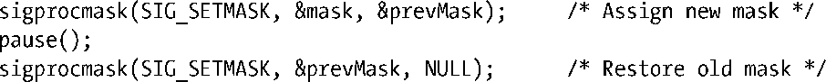
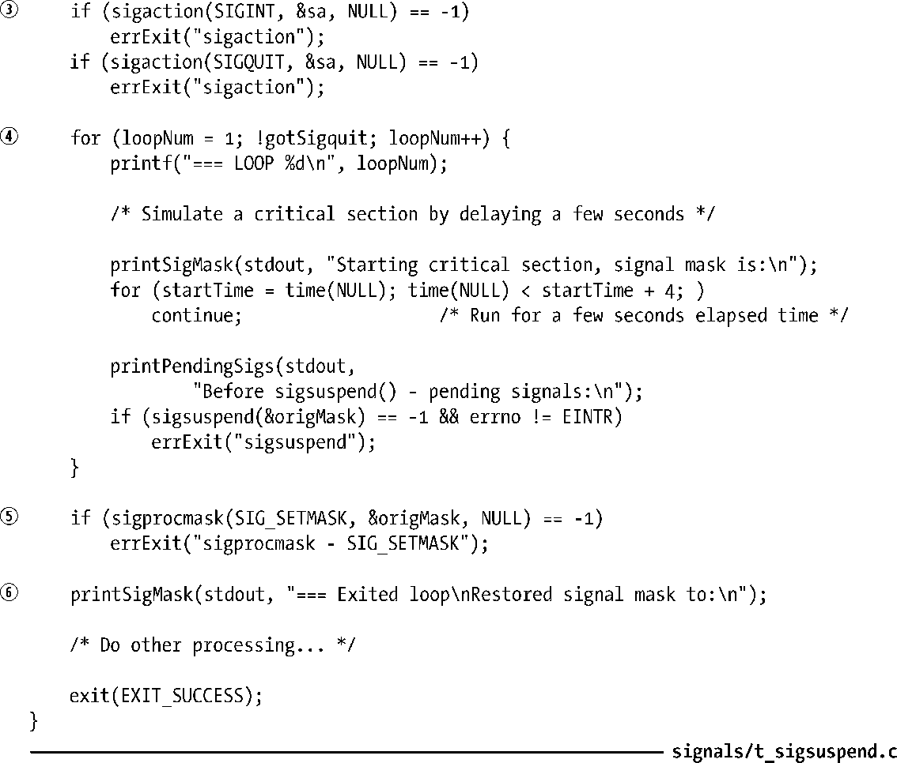
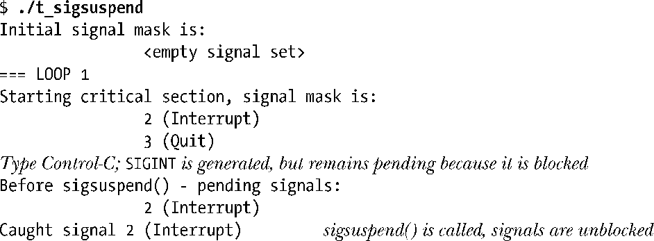
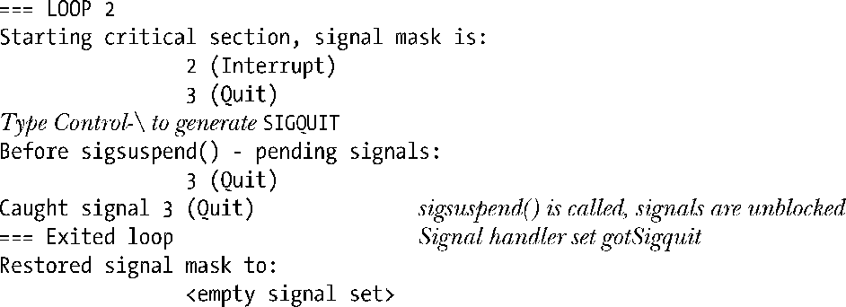

### 22.9　使用掩码来等待信号：sigsuspend()

在解释sigsuspend()的功用之前，先介绍一下它的一种使用场景。在对信号编程时偶尔会遇到如下情况。

**1．** 临时阻塞一个信号，以防止其信号处理器不会将某些关键代码片段的执行中断。

**2．** 解除对信号的阻塞，然后暂停执行，直至有信号到达。

为达到这一目的，可能会尝试使用程序清单22-4中代码所示方法。

程序清单22-4：解除阻塞并等待信号的错误做法

程序清单22-4中代码存在一个问题。假设SIGINT信号的传递发生在第二次调用sigprocmask()之后，调用pause()之前。（实际上，该信号可能产生于执行关键片段期间的任一时刻，仅当解除对信号的阻塞后才会随之而传递。）SIGINT信号的传递将导致对处理器函数的调用，而当处理器返回后，主程序恢复执行，pause()调用将陷入阻塞，直到SIGINT信号的第二个实例到达为止。这有违代码的本意：解除对SIGINT阻塞并等待其第一次出现。

即使在关键片段的起始点（即首次调用sigprocmask()）和pause()调用之间产生SIGINT信号的可能性不大，但这确实是上述代码的一处缺陷。这种取决于时间的缺陷是竞态条件（5.1节）的例子之一。通常，竞态条件发生于两个进程或线程共享资源时。然而，此处的竞态条件却发生在主程序和其自身的信号处理器之间。

要避免这一问题，需要将解除信号阻塞和挂起进程这两个动作封装成一个原子操作。这正是sigsuspend()系统调用的目的所在。

sigsuspend()系统调用将以mask所指向的信号集来替换进程的信号掩码，然后挂起进程的执行，直到其捕获到信号，并从信号处理器中返回。一旦处理器返回，sigsuspend()会将进程信号掩码恢复为调用前的值。

调用sigsuspend()，相当于以不可中断方式执行如下操作：

虽然恢复老的信号掩码乍看起来似乎麻烦，但为了在需要反复等待信号的情况下避免竞态条件，这一做法就至关重要。在这种情况下，除非是在sigsuspend()调用期间，否则信号必须保持阻塞状态。如果稍后需要对在调用sigsuspend()之前遭到阻塞的信号解除阻塞，可以进一步调用sigprocmask()。

若sigsuspend()因信号的传递而中断，则将返回−1，并将errno置为EINTR。如果mask指向的地址无效，则sigsuspend()调用失败，并将errno置为EFAULT。

#### 示例程序

程序清单22-5展示了对sigsuspend()的使用。该程序执行如下步骤。

+ 调用printSigMask()函数（程序清单20-4）来显示进程信号掩码的初始值。
+ 阻塞SIGINT和SIGQUIT信号，并保存原始的进程信号掩码。
+ 为SIGINT和SIGQUIT信号建立相同的处理器函数。该处理器显示一条消息，且若对其调用因SIGQUIT信号的传递而引起，则设置全局变量gotSigquit。
+ 循环执行，直至对gotSigquit进行了设置。每次循环都执行如下步骤。
      + 使用printSigMask()函数显示信号掩码的当前值。
    + 令CPU忙于循环并持续数秒钟，以此来模拟对一个关键片段的执行。
    + 使用printPendingSigs()函数来显示等待信号的掩码（程序清单20-4）。
    + 使用sigsuspend()来解除对SIGINT和SIGQUIT信号的阻塞，并等待信号（如果尚未有信号处于等待状态）。  
+ 使用sigprocmask()将进程信号掩码恢复为原始状态，然后再使用printSigMask()来显示信号掩码。

程序清单22-5：使用sigsuspend()

以下shell会话日志所示为程序清单22-5中程序的运行结果示例：

程序调用sigsuspend()解除了对SIGINT信号的阻塞，还显示了最后一行输出。正是在那一点，调用了信号处理器，并显示了那一行输出。

主程序会继续循环。

此时按下Control-\，将导致信号处理器去设置gotSigquit标志，并转而引发主程序终止循环。

