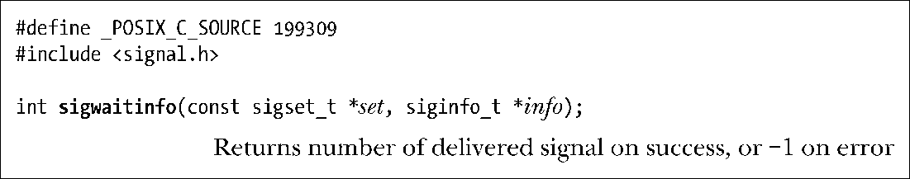
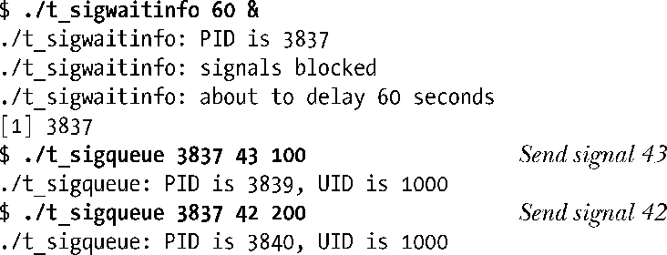
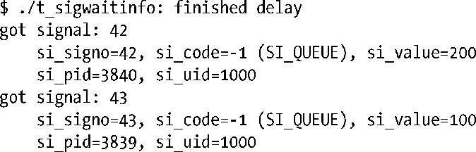
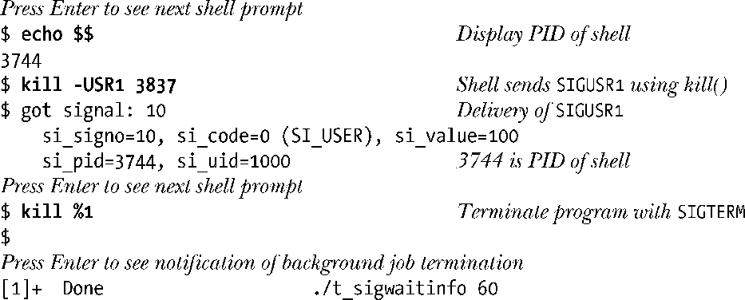
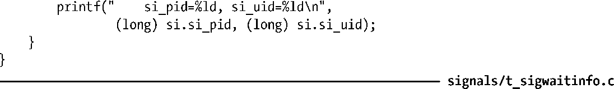
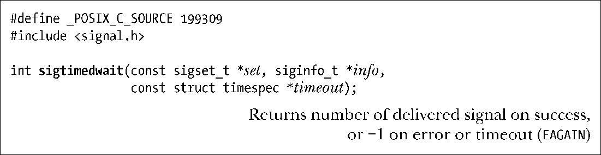
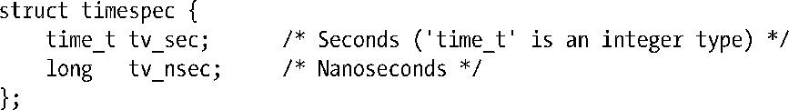

### 22.10　以同步方式等待信号

22.9节描述了如何结合信号处理器和sigsuspend()来挂起一个进程的执行，直至传来一个信号。然而，这需要编写信号处理器函数，还需要应对信号异步传递所带来的复杂性。对于某些应用而言，这种方法过于繁复。作为替代方案，可以利用sigwaitinfo()系统调用来同步接收信号。

sigwaitinfo()系统调用挂起进程的执行，直至set指向信号集中的某一信号抵达。如果调用sigwaitinfo()时，set中的某一信号已经处于等待状态，那么sigwaitinfo()将立即返回。传递来的信号就此从进程的等待信号队列中移除，并且将返回信号编号作为函数结果。info参数如果不为空，则会指向经过初始化处理的siginfo_t结构，其中所含信息与提供给信号处理器函数的siginfo_t参数（21.4节）相同。

sigwaitinfo()所接受信号的传递顺序和排队特性与信号处理器所捕获的信号相同，就是说，不对标准信号进行排队处理，对实时信号进行排队处理，并且对实时信号的传递遵循低编号优先的原则。

除了卸去编写信号处理器的负担之外，使用sigwaitinfo()来等待信号也要比信号处理器外加sigsuspend()的组合要稍快一些（见练习22-3）。

将对set中信号集的阻塞与调用sigwaitinfo()结合起来，这当属明智之举。（即便某一信号遭到阻塞，仍然可以使用sigwaitinfo()来获取等待信号。）如果没有这么做，而信号在首次调用sigwaitinfo()之前，或者两次连续调用sigwaitinfo()之间到达，那么对信号的处理将只能依照其当前处置。

SUSv3规定，调用sigwaitinfo()而不阻塞set中的信号将导致不可预知的行为（其行为未定义）。

程序清单22-6所示为使用sigwaitinfo()的例子之一。程序首先阻塞所有信号，然后延迟数秒时间，具体秒数由可选命令行参数来指定，从而允许在调用sigwaitinfo()之前向程序发送信号。程序随即持续循环调用sigwaitinfo()来接收输入信号，直至收到SIGINT或SIGTERM信号。

如下shell会话日志展示了程序清单22-6中程序的运行情况。程序在后台运行，并指定在执行sigwaitinfo()前需延迟60秒，随后再向进程发送两个信号：

最终，程序完成睡眠，sigwaitinfo()调用循环接收排队信号。（由于t_sigwaitinfo程序正在后台输出信息，故而可以观察到shell提示符和程序的下一行输出混杂在一起。）至于处理器所捕获到的实时信号，可以看出，编号低的信号率先传递，而且，借助于传递给信号处理器函数的siginfo_t结构，还可以获得发送进程的进程ID和用户ID。

继续使用shell的kill命令向进程发送信号。可以观察到，这次将si_code字段置为SI_USER（而非SI_QUEUE）。

收到SIGUSR1信号，由其输出可知，si_value字段值为100。该值是由sigqueue()发送的前一信号初始化而成。前文曾指出，仅对由sigqueue()所发送的信号，si_value字段所包含的信息才是可靠的。

程序清单22-6：使用sigwaitinfo()来同步等待信号

sigtimedwait()系统调用是sigwaitinfo()调用的变体。唯一的区别是sigtimedwait()允许指定等待时限。

timeout参数指定了允许sigtimedwait()等待一个信号的最大时长，是指向如下类型结构的一枚指针：

填写timespec结构的所属字段，也就指定了允许sigtimedwait()等待的最大秒数和纳秒数。如果将这两个字段均指定为0，那么函数将立刻超时，就是说，会去轮询检查是否有指定信号集中的任一信号处于等待状态。②如果调用超时而又没有收到信号，sigtimedwait()将调用失败，并将errno置为EAGAIN。

如果将timeout参数指定为NULL，那么sigtimedwait()将完全等同于sigwaitinfo()。SUSv3对于timeout的NULL值含义也语焉不详，而某些UNIX实现则将该值视为轮询请求并立即将其返回。

