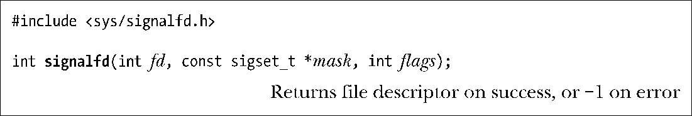
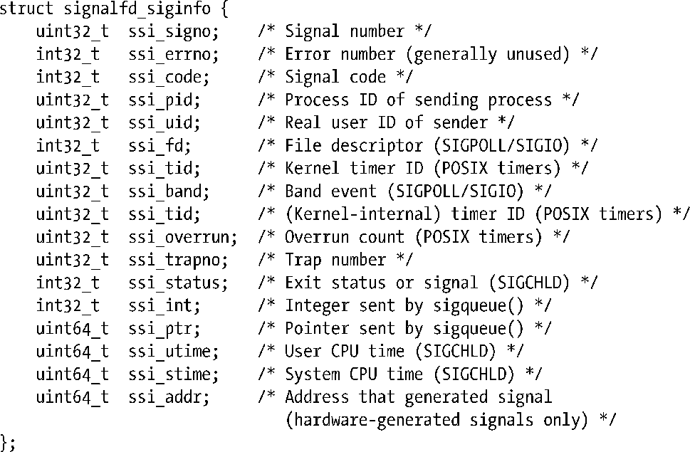
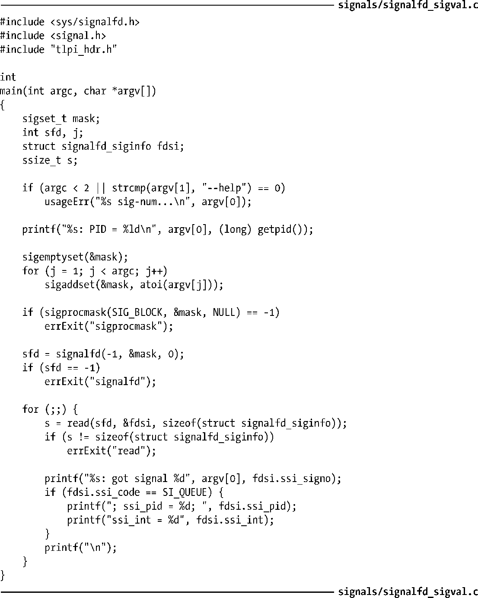
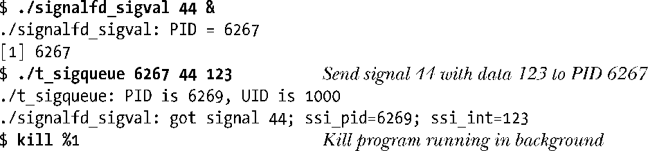

### 22.11　通过文件描述符来获取信号

始于内核2.6.22，Linux提供了（非标准的）signalfd()系统调用；利用该调用可以创建一个特殊文件描述符，发往调用者的信号都可从该描述符中读取。signalfd机制为同步接受信号提供了sigwaitinfo()之外的另一种选择。

mask参数是一个信号集，指定了有意通过signalfd文件描述符来读取的信号。如同sigwaitinfo()一样，通常也应该使用sigprocmask()阻塞mask中的所有信号，以确保在有机会读取这些信号之前，不会按照默认处置对它们进行处理。

如果指定fd为−1，那么signalfd()会创建一个新的文件描述符，用于读取mask中的信号；否则，将修改与fd相关的mask值，且该fd一定是由之前对signalfd()的一次调用创建而成。

早期实现将flag参数保留下来供将来使用，且必须将其指定为0。然而，Linux从版本2.6.27开始支持下面两个标志。

##### SFD_CLOEXEC

为新的文件描述符设置close-on-exec（FD_CLOEXEC）标志。该标志之所以必要，与4.3.1节中描述的open()O_CLOEXEC标志的设置理由相同。

##### SFD_NONBLOCK

为底层的打开文件描述设置O_NONBLOCK标志，以确保不会阻塞未来的读操作。既省去了一个额外的fcntl()调用，又获得了相同的结果。

创建文件描述符之后，可以使用read()调用从中读取信号。提供给read()的缓冲区必须足够大，至少应能够容纳一个signalfd_siginfo结构。<sys/signalfd.h>文件定义了该结构，如下所示：

该结构中字段所返回的信息与传统siginfo_t结构（21.4节）中类似命名的字段信息相同。

read()每次调用都将返回与等待信号数目相等的signalfd_siginfo结构，并填充到已提供的缓冲区中。如果调用时并无信号正在等待，那么read()将阻塞，直到有信号到达。也可以使用fcntl()的F_SETFL操作（5.3节）来为文件描述符设置O_NONBLOCK标志，使得读操作不再阻塞，且若无信号等待，则调用失败，errno为EAGAIN。

当从signalfd文件描述符中读取到一信号时，该信号获得接纳，且不再为该进程而等待。

程序清单22-7：使用signalfd()来读取信号

select()、poll()和epoll（参见第63章）可以将signalfd描述符和其他描述符混合起来进行监控。撇开其他用途不提，该特性可成为63.5.2节所述self-pipe技巧之外的另一选择。如果有信号正在等待，那么这些技术将文件描述符指示为可读取。

当不再需要signalfd文件描述符时，应当关闭signalfd以释放相关内核资源。

程序清单22-7展示了signalfd()的用法。程序为在命令行参数中指定的信号创建掩码，阻塞这些信号，然后创建用来读取这些信号的signalfd文件描述符，之后循环从该文件描述符中读取信号，并显示返回的signalfd_siginfo结构中的部分信息。如下shell会话在后台运行了程序清单22-7中程序，并使用程序清单22-2中程序（t_sigqueue.c）向该进程发送实时信号及伴随数据：

