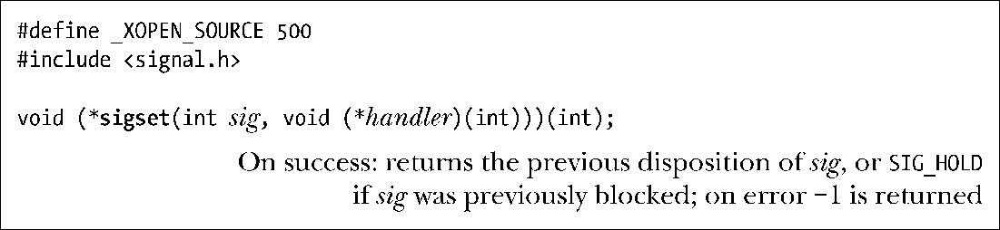
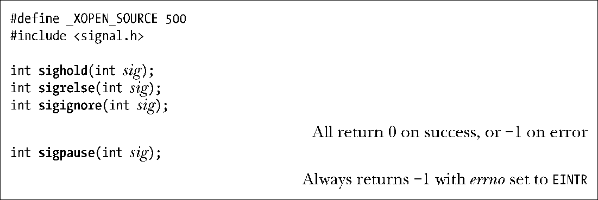
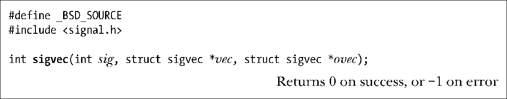
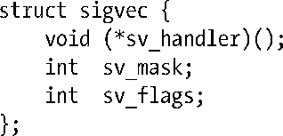
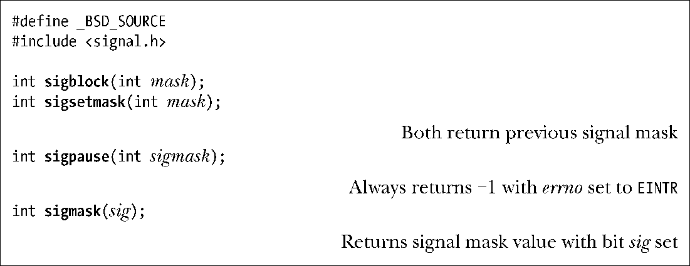
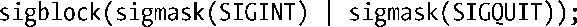

### 22.13　早期的信号API（System V和BSD）

之前对信号的讨论一直着眼于POSIX信号API。本节将简要回顾一下System V和BSD提供的历史API。虽然所有的新应用程序都应当使用POSIX API，但是在从其他UNIX实现移植（通常较为老迈的）应用时，可能还是会碰到这些过时的API。当移植这些使用老旧API的程序时，因为Linux（像许多其他UNIX实现一样）提供了与System V和BSD兼容的API，所以通常所要做的全部工作不过是在Linux平台上重新进行编译而已。

#### System V信号API

如前所述，System V中的信号API存在一个重要差异：当使用signal()建立处理器函数时，得到的是老版、不可靠的信号语义。这意味着不会将信号添加到进程的信号掩码中，调用信号处理器时会将信号处置重置为默认行为，以及不会自动重启系统调用。

下面，简单介绍一些System V信号API中的函数。手册页提供有全部的细节。SUSv3定义了所有这些函数，但指出应优先使用现代版的POSIX等价函数。SUSv4将这些函数标记为已废止。

为了建立一个具有可靠语义的信号处理器，System V提供了sigset()调用（原型类似于signal()）。与signal()一样，可以将sigset()的handler参数指定为SIG_IGN、SIG_DFL或者信号处理器函数的地址。此外，还可以将其指定为SIG_HOLD，在将信号添加到进程信号掩码的同时保持信号处置不变。

如果指定handler参数为SIG_HOLD之外的其他值，那么会将sig从进程信号掩码中移除（即，如果sig遭到阻塞，那么将解除对其阻塞）。

sighold()函数将一个信号添加到进程信号掩码中。sigrelse()函数则是从信号掩码中移除一个信号。sigignore()函数设定对某信号的处置为“忽略（ignore）”。sigpause()函数类似于sigsuspend()函数，但仅从进程信号掩码中移除一个信号，随后将暂停进程，直到有信号到达。

#### BSD信号API

POSIX信号API从4.2BSD API中汲取了很多灵感，所以BSD函数与POSIX函数大体相仿。

如同前文对System V信号API中函数的描述一样，首先给出BSD信号API中各函数的原型，随后简单解释一下每个函数的操作。再啰嗦一句，手册页提供有全部细节。

sigvec()类似于sigaction()。vec和ovec参数是指向如下类型结构的指针：

sigvec结构中的字段与sigaction结构中的那些字段紧密对应。第一个显著差异是sv_mask（类似与sa_mask）字段是一个整型，而非sigset_t类型。这意味着，在32位架构中，最多支持31个不同信号。另一个不同之处则在于在sv_flags（类似与a_flags）字段中使用了SV_INTERRUPT标志。因为重启系统调用是4.2BSD的默认行为，该标志是用来指定应使用信号处理器来中断慢速系统调用。（这点与POSIX API截然相反，在使用sigaction()建立信号处理器时，如果希望启用系统调用重启功能，就必须显式指定SA_RESTART标志。）

sigblock()函数向进程信号掩码中添加一组信号。这类似于sigprocmask()的SIG_BLOCK操作。sigsetmask()调用则为信号掩码指定了一个绝对值。这类似于sigprocmask()的SIG_SETMASK操作。

sigpause()类似于sigsuspend()。注意，对该函数的定义在System V和BSD API中具有不同的调用签名。GNU C函数库默认提供System V版本，除非在编译程序时指定了特性测试宏_BSD_SOURCE。

sigmask()宏将信号编号转换成相应的32位掩码值。此类位掩码可以彼此相或，一起创建一组信号，如下所示：

