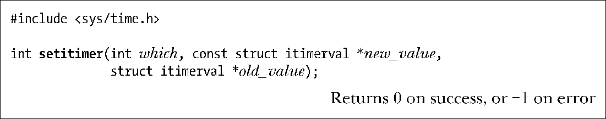
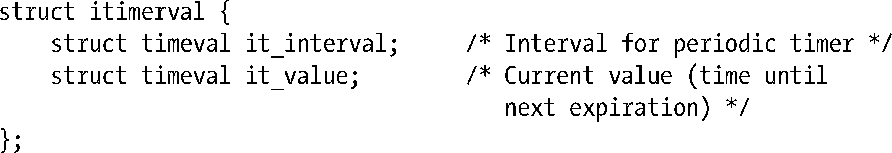
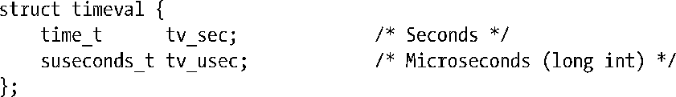
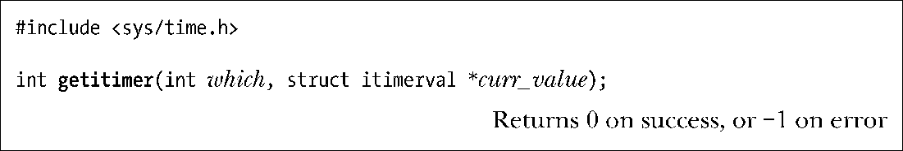
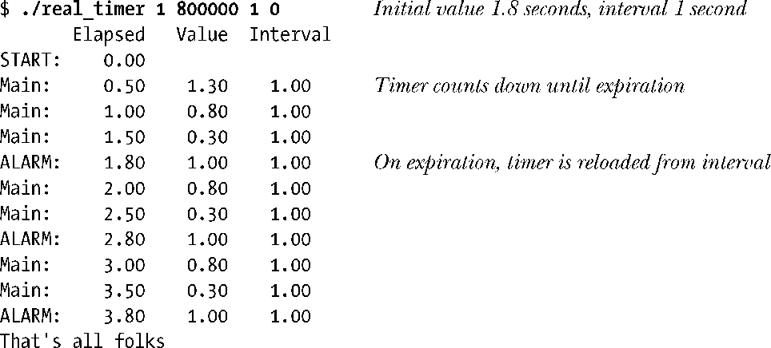
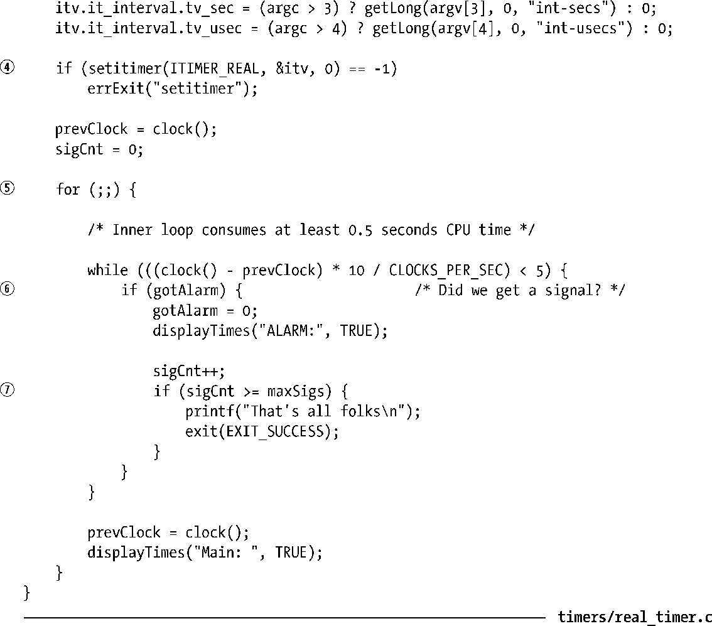
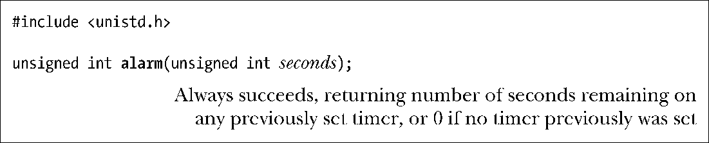

### 23.1　间隔定时器

系统调用setitimer()创建一个间隔式定时器（interval timer），这种定时器会在未来某个时间点到期，并于此后（可选择地）每隔一段时间到期一次。

通过在调用setitimer()时为which指定以下值，进程可以创建3种不同类型的定时器。

##### ITIMER_REAL

创建以真实时间倒计时的定时器。到期时会产生SIGALARM信号并发送给进程。

##### ITIMER_VIRTUAL

创建以进程虚拟时间（用户模式下的CPU时间）倒计时的定时器。到期时会产生信号SIGVTALRM。

##### ITIMER_PROF

创建一个profiling定时器，以进程时间（用户态与内核态CPU时间的总和）倒计时。到期时，则会产生SIGPROF信号。

对所有这些信号的默认处置（disposition）均会终止进程。除非真地期望如此，否则就需要针对这些定时器信号创建处理器函数。

参数new_value和old_value均为指向结构itimerval的指针，结构的定义如下：

结构itimerval中的字段类型均为timeval结构，timeval又由秒和微秒两部分组成：

参数new_value的下属结构it_value指定了距离定时器到期的延迟时间。另一下属结构it_interval则说明该定时器是否为周期性定时器。如果it_interval的两个字段值均为0，那么该定时器就属于在it_value所指定的时间间隔后到期的一次性定时器。只要it_interval中的任一字段非0，那么在每次定时器到期之后，都会将定时器重置为在指定间隔后再次到期。

进程只能拥有上述3种定时器中的一种。当第2次调用setitimer()时，修改已有定时器的属性要符合参数which中的类型。如果调用setitimer()时将new_value.it_value的两个字段均置为0，那么会屏蔽任何已有的定时器。

若参数old_value不为NULL，则以其所指向的itimerval结构来返回定时器的前一设置。如果old_value.it_value的两个字段值均为0，那么该定时器之前处于屏蔽状态。如果old_value.it_interval的两个字段值均为0，那么该定时器之前被设置为历经old_value.it_value指定时间而到期的一次性定时器。对于需要在新定时器到期后将其还原的情况而言，获取定时器的前一设置就很重要。如果不关心定时器的前一设置，可以将old_value置为NULL。

定时器会从初始值（it_value）倒计时一直到0为止。递减为0时，会将相应信号发送给进程，随后，如果时间间隔值（it_interval）非0，那么会再次将it_value加载至定时器，重新开始向0倒计时。

可以在任何时刻调用getitimer()，以了解定时器的当前状态、距离下次到期的剩余时间。

系统调用getitimer()返回由which指定定时器的当前状态，并置于由curr_value所指向的缓冲区中。这与setitimer()借参数old_value所返回的信息完全相同，区别则在于getitimer()无需为了获取这些信息而改变定时器的设置。子结构curr_value.it_value返回距离下一次到期所剩余的总时间。该值会随定时器倒计时而变化，如果设置定时器时将it_interval置为非0值，那么会在定时器到期时将其重置。子结构curr_value.it_interval返回定时器的间隔时间，除非再次调用setitimer()，否则该值一直保持不变。

使用setitimer()（和alam()，稍后讨论）创建的定时器可以跨越exec()调用而得以保存，但由fork()创建的子进程并不继承该定时器。

> SUSv4废止了getitimer()和setitimer()，同时推荐使用POSIX定时器API（23.6节）。

#### 示例程序

程序清单23-1演示了setitimer()和getitimer()的使用，所执行的步骤如下。

+ 为SIGALRM信号创建处理器函数③。
+ 利用命令行参数为实时（ITIMER_REAL）定时器设置到期值及间隔时间④。若未提供命令行参数，程序默认创建一个两秒到期的一次性定时器。
+ 进入一个循环⑤，消耗CPU时间并周期性地调用函数displayTimes()①。该函数会显示自程序启动以来逝去的真实时间，以及ITIMER_REAL定时器的当前状态。

每当定时器到期时，都会调用SIGALRM处理器函数，其中会去设置全局标志gotAlarm②。一旦设置了这一标志，主程序循环就会调用displayTimers()来显示处理器函数的调用时点以及定时器状态⑥。（之所以采用这一方式来设计信号处理器函数，意在避免从处理器函数内部去调用非异步信号安全的函数，究其原因可参考21.1.2节。）如果定时器的时间间隔为0，那么程序会在第1次收到信号时即行退出。否则，程序会在捕获到3个信号后终止。⑦

运行程序清单23-1中的程序，可以看到如下结果：

程序清单23-1：实时定时器的使用

#### 更为简单的定时器接口：alarm()

系统调用alarm()为创建一次性实时定时器提供了一个简单接口。（历史上，alarm()曾是设置定时器的原始UNIX API。）

参数seconds表示定时器到期的秒数。到期时，会向调用进程发送SIGALRM信号。

调用alarm()会覆盖对定时器的前一个设置。调用alarm(0)可屏蔽现有定时器。

alarm()的返回值是定时器前一设置距离到期的剩余秒数，如未设置定时器则返回0。

23.3节提供了一个使用alarm()的例子。

> 本书后面的一些示例会使用alarm()来启动定时器，同时不为SIGALRM信号设置处理器函数。采用该技术可以确保，即便进程没有终止，也能将其杀死。

#### setitimer()和alarm()之间的交互

Linux中，alarm()和setitimer()针对同一进程（per-process）共享同一实时定时器，这也意味着，无论调用两者之中的哪个完成了对定时器的前一设置，同样可以调用二者中的任一函数来改变这一设置。其他UNIX系统的情况可能会有所不同（也就是说，这两个函数可能分别控制着不同的定时器）。对于setitimer()与alarm()之间的交互，以及二者与sleep()函数（23.4.1节）之间的交互，SUSv3均未加以规范。为了确保应用程序可移植性的最大化，程序设置实时定时器的函数只能在二者中选择其一。

