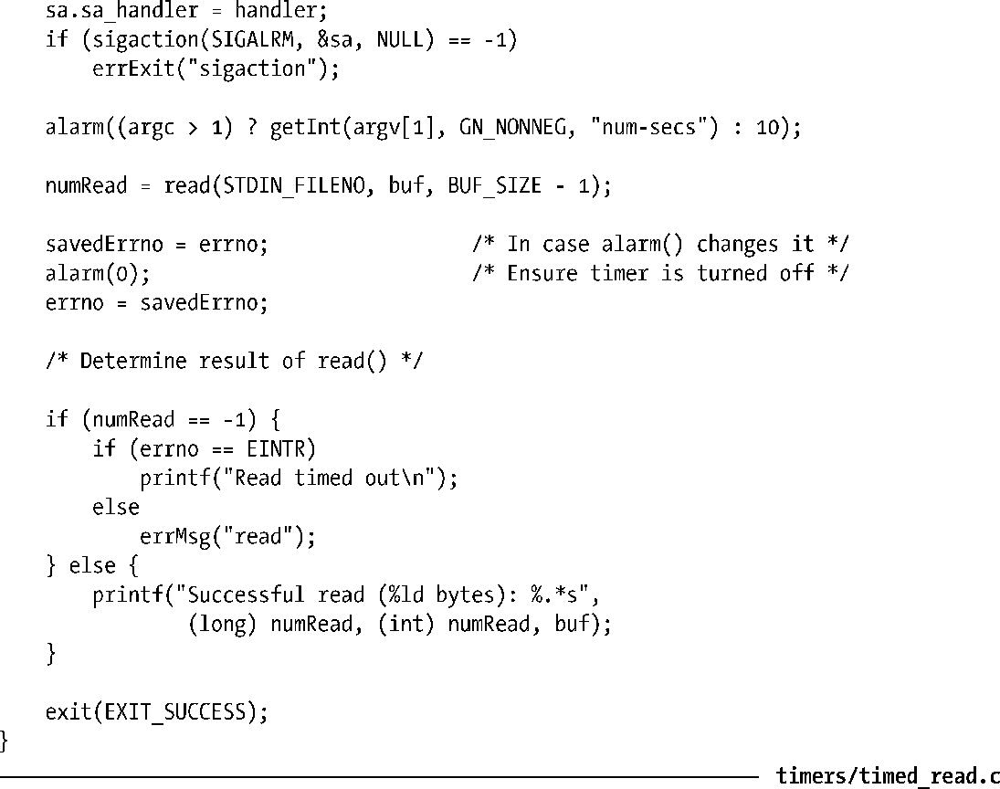

### 23.3　为阻塞操作设置超时

实时定时器的用途之一是为某个阻塞系统调用设置其处于阻塞状态的时间上限。例如，当用户在一段时间内没有输入整行命令时，可能希望取消对终端的read()操作。处理如下。

**1．** 调用sigaction()为SIGALRM信号创建处理器函数，排除SA_RESTART标志以确保系统调用不会重新启动（参考21.5节）。

**2．** 调用alarm()或setitimer()来创建一个定时器，同时设定希望系统调用阻塞的时间上限。

**3．** 执行阻塞式系统调用。

**4．** 系统调用返回后，再次调用alarm()或setitimer()以屏蔽定时器（以防止系统调用在定时器到期之前就已完成的情况）。

**5．** 检查系统调用失败时是否将errno置为EINTR（系统调用遭到中断）。

程序清单23-2针对read()调用展示了这一技术，创建定时器时使用的是alarm()。

程序清单23-2：运行设置了超时的read()

注意，程序清单23-2中程序理论上存在导致竞争条件的可能性。如果定时器到期时处于 alarm()调用之后，read()调用之前，那么信号处理器函数将不会中断read()。由于在这种场景下设定的超时值一般相对较大（至少几秒），故而发生上述情况的概率极低，因此这种技术实际上是可行的。[Stevens & Rago, 2005]推荐了另一种方法，使用的是longjmp()。在处理I/O系统调用时，还有另一种备选方案，利用了系统调用select()或poll()（第63章）的超时特性，锦上添花的是还能同时等待多路描述符的I/O。

