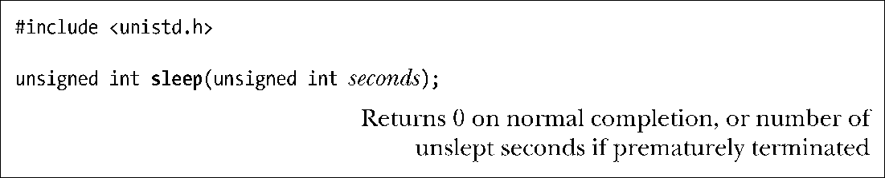

### 23.4.1　低分辨率休眠：sleep()

函数sleep()可以暂停调用进程的执行达数秒之久（由参数seconds设置），或者在捕获到信号（从而中断调用）后恢复进程的运行。

如果休眠正常结束，sleep()返回0。如果因信号而中断休眠，sleep()将返回剩余（未休眠）的秒数。与alarm()和setitimer()所设置的定时器相同，由于系统负载的原因，内核可能会在完成sleep()的一段（通常很短）时间后才对进程重新加以调度。

对于sleep()和alarm()以及setitimer()之间的交互方式，SUSv3并未加以规范。Linux将sleep()实现为对nanosleep()（23.4.2节）的调用，其结果是sleep()与定时器函数之间并无交互。不过，许多其他的实现，尤其是一些老系统，会使用alarm()以及SIGALRM信号处理器函数来实现sleep()。考虑到可移植性，应避免将sleep()和alarm()以及setitimer()混用。

