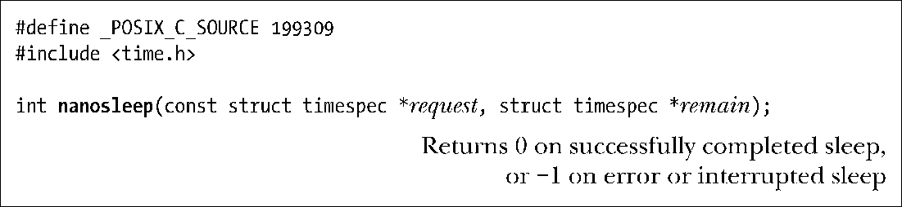
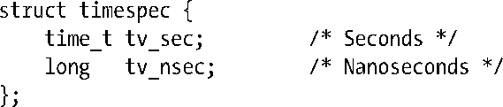
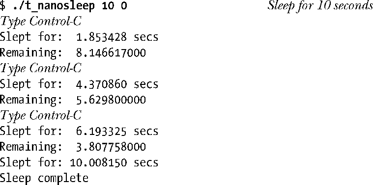
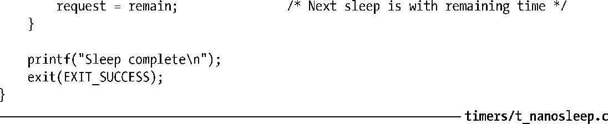

### 23.4.2　高分辨率休眠：nanosleep()

函数nanosleep()的功用与sleep()类似，但更具优势，其中包括能以更高分辨率来设定休眠间隔时间。

参数request指定了休眠的持续时间，是一个指向如下结构的指针：

tv_nsec字段为纳秒值，取值范围在0～999999999之间。

nanosleep()的更大优势在于，SUSv3明文规定不得使用信号来实现该函数。这意味着，与sleep()不同，即使将nanosleep()与alarm()或setitimer()混用，也不会危及程序的可移植性。

尽管 nanosleep()的实现并未使用信号，但还是可以通过信号处理器函数来将其中断。这时，nanosleep()将返回−1，并将 errno 置为 EINTR。同时，若参数 remain 不为 NULL，则该指针所指向的缓冲区将返回剩余的休眠时间。可利用这一返回值重启该系统调用以完成休眠。程序清单23-3演示了这一用途。程序从命令行参数中获取传入 nanosleep()的秒和纳秒值，并反复循环执行nanosleep()，直至耗尽全部的休眠间隔时间。如果信号SIGINT（按下 Ctrl-C产生）的处理器函数将nanosleep()中断，那么会以参数remain中的返回值重新调用nanosleep()。其运行结果如下：

虽然nanosleep()允许设定纳秒级精度的休眠间隔值，但其精度依然受制于软件时钟的间隔大小（10.6节）。如果指定的间隔值并非软件时钟间隔的整数倍，那么会对其向上取整。

> 前文曾提及，在支持高精度定时器的系统中，休眠时间间隔的精度要比软件时钟间隔精细许多。

当以高频率接收信号时，这一取整行为会给程序清单23-3中程序所采用的编程手法带来问题。由于返回的remain时间未必是软件时钟间隔的整数倍，故而nanosleep()的每次重启都会遭遇取整错误。其结果是，nanosleep()每次重启后的休眠时间都要长于前一调用返回的remain值。在信号接收频率极高的情况下（与软件时钟间隔的频率一致或更高），进程的休眠可能永远也完成不了。Linux 2.6中，使用带有TIMER_ABSTIME选项的clock_nanosleep()可以避免这一问题。23.5.4节将对clock_nanosleep()加以讨论。

> 在2.4以及更早期的Linux内核版本中，nanosleep()的实现存在着一种奇怪的特性。假设正在执行nanosleep()的进程因信号而停止，当进程于稍后截获SIGCONT而继续运行时，nanosleep()会如期调用失败并返回EINTR错误。不过，如果进程接着重启nanosleep()调用，那么进程处于停止状态所消耗的时间将不会计入休眠间隔时间，进程的休眠时间也就比预期的要久。Linux 2.6中去除了这一怪异特性，nanosleep()在收到SIGCONT信号时将自动恢复，进程处于停止状态所消耗的时间也会计入休眠间隔时间。

程序清单23-3：使用nanosleep()

