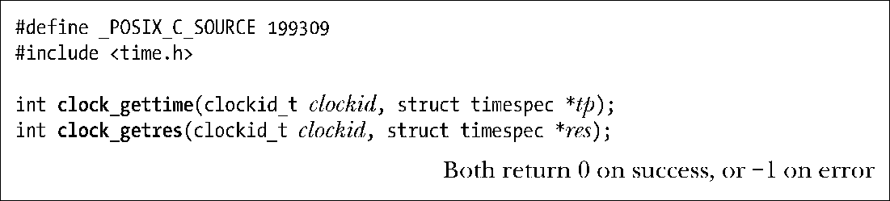

### 23.5.1　获取时钟的值：clock_gettime()

系统调用clock_gettime()针对参数clockid所指定的时钟返回时间。

返回的时间值置于tp指针所指向的timespec结构中。虽然timespec结构提供了纳秒级精度，但clock_gettime()返回的时间值粒度可能还是要更大一点。系统调用clock_getres()在参数res中返回指向timespec结构的指针，机构中包含了由clockid所指定时钟的分辨率。

clockid_t是一种由SUSv3定义的数据类型，用于表示时钟标识符。表23-1中第1列值即可用于设定clockid。

<b class="my_markdown">表23-1：POSIX.1b时钟类型</b>

| 时钟ID | 描　　述 |
| :-----  | :-----  | :-----  | :-----  |
| CLOCK_REALTIME | 可设定的系统级实时时钟 |
| CLOCK_MONOTONIC | 不可设定的恒定态时钟 |
| CLOCK_PROCESS_CPUTIME_ID | 每进程CPU时间的时钟（自Linux 2.6.12） |
| CLOCK_THREAD_CPUTIME_ID | 每线程CPU时间的时钟（自Linux 2.6.12） |

CLOCK_REALTIME时钟是一种系统级时钟，用于度量真实时间。与CLOCK_MONOTONIC时钟不同，它的设置是可以变更的。

SUSv3规定，CLOCK_MONOTONIC时钟对时间的度量始于“未予规范的过去某一时点”，系统启动后就不会发生改变。该时钟适用于那些无法容忍系统时钟发生跳跃性变化（例如：手工改变了系统时间）的应用程序。Linux上，这种时钟对时间的测量始于系统启动。

CLOCK_PROCESS_CPUTIME_ID 时钟测量调用进程所消耗的用户和系统 CPU 时间。CLOCK_THREAD_CPUTIME_ID时钟的功用与之相类似，不过测量对象是进程中的单条线程。

SUSv3规范了表23-1中的所有时钟，但强制要求实现的仅有CLOCK_REALTIME一种，这同时也是受到UNIX实现广泛支持的时钟类型。

> Linux 2.6.28增加了一种新的时钟类型：CLOCK_MONOTONIC_RAW。类似于CLOCK_MONOTONIC，这也是一种无法设置的时钟，但是提供了对纯基于硬件时间的访问，且不受NTP时间调整的影响。这种非标准时钟适用于专业时钟同步应用程序。
> Linux 2.6.35又提供了两种新时钟：CLOCK_REALTIME_COARSE和CLOCK_MONTIC_COARSE。这些时钟类似于CLOCK_REALTIME和CLOCK_MONTONIC，适用于那些希望以最小代价获取较低分辨率时间戳的程序。这些非标准时钟不会引发对硬件时钟的任何访问（访问某些硬件时钟源的代价高昂），其返回值的分辨率为jiffy（软件时钟周期，见10.6节）。

