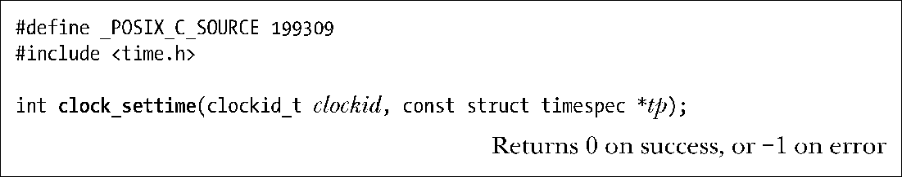

### 23.5.2　设置时钟的值：clock_settime()

系统调用clock_settime()利用参数tp所指向缓冲区中的时间来设置由clockid指定的时钟。

如果由tp指定的时间并非由clock_getres()所返回时钟分辨率的整数倍，时间会向下取整。

特权级（CAP_SYS_TIME）进程可以设置CLOCK_REALTIME时钟。该时钟的初始值通常是自Epoch（1970年1月1日0点0分0秒）以来的时间。表23-1中的其他时钟均不可更改。

> 根据SUSv3，系统实现可允许设置CLOCK_PROCESS_CPUTIME_ID和CLOCK_THR EAD_CPUTIME_ID型时钟。撰写本书之际，这些时钟在Linux上依然是只读属性。

