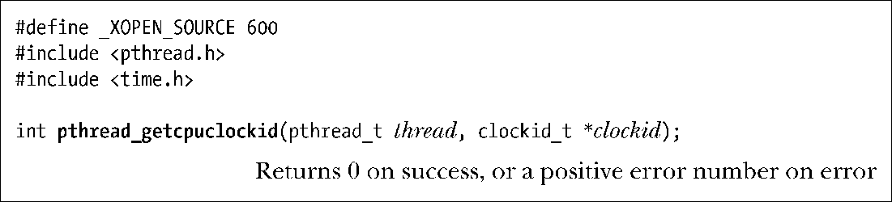

### 23.5.3　获取特定进程或线程的时钟ID

要测量特定进程或线程所消耗的CPU时间，首先可借助本节所描述的函数来获取其时钟ID。接着再以此返回id去调用clock_gettime()，从而获得进程或线程耗费的CPU时间。

函数clock_getcpuclockid()会将隶属于pid进程的CPU时间时钟的标识符置于clockid指针所指向的缓冲区中。

参数pid为0时，clock_getcpuclockid()返回调用进程的CPU时间时钟ID。

函数pthread_getcpuclockid()是clock_getcpuclockid()的POSIX线程版，返回的标识符所标识的时钟用于度量调用进程中指定线程消耗的CPU时间。

参数thread是POSIX线程ID，用于指定希望获取的CPU时钟ID所从属的线程。返回的时钟ID存放于clockid指针所指向的缓冲区中。

