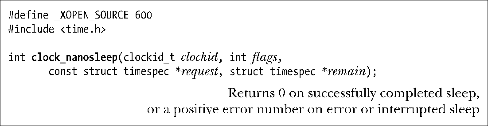

### 23.5.4　高分辨率休眠的改进版：clock_nanosleep()

类似于nanosleep()，Linux特有的clock_nanosleep()系统调用也可以暂停调用进程，直到历经一段指定的时间间隔后，亦或是收到信号才恢复运行。本节将讨论两者间的差异。

参数request及remain同nanosleep()中的对应参数目的相似。

默认情况下（即flags为0），由request指定的休眠间隔时间是相对时间（类似于nanosleep()）。不过，如果在flags（参考程序清单23-4）中设定了TIMER_ABSTIME，request则表示 clockid时钟所测量的绝对时间。这一特性对于那些需要精确休眠一段指定时间的应用程序至关重要。如果只是先获取当前时间，计算与目标时间的差距，再以相对时间进行休眠，进程可能执行到一半就被占先了①，结果休眠时间比预期的要久。

如23.4.2节所述，对于那些被信号处理器函数中断并使用循环重启休眠的进程来说，“嗜睡（oversleeping）”问题尤其明显。如果以高频率接收信号，那么按相对时间休眠（nanosleep()所执行的类型）的进程在休眠时间上会有较大误差。但可以通过如下方式来避免嗜睡问题：先调用 clock_gettime()获取时间，加上期望休眠的时间量，再以 TIMER_ABSTIME 标志调用 clock_nanosleep()函数（并且，如果被信号处理器中断，则会重启系统调用）。

指定TIMER_ABSTIME时，不再（且不需要）使用参数remain。如果信号处理器程序中断了clock_nanosleep()调用，再次调用该函数来重启休眠时，request参数不变。

将clock_nanosleep()与nanosleep()区分开来的另一特性在于，可以选择不同的时钟来测量休眠间隔时间。可在clockid中指定所期望的时钟CLOCK_REALTIME、CLOCK_MONOTONIC或CLOCK_PROCESS_CPUTIME_ID。请参考表23-1对这些时钟的描述。

程序清单23-4演示了clock_nanosleep()的用法：针对CLOCK_REALTIME时钟，以绝对时间休眠20秒。

程序清单23-4：使用clock_nanosleep()

