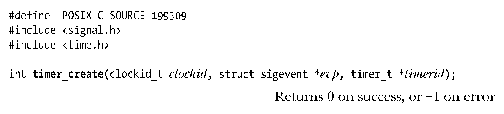

### 23.6.1　创建定时器：timer_create()

函数timer_create()创建一个新定时器，并以由clockid指定的时钟来进行时间度量。

设置参数clockid，可以使用表23-1中的任意值，也可以采用clock_getcpuclocid()或pthread_getcpuclockid()返回的clockid值。函数返回时会在参数timerid所指向的缓冲区中放置定时器句柄（handle），供后续调用中指代该定时器之用。这一缓冲区的类型为timer_t，是一种由SUSv3定义的数据类型，用于标识定时器。

参数evp可决定定时器到期时对应用程序的通知方式，指向类型为sigevent的数据结构，具体定义如下：

可以表23-2所示值之一来设置结构中的sigev_notify字段。

<b class="my_markdown">表23-2：sigevent结构中sigev_notify字段的值</b>

| sigev_notify的值 | 通 知 方 法 | SUSv3 |
| :-----  | :-----  | :-----  | :-----  | :-----  |
| SIGEV_NONE | 不通知；使用timer_gettime()监测定时器 | ● |
| SIGEV_SIGNAL | 发送sigev_signo信号给进程 | ● |
| SIGEV_THREAD | 调用sigev_notify_function作为新线程的启动函数 | ● |
| SIGEV_THREAD_ID | 发送sigev_signo信号给 sigev_notify_thread_id所标识的线程 |

关于sigev_notify常量值的更多细节，以及sigval结构中与每个常量值相关的字段，特做如下说明。

##### SIGEV_NONE

不提供定时器到期通知。进程可以使用timer_gettime()来监控定时器的运转情况。

##### SIGEV_SIGNAL

定时器到期时，为进程生成指定于sigev_signo中的信号。如果sigev_signal为实时信号，那么sigev_value字段则指定了信号的伴随数据（整型或指针）（22.8.1节）。通过siginfo_t结构的si_value可获取这一数据，至于siginfo_t结构，既可以直接传递给该信号的处理器函数，也可以由调用sigwaitinfo()或sigtimerdwait()返回。

##### SIGEV_THREAD

定时器到期时，会调用由sigev_notify_function字段指定的函数。调用该函数类似于调用新线程的启动函数。上述措词摘自SUSv3，即允许系统实现以如下两种方式为周期性定时器产生通知：要么将每个通知分别传递给一个唯一的新线程，要么将通知成系列发送给单个新线程。可将sigev_notify_attribytes字段置为NULL，或是指向pthread_attr_t结构的指针，并在结构中定义线程属性。在sigev_value中设定的联合体sigval值是传递给函数的唯一参数。

##### SIGEV_THREAD_ID

这与SIGEV_SIGNAL相类似，只是发送信号的目标线程ID要与sigev_notify_thread_id相匹配。该线程应与调用线程同属一个进程。（伴随SIGEV_SIGNAL通知，会将信号置于针对整个进程的一个队列中排队，并且，如果进程包含多条线程，那么可将信号传递给进程中的任意线程。）可用 clone()或 gettid()的返回值对 sigev_notify_thread_id 赋值。设计 SIGEV_THREAD_ID标志，意在供线程库使用。（要求线程实现使用28.2.1 节描述的CLONE_THREAD选项。现代NPTL线程实现采用了CLONE_THREAD，但较老的LinuxThreads线程则没有。）

除去Linux系统特有的SIGEV_THREAD_ID之外，SUSv3定义了上述所有常量。

将参数evp置为NULL，这相当于将sigev_notify置为SIGEV_SIGNAL，同时将sigev_signo置为SIGALRM（这与其他系统可能会有出入，因为SUSv3的措词是：一个缺省的信号值），并将sigev_value.sival_int置为定时器ID。

在当前实现中，内核会为每个用timer_create()创建的POSIX定时器在队列中预分配一个实时信号结构。之所以要采取预分配，旨在确保当定时器到期时，至少有一个有效结构可服务于所产生的队列化信号。这也意味着可以创建的POSIX定时器数量受制于排队实时信号的数量（参考22.8节）。

