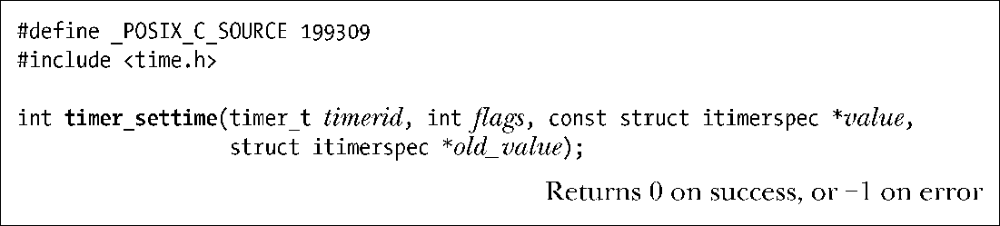
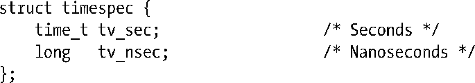

### 23.6.2　配备和解除定时器：timer_settime()

一旦创建了定时器，就可以使用timer_settime()对其进行配备（启动）或解除（停止）。

函数timer_settime()的参数timerid是一个定时器句柄（handle），由之前对timer_create()的调用返回。

参数value和old_value则类似于函数setitimer()的同名参数：value中包含定时器的新设置，old_value则用于返回定时器的前一设置（参考稍后对timer_gettime()的说明）。如果对定时器的前一设置不感兴趣，可将old_value设为NULL。参数value和old_value都是指向结构itimerspec的指针，该结构定义如下：

结构itimerspec中的所有字段都是timespec类型的结构，用秒和纳秒来指定时间：

it_value指定了定时器首次到期的时间。如果it_interval的任一子字段非0，那么这就是一个周期性定时器，在经历了由it_value指定的初次到期后，会按这些子字段指定的频率周期性到期。如果it_interval的下属字段均为0，那么这个定时器将只到期一次。

若将flags置为0，则会将value.it_value视为始于timer_settime()（与setitimer()类似）调用时间点的相对值。如果将flags设为TIMER_ABSTIME，那么value.it_value则是一个绝对时间（从时钟值0开始）。一旦时钟过了这一时间，定时器会立即到期。

为了启动定时器，需要调用函数timer_settime()，并将value.it_value的一个或全部下属字段设为非0值。如果之前曾经配备过定时器，timer_settime()会将之前的设置替换掉。

如果定时器的值和间隔时间并非对应时钟分辨率（由clock_getres()返回）的整数倍，那么会对这些值做向上取整处理。

定时器每次到期时，都会按特定方式通知进程，这种方式由创建定时器的 timer_create()定义。如果结构it_interval包含非0值，那么会用这些值来重新加载it_value结构。

要解除定时器，需要调用timer_settime()，并将value.it_value的所有字段指定为0。

