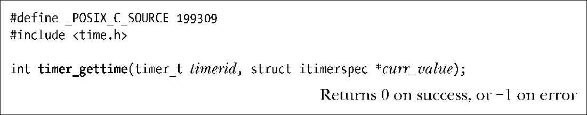

### 23.6.3　获取定时器的当前值：timer_gettime()

系统调用timer_gettime()返回由timerid指定POSIX定时器的间隔以及剩余时间。

curr_value指针所指向的itimerspec结构中返回的是时间间隔以及距离下次定时器到期的时间。即使是以TIMER_ABSTIME标志创建的绝对时间定时器，在curr_value.it_value字段中返回的也是距离定时器下次到期的时间值。

如果返回结构curr_value.it_value的两个字段均为0，那么定时器当前处于停止状态。如果返回结构curr_value.it_interval的两个字段都是0，那么该定时器仅在curr_value.it_value给定的时间到期过一次。

