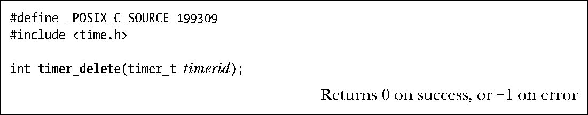

### 23.6.4　删除定时器：timer_delete()

每个POSIX定时器都会消耗少量系统资源。所以，一旦使用完毕，应当用timer_delete()来移除定时器并释放这些资源。

参数timerid是之前调用timer_create()时返回的句柄。对于已启动的定时器，会在移除前自动将其停止。如果因定时器到期而已经存在待定（pending）信号，那么信号会保持这一状态。（SUSv3对此并未加以规范，所以其他的一些UNIX实现可能会有不同行为。）当进程终止时，会自动删除所有定时器。

