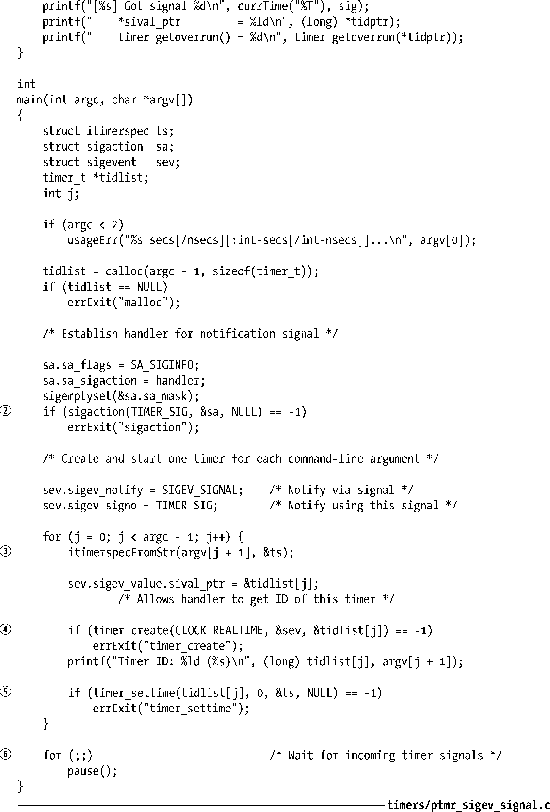
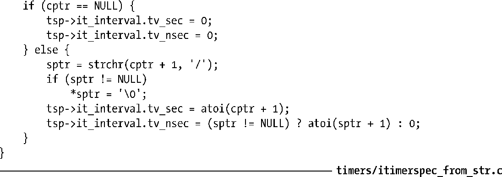
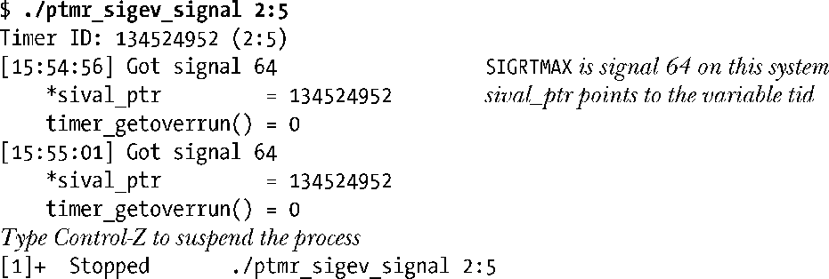
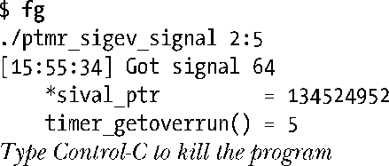

### 23.6.5　通过信号发出通知

如果选择通过信号来接收定时器通知，那么处理这些信号时既可以采用信号处理器函数，也可以调用sigwaitinfo()或是sigtimerdwait()。接收进程借助于这两种方法可以获得一个siginfo_t结构（21.4节），其中包含与信号相关的深入信息。（要在信号处理器函数中使用这种特性，创建信号处理器函数时需设置SA_SIGINFO标志。）在结构siginfo_t中设置如下字段。

+ si_signo：包含由定时器产生的信号。
+ si_code：置为SI_TIMER，表示这是因POSIX定时器到期而产生的信号。
+ si_value：将该字段置为以timer_create()创建定时器时在evp.sigev_value中提供的值。为evp.sigev_value指定不同的值，可以将到期时发送同类信号的不同定时器区分开来。

调用timer_create()时，通常将evp.sigev_value.sival_ptr赋值为当前调用中参数timerid的地址（见程序清单23-5）。从而允许信号处理器函数（或sigwaitinfo()调用）获得产生信号的定时器ID。（另外，也可以将调用函数timer_create()时给定的timerid参数置于一结构中，并将结构地址赋予evp.sigev_value.sival_ptr。）

Linux还为siginfo_t结构提供了如下非标准字段。

+ si_overrun：包含了定时器溢出个数（在23.6.6节中说明）。

> Linux还支持另一个非标准字段si_timerid，其中包含一个标识符，供系统内部识别定时器之用（与timer_create()返回的ID不同）。对于应用程序来说没什么用处。

程序清单23-5所演示的是使用信号作为POSIX定时器的通知机制。

程序清单23-5：使用信号进行POSIX定时器通知

程序清单23-5程序的每个命令行参数都为定时器指定了初始值及间隔时间。程序的“用法”输出中描述了这些参数的语法，并在后面的shell会话中做了演示。程序执行的步骤如下。

+ 为用于定时器通知的信号创建处理器函数②。
+ 为每一个命令行参数，创建④并配备⑤一个使用SIGEV_SIGNAL通知机制的POSIX定时器。至于将命令行参数转换③为itimerspec结构的函数itimerspecFromStr()，请参考程序清单23-6。
+ 每当一个定时器到期时，都将发送由sev.sigev_signo指定的信号给进程。信号处理器函数会将sev.sigev_value.sival_ptr中提供的值（定时器ID，tidlist[j]）以及定时器溢出值①显示出来。
+ 创建并配备定时器之后，在循环中反复调用pause()，以等待定时器到期⑥。

程序清单23-6中函数可将程序23-5的命令行参数转化为相应的itimerspec结构。函数可识别的字符串参数格式在源码文件开始的注释中做了说明（并在下面的shell会话中做了演示）。

程序清单23-6：将“时间+间隔”的字符串转换为itimerspec的值

如下shell会话演示了对程序清单23-5中程序的调用，创建了一个初始到期值为2秒，间隔时间为5秒的定时器。

挂起程序后，暂停几秒钟，在恢复程序运行之前会有多个定时器到期。

程序输出的最后一行表明发生了5次定时器溢出，亦即在捕获上一信号之后定时器到期了6次。

