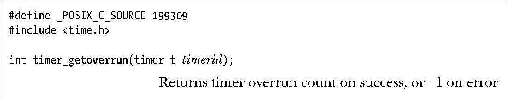

### 23.6.6　定时器溢出

假设已经选择通过信号（即sigev_notify为SIGEV_SIGNAL）传递的方式来接收定时器到期通知。进一步假设，在捕获或接收相关信号之前，定时器到期多次。这可能是因为进程再次获得调度前的延时所致。另外，不论是直接调用sigprocmask()，还是在信号处理器函数里暗中处理，也都有可能堵塞相关信号的发送。如何知道发生了这些定时器溢出呢？

也许会认为使用实时信号有助于解决这个问题，因为可以对实时信号的多个实例进行排队。不过，由于对排队实时信号有数量上的限制，结果证明这种方法也无法奏效。所以POSIX.1b委员会选用了另一种方法：一旦选择通过信号来接收定时器通知，那么即便用了实时信号，也绝不会对该信号的多个实例进行排队。相反，在接收信号后（无论是通过信号处理器函数还是调用sigwaitinfo()），可以获取定时器溢出计数，即在信号生成与接收之间发生的定时器到期额外次数。如果上次收到信号后定时器发生了3次到期，那么溢出计数是2。

接收到定时器信号之后，有两种方法可以获取定时器溢出值。

+ 调用timer_getoverrun()，稍后将会讨论。这是由SUSv3指定去获取溢出计数的方法。
+ 使用随信号一同返回的结构 siginfo_t 中的 si_overrun 字段值。这种方法可以避免timer_getoverrun()的系统调用开销，但同时也是一种Linux扩展方法，无法移植。

每次收到定时器信号后，都会重置定时器溢出计数。若自处理或接收定时器信号之后，定时器仅到期一次，则溢出计数为0（即无溢出）。

函数timer_getoverrun()返回由参数timerid指定定时器的溢出值。

根据SUSv3规定（表21-1），函数timer_getoverrun()是异步信号安全的函数之一，故而在信号处理器函数内部调用也是安全的。

