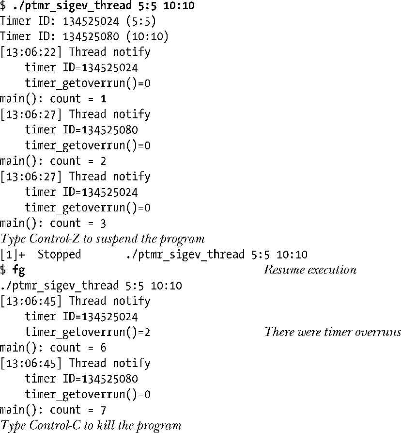
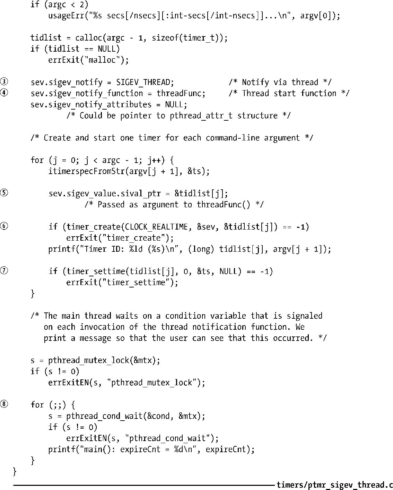

### 23.6.7　通过线程来通知

SIGEV_THREAD标志允许程序从一个独立的线程中调用函数来获取定时器到期通知。要理解这一标志的含义，需要具备第29章和第30章中关于POSIX线程的知识。如果不了解POSIX线程，那么在查看本节示例程序前，可能需要预先阅读一下这些章节。

程序清单23-7演示了SIGEV_THREAD的使用。该程序的命令行参数与程序清单23-5相同。所执行的步骤如下。

+ 针对每个命令行参数，程序都创建⑥并配备⑦一个使用了SIGEV_THREAD通知机制③的POSIX定时器。
+ 每当定时器到期时，会在一条独立线程中调用由sev.sigev_notify_function指定的函数。调用函数时，使用由sev.sigev_value.sival_ptr指定的值作为参数。程序中会将定时器ID（tidlist[j]）的地址赋给该字段⑤，以便在调用通知函数时可以获得定时器ID。
+ 创建和配备所有定时器之后，主程序进入循环并等待定时器到期⑧。每次循环，程序都会调用pthread_cond_wait()，等待处理定时器通知的线程就条件变量（cond）发出信号。
+ 每次定时器到期都会调用函数threadFunc()①。在打印消息后，增加全局变量expireCnt的值。考虑到定时器可能溢出，会将timer_getoverrun()的返回值也加入expireCnt变量中。（23.6.6节解释了定时器溢出与SIGEV_SIGNAL通知机制之间的关系。定时器溢出还可以与SIGEV_THREAD机制协作使用，因为在调用通知函数前，定时器可能会多次到期。）通知函数就条件变量（cond）发出信号，告知主程序定时器到期。

下面的shell会话日志展示了对程序清单23-7中程序的调用。在本例中，程序创建了两个定时器：一个定时器首次到期时间为5秒，并设置了5秒的时间间隔；另一个初次到期时间为10秒，并设置了10秒的时间间隔。

程序清单23-7：使用线程函数发送POSIX定时器通知

