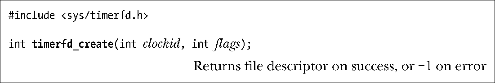
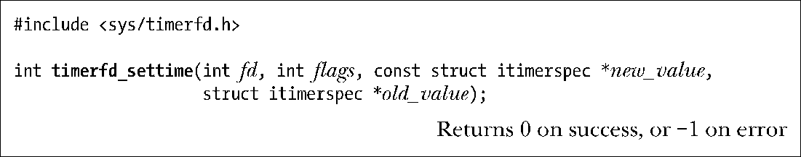
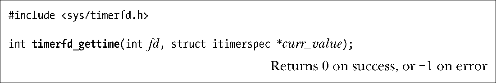
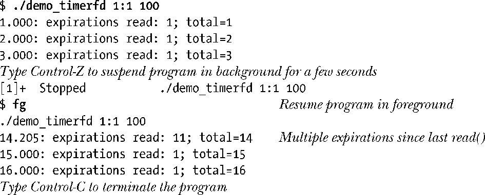

### 23.7　利用文件描述符进行通知的定时器：timerfd API

始于版本2.6.25，Linux内核提供了另一种创建定时器的API。Linux特有的timerfd API，可从文件描述符中读取其所创建定时器的到期通知。因为可以使用select()、poll()和epoll()（将在第63章进行讨论）将这种文件描述符会同其他描述符一同进行监控，所以非常实用。（至于说本章讨论的其他定时器API，想要把一个或多个定时器与一组文件描述符放在一起同时监测，可不是件容易的事。）

这组API中的3个新系统调用，其操作与23.6节所述的timer_create()、timer_settime()和timer_gettime()相类似。

新加入的第1个系统调用是timerfd_create()，它会创建一个新的定时器对象，并返回一个指代该对象的文件描述符。

参数clockid的值可以设置为CLOCK_REALTIME或CLOCK_MONOTONIC（参考表23-1）。

timerfd_create()的最初实现将参数flags预留供未来使用，必须设置为0。不过，Linux内核从2.6.27版本开始支持下面两种flags标志。

##### TFD_CLOEXEC

为新的文件描述符设置运行时关闭标志（FD_CLOEXEC）。与4.3.1节介绍的open()标志O_CLOEXEC适用于相同情况。

##### TFD_NONBLOCK

为底层的打开文件描述设置O_NONBLOCK标志，随后的读操作将是非阻塞式的。这样设置省却了对fcntl()的额外调用，却能达到相同效果。

timerfd_create()创建的定时器使用完毕后，应调用close()关闭相应的文件描述符，以便于内核能够释放与定时器相关的资源。

系统调用timerfd_settime()可以配备（启动）或解除（停止）由文件描述符fd所指代的定时器。

参数new_value为定时器指定新设置。参数old_value可用来返回定时器的前一设置（细节请参考随后对timerfd_gettime()的说明）。如果不关心定时器的前一设置，可将old_value置为NULL。两个参数均指向itimerspec结构，用法与timer_settime()（参考23.6.2节）相同。

参数flags与timer_settime()中的对应参数类似。可以是0，此时将new_value.it_value的值视为相对于调用timerfd_settime()时间点的相对时间，也可以设为TFD_TIMER_ABSTIME，将其视为一个绝对时间（从时钟的0点开始测量）。

系统调用timerfd_gettime()返回文件描述符fd所标识定时器的间隔及剩余时间。

同timer_gettime()一样，间隔以及距离下次到期的时间均返回curr_value指向的结构itimerspec中。即使是以TFD_TIMER_ABSTIME标志创建的绝对时间定时器，curr_vallue. it_value字段中返回值的意义也会保持不变。如果返回的结构curr_value.it_value中所有字段值均为0，那么该定时器已经被解除。如果返回的结构curr_value.it_interval中两字段值均为0，那么定时器只会到期一次，到期时间在curr_value.it_value中给出。

#### timerfd与fork()及exec()之间的交互

调用fork()期间，子进程会继承timerfd_create()所创建文件描述符的拷贝。这些描述符与父进程的对应描述符均指代相同的定时器对象，任一进程都可读取定时器的到期信息。

timerfd_create()创建的文件描述符能跨越exec()得以保存（除非将描述符置为运行时关闭，如27.4节所述），已配备的定时器在exec()之后会继续生成到期通知。

#### 从timerfd文件描述符读取

一旦以timerfd_settime()启动了定时器，就可以从相应文件描述符中调用read()来读取定时器的到期信息。出于这一目的，传给read()的缓冲区必须足以容纳一个无符号8字节整型（uint64_t）数。

在上次使用timerfd_settime()修改设置以后，或是最后一次执行read()后，如果发生了一起到多起定时器到期事件，那么read()会立即返回，且返回的缓冲区中包含了已发生的到期次数。如果并无定时器到期，read()会一直阻塞直至产生下一个到期。也可以执行fcntl()的F_SETFL操作（5.3节）为文件描述符设置O_NONBLOCK标志，这时的读动作是非阻塞式的，且如果没有定时器到期，则返回错误，并将errno值置为EAGAIN。

如前所述，可以利用select()、poll()和epoll()对timerfd文件描述符进行监控。如果定时器到期，会将对应的文件描述符标记为可读。

#### 示例程序

程序清单23-8演示了timerfd API的使用。该程序从命令行取得两个参数。第1个参数为必填项，用以标识定时器的初始和间隔时间。（程序清单23-6中的函数itimerspecFromStr()可以用来解析这一参数。）第2个参数是可选项，表示程序退出之前应等待的定时器过期最大次数，其默认值为1。

程序调用timerfd_create()来创建一个定时器，并通过timerfd_settime()将其启动。接着进入循环，从文件描述符中读取定时器到期通知，直至达到指定的定时器到期次数。每次read()之后，程序都会显示定时器启动以来的逝去时间、读取到的到期次数以及至今为止的到期总数。

下面的shell会话日志中，通过命令行参数创建了一个初始时间为1秒，间隔为1秒，最大到期次数为100次的定时器。

从以上结果可以看出，程序在后台暂停时定时器出现了多次到期。在程序恢复运行之后，第1次read()调用就返回了所有这些到期。

程序清单23-8：使用timerfd API

