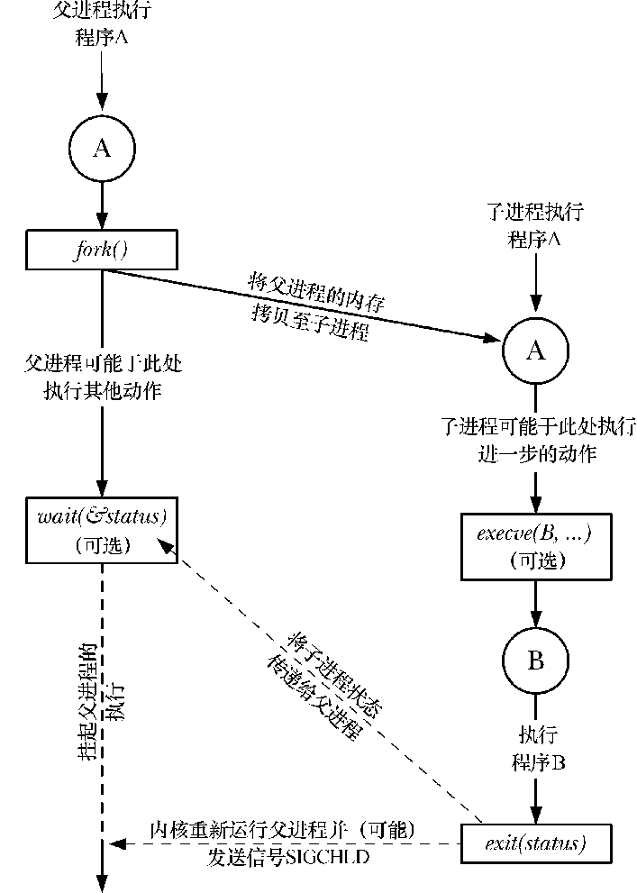

### 24.1　fork()、exit()、wait()以及execve()的简介

本章以及随后几章的议题会集中在fork()、exit()、wait()以及execve()这几个系统调用上。上述每种系统调用都各有变体，后续会一一论及。此处将首先对这4个系统调用及其典型用法简单加以介绍。

+ 系统调用fork()允许一进程（父进程）创建一新进程（子进程）。具体做法是，新的子进程几近于对父进程的翻版：子进程获得父进程的栈、数据段、堆和执行文本段（6.3节）的拷贝。可将此视为把父进程一分为二，术语fork也由此得名。
+ 库函数exit（status）终止一进程，将进程占用的所有资源（内存、文件描述符等）归还内核，交其进行再次分配。参数status为一整型变量，表示进程的退出状态。父进程可使用系统调用wait()来获取该状态。

> 库函数 exit()位于系统调用_exit()之上。第 25 章将解释二者之间的差异。这里只是强调，在调用fork()之后，父、子进程中一般只有一个会通过调用 exit()退出，而另一进程则应使用_exit()终止。

+ 系统调用wait（&status）的目的有二：其一，如果子进程尚未调用 exit()终止，那么wait()会挂起父进程直至子进程终止；其二，子进程的终止状态通过wait()的status参数返回。
+ 系统调用 execve(pathname，argv，envp)加载一个新程序（路径名为 pathname，参数列表为 argv，环境变量列表为 envp）到当前进程的内存。这将丢弃现存的程序文本段，并为新程序重新创建栈、数据段以及堆。通常将这一动作称为执行（execing）一个新程序。稍后会介绍构建于execve()之上的多个库函数，每种都为编程接口提供了实用的变体。在彼此差异无关宏旨的场合，循例会将此类函数统称为exec()，尽管实际上并没有以之命名的系统调用或者库函数。

其他一些操作系统则将fork()和exec()的功能合二为一，形成单一的spawn操作——创建一个新进程并执行指定程序。比较而言，UNIX的方案通常更为简单和优雅。两步走的策略使得API更为简单（系统调用fork()无需参数），程序也得以在这两步之间执行一些其他操作，因而更具弹性。另外，只执行fork()而不执行exec()的场景也颇为常见。

> SUSv3 所详细规定的 posix_spawn()函数，就将 fork()和 exec()的功能结合起来，但规范并未对实现此函数做强制要求。Linux 的 glibc 函数库实现了该函数以及SUSv3中的其他几个相关API。将posix_spawn()纳入SUSv3，意在为缺乏交换（swap）设施或内存管理单元（memory-management units）的硬件架构（嵌入式系统大多如此）编写具备可移植性的应用程序。在此类架构上实现传统意义的 fork()，即便存在可能性，难度也很大。

图24-1对fork()、exit()、wait()以及exece()之间的相互协同作了总结。（此图勾勒了 shell执行一条命令所历经的步骤：shell读取命令，进行各种处理，随之创建子进程以执行该命令，如此循环不已。）

<b class="my_markdown">图24-1：概述函数fork()、exit()、wait()和execve()的协同使用</b>

图中对execve()的调用并非必须。有时，让子进程继续执行与父进程相同的程序反而会有妙用。最终，两种情况殊途同归：总是要通过调用exit()（或接收一个信号）来终止子进程，而父进程可调用wait()来获取其终止状态。

同样，对wait()的调用也属于可选项。父进程可以对子进程不闻不问，继续我行我素。不过，由后续内容可知，对wait()的使用通常也是不可或缺的，每每在SIGCHLD信号的处理程序中使用。当子进程终止时，内核会为其父进程产生此类信号（默认的处理是忽略SIGCHLD信号，下图将此标记为可选，原因正在于此）。

