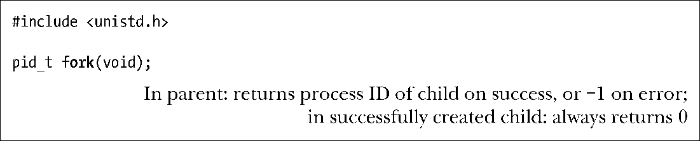
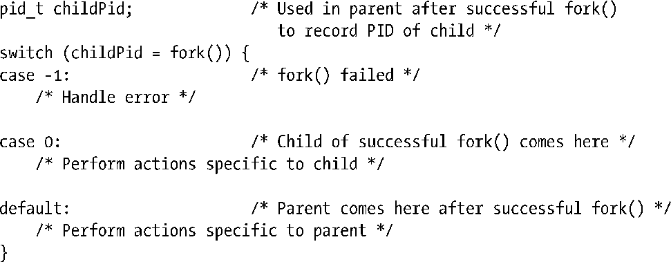
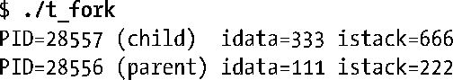
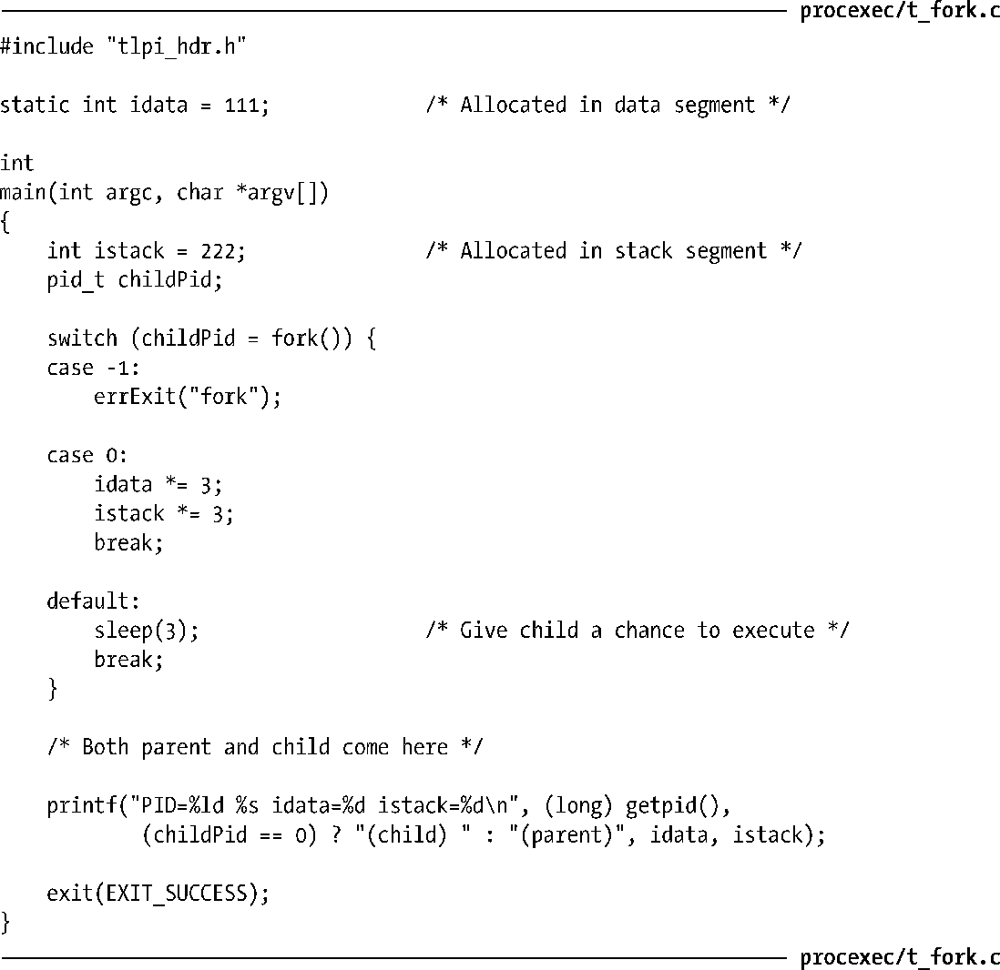

### 24.2　创建新进程：fork()

在诸多应用中，创建多个进程是任务分解时行之有效的方法。例如，某一网络服务器进程可在侦听客户端请求的同时，为处理每一请求而创建一新的子进程，与此同时，服务器进程会继续侦听更多的客户端连接请求。以此类手法分解任务，通常会简化应用程序的设计，同时提高了系统的并发性。（即，可同时处理更多的任务或请求。）

系统调用fork()创建一新进程（child），几近于对调用进程（parent）的翻版。

理解fork()的诀窍是，要意识到，完成对其调用后将存在两个进程，且每个进程都会从fork()的返回处继续执行。

这两个进程将执行相同的程序文本段，但却各自拥有不同的栈段、数据段以及堆段拷贝。子进程的栈、数据以及栈段开始时是对父进程内存相应各部分的完全复制。执行 fork()之后，每个进程均可修改各自的栈数据、以及堆段中的变量，而并不影响另一进程。

程序代码则可通过fork()的返回值来区分父、子进程。在父进程中，fork()将返回新创建子进程的进程ID。鉴于父进程可能需要创建，进而追踪多个子进程（通过wait()或类似方法），这种安排还是很实用的。而fork()在子进程中则返回0。如有必要，子进程可调用getpid()以获取自身的进程ID，调用getppid()以获取父进程ID。

当无法创建子进程时，fork()将返回-1。失败的原因可能在于，进程数量要么超出了系统针对此真实用户（real user ID）在进程数量上所施加的限制（RLIMIT_NPROC，36.3节将对此加以描述），要么是触及允许该系统创建的最大进程数这一系统级上限。

调用fork()时，有时会采用如下习惯用语：

调用fork()之后，系统将率先“垂青”于哪个进程（即调度其使用CPU），是无法确定的，意识到这一点极为重要。在设计拙劣的程序中，这种不确定性可能会导致所谓“竞争条件（race condition）”的错误，24.2节会对此做进一步说明。

程序清单24-1展示了fork()的用法。该程序创建一子进程，并对继承自fork()的全局及自动变量拷贝进行修改。

使用sleep()（存在于由父进程所执行的代码中），意在允许子进程先于父进程获得系统调度并使用CPU，以便在父进程继续运行之前完成自身任务并退出。要想确保这一结果，sleep()的这种用法并非万无一失，24.5节中的方法更胜一筹。

运行程序清单24-1中程序，其输出如下。

以上输出表明，子进程在fork()时拥有了自己的栈和数据段拷贝，且其对这些段中变量的修改将不会影响父进程。

程序清单24-1：调用fork()

