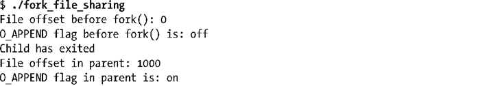
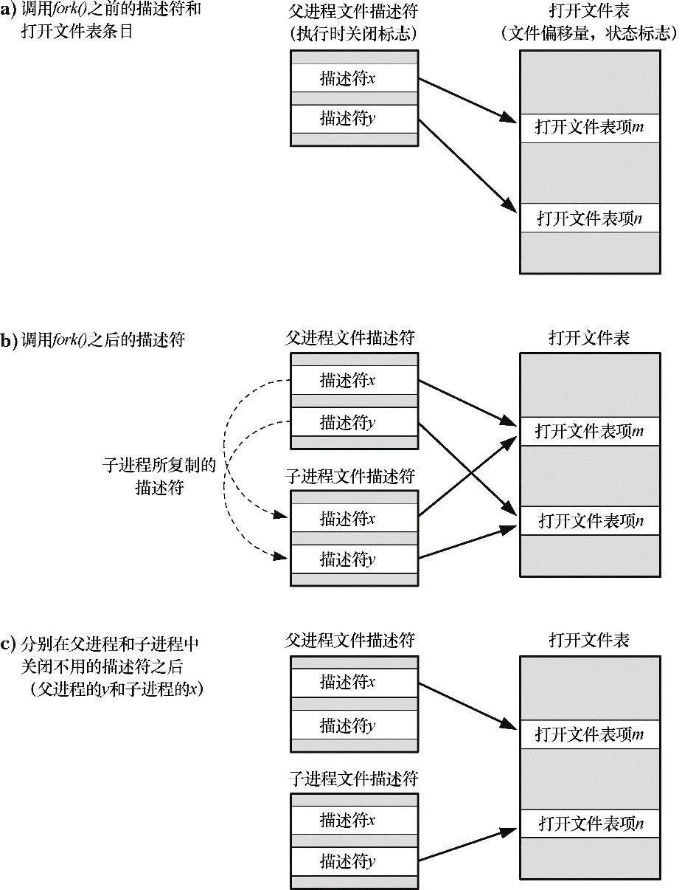

### 24.2.1　父、子进程间的文件共享

执行fork()时，子进程会获得父进程所有文件描述符的副本。这些副本的创建方式类似于dup()，这也意味着父、子进程中对应的描述符均指向相同的打开文件句柄（即 open file description，详见5.4节译注）。正如5.4节所述，打开文件句柄包含有当前文件偏移量（由read()、write()和lseek()修改）以及文件状态标志（由open()设置，通过fcntl()的F_SETFL操作改变）。一个打开文件的这些属性因之而在父子进程间实现了共享。举例来说，如果子进程更新了文件偏移量，那么这种改变也会影响到父进程中相应的描述符。

程序清单 24-2 所展示的正是这样一个事实；fork()之后，这些属性将在父子进程之间共享。该程序使用mkstemp()打开一个临时文件，接着调用fork()以创建子进程。子进程改变文件偏移量以及文件状态标志，最后退出。父进程随即获取文件偏移量和标志，以验证其可以观察到由子进程所造成的变化。此程序运行结果如下：

关于程序清单24-2为何要将lseek()的返回值强制转换为long long，参见5.10节。

程序清单24-2：在父子进程间共享文件偏移量和打开文件状态标志

父子进程间共享打开文件属性的妙用屡见不鲜。例如，假设父子进程同时写入一文件，共享文件偏移量会确保二者不会覆盖彼此的输出内容。不过，这并不能阻止父子进程的输出随意混杂在一起。要想规避这一现象，需要进行进程间同步。比如，父进程可以使用系统调用wait()来暂停运行并等待子进程退出。shell就是这么做的：只有当执行命令的子进程退出后，shell才会打印出提示符（除非用户在命令行最后加上&符以显式在后台运行命令）。

如果不需要这种对文件描述符的共享方式，那么在设计应用程序时，应于fork()调用后注意两点：其一，令父、子进程使用不同的文件描述符；其二，各自立即关闭不再使用的描述符（亦即那些经由其他进程使用的描述符）。如果进程之一执行了exec()，那么27.4节所描述的执行时关闭功能（close-on-exec）也会很有用处。图24-2展示了这些步骤。

<b class="my_markdown">图24-2：执行fork()期间对文件描述符的复制，以及关闭不再使用的描述符</b>

