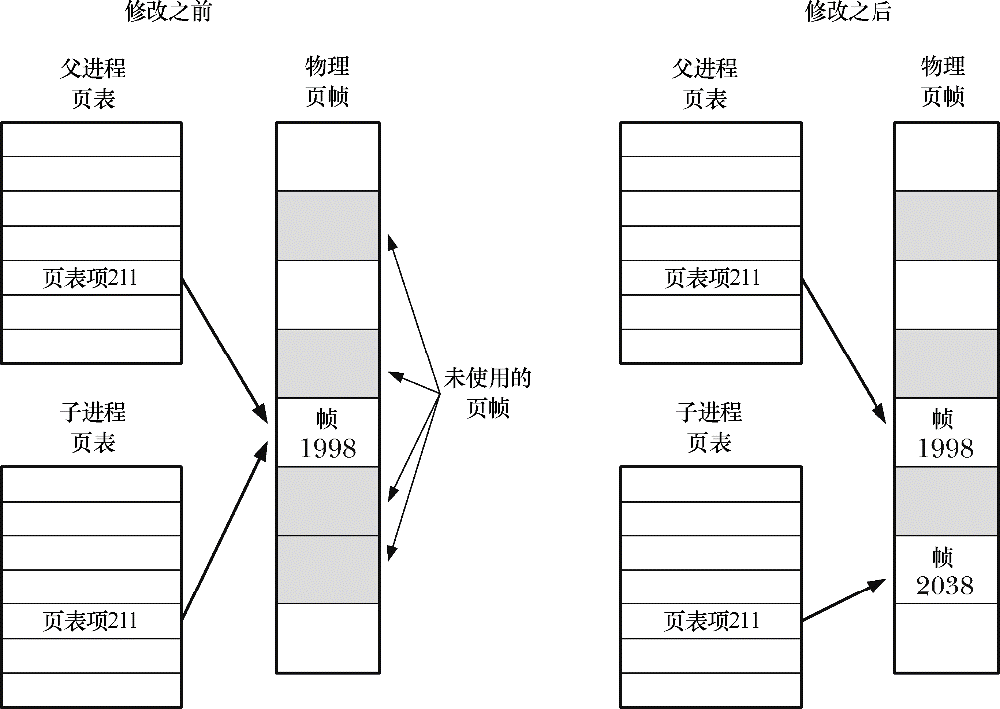
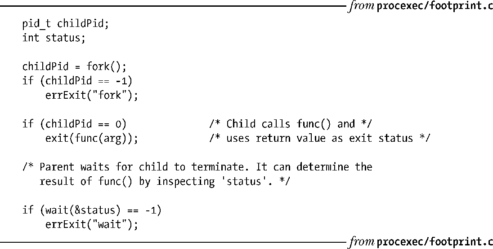

### 24.2.2　fork()的内存语义

从概念上说来，可以将fork()认作对父进程程序段、数据段、堆段以及栈段创建拷贝。的确，在一些早期的UNIX实现中，此类复制确实是原汁原味：将父进程内存拷贝至交换空间，以此创建新进程映像（image），而在父进程保持自身内存的同时，将换出映像置为子进程。不过，真要是简单地将父进程虚拟内存页拷贝到新的子进程，那就太浪费了。原因有很多，其中之一是：fork()之后常常伴随着 exec(), 这会用新程序替换进程的代码段，并重新初始化其数据段、堆段和栈段。大部分现代UNIX实现（包括Linux）采用两种技术来避免这种浪费。

+ 内核（Kernel）将每一进程的代码段标记为只读，从而使进程无法修改自身代码。这样，父、子进程可共享同一代码段。系统调用 fork()在为子进程创建代码段时，其所构建的一系列进程级页表项（page-table entries）均指向与父进程相同的物理内存页帧。
+ 对于父进程数据段、堆段和栈段中的各页，内核采用写时复制（copy-on-write）技术来处理。（[Bach, 1986]和[Bovert & Cersati, 2005]描述了写时复制的实现。）最初，内核做了一些设置，令这些段的页表项指向与父进程相同的物理内存页，并将这些页面自身标记为只读。调用 fork()之后，内核会捕获所有父进程或子进程针对这些页面的修改企图，并为将要修改的（about-to-be-modified）页面创建拷贝。系统将新的页面拷贝分配给遭内核捕获的进程，还会对子进程的相应页表项做适当调整。从这一刻起，父、子进程可以分别修改各自的页拷贝，不再相互影响。图24-3展示了写时复制技术。

<b class="my_markdown">图24-3：对一共享写时复制页进行修改前后的页表</b>

#### 控制进程的内存需求

通过将 fork()与 wait()组合使用，可以控制一个进程的内存需求。进程的内存需求量，亦即进程所使用的虚拟内存页范围，受到多种因素的影响，例如，调用函数，或从函数返回时栈的变化情况，对exec()的调用，以及因调用malloc()和free()而对堆所做的修改——这点对这里的讨论有着特殊意义。

假设以程序清单24-3所示方式调用fork()和wait()，且将对某函数func()的调用置于括号之中。由执行程序可知，由于所有可能的变化都发生于子进程，故而从对func()的调用之前开始，父进程的内存使用量将保持不变。这一用法的实用性则归于如下理由。

+ 若已知func()导致内存泄露，或是引发堆内存的过度碎片化，该技术则可以避免这些问题。（要是无法访问func()的源码，想要处理这些问题也就无从谈起。）
+ 假设某一算法在做树状分析（tree analysis）的同时需要进行内存分配（例如，游戏程序需要分析一系列可能的招法以及对方的应手）。本可以调用free()来释放所有已分配的内存，不过在某些情况下，使用此处所描述的技术会更为简单，返回（父进程），且调用者（父进程）的内存需求并无改变。

如程序清单24-3的实现所示，必须将func()的返回结果置于exit()的8位传出值中，父进程调用wait()可获得该值。不过，也可以利用文件、管道或其他一些进程间通信技术，使func()返回更大的结果集①。

程序清单24-3：调用函数而不改变进程的内存需求量

