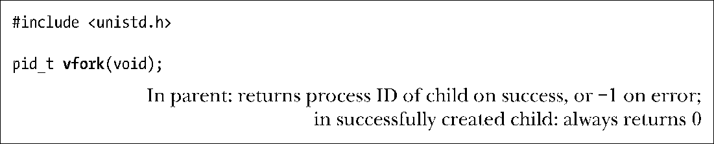
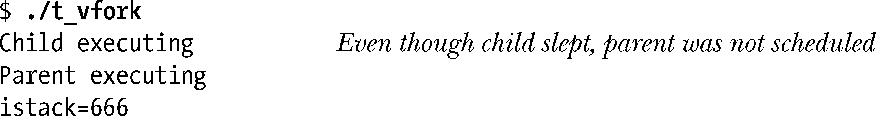
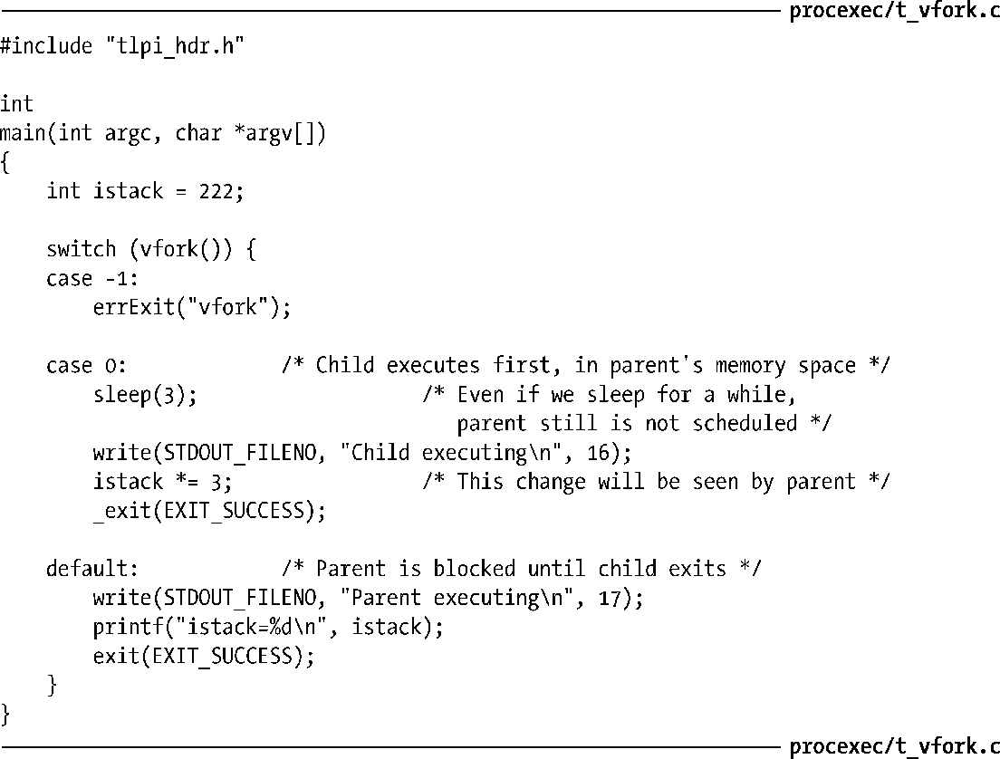

### 24.3　系统调用vfork()

在早期的BSD实现中，fork()会对父进程的数据段、堆和栈施行严格的复制。如前所述，这是一种浪费，尤其是在调用fork()后立即执行exec()的情况下。出于这一原因，BSD的后期版本引入了vfork()系统调用，尽管其运作含义稍微有些不同（实则有些怪异），但效率要远高于BSD fork()。现代UNIX采用写时复制技术来实现fork()，其效率较之于早期的fork()实现要高出许多，进而将对vfork()的需求剔除殆尽。虽然如此，Linux（如同许多其他的UNIX实现一样）还是提供了具有BSD语义的vfork()系统调用，以期为程序提供尽可能快的fork功能。不过，鉴于vfork()的怪异语义可能会导致一些难以察觉的程序缺陷（bug），除非能给性能带来重大提升（这种情况发生的概率极小），否则应当尽量避免使用这一调用。

类似于fork()，vfork()可以为调用进程创建一个新的子进程。然而，vfork()是为子进程立即执行exec()的程序而专门设计的。

vfork()因为如下两个特性而更具效率，这也是其与fork()的区别所在。

+ 无需为子进程复制虚拟内存页或页表。相反，子进程共享父进程的内存，直至其成功执行了 exec()或是调用_exit()退出。
+ 在子进程调用exec()或_exit()之前，将暂停执行父进程。

这两点还另有深意：由于子进程使用父进程的内存，因此子进程对数据段、堆或栈的任何改变将在父进程恢复执行时为其所见。此外，如果子进程在 vfork()与后续的 exec()或_exit()之间执行了函数返回，这同样会影响到父进程。这与 6.8 节所描述的例子（试图以longjmp()进入一个已经执行了返回的函数中）相类似。同样相似的还有这一乱局的收场——以典型的段错误（SIGSEGV）而告终。

在不影响父进程的前提下，子进程能在vfork()与exec()之间所做的操作屈指可数。其中包括对打开文件描述符进行操作（但不能施之于stdio 文件流）。因为系统是在内核空间为每个进程维护文件描述符表（5.4节），且在vfork()调用期间将复制该表，所以子进程对文件描述符的操作不会影响到父进程。

> SUSv3指出，在如下情况下程序行为未定义：a）修改了除用于存储vfork()返回值的pid_t型变量之外的任何数据；b）从调用 vfork()的函数中返回；c）在成功地调用_exit()或执行exec()之前，调用了任何其他函数。
> 28.2节在介绍系统调用clone()时将会提及，由fork()或vfork()创建的子进程还具有少量其他进程属性的自有拷贝。

vfork()的语义在于执行该调用后，系统将保证子进程先于父进程获得调度以使用CPU。24.2节曾经提及fork()是无法保证这一点的，父、子进程均有可能率先获得调度。

程序清单24-4展示了vfork()的用法，将其区分于fork()的两种语义特性显露无遗：子进程共享父进程的内存，父进程会一直挂起直至子进程终止或调用exec()。运行该程序，其输出结果如下：

由输出的最后一行可知，子进程对变量istack的修改影响了父进程的对应变量。

程序清单24-4：使用vfork()

除非速度绝对重要的场合，新程序应当舍vfork()而取fork()。原因在于，当使用写时复制语义实现fork()（大部分现代UNIX实现皆是如此）时，在速度几近于vfork()的同时，又避免了vfork()的上述怪异行止。（28.3节会给出fork()与vfork()在速度方面的某些比较。）

SUSv3将vfork()标记为已过时，SUSv4则进一步将其从规范中删除。对于vfork()运作的诸多细节，SUSv3颇有些语焉不详，因而可能将其实现为对fork()的调用。如此一来，那么vfork()的BSD语义将不复存在。一些UNIX系统还真就把vfork()实现为对fork()的调用，Linux系统在内核 2.0及其之前的版本中也是如此。

在使用时，一般应立即在vfork()之后调用exec()。如果exec()执行失败，子进程应调用_exit()退出。（vfork()产生的子进程不应调用exit()退出，因为这会导致对父进程stdio缓冲区的刷新和关闭。25.4节将会详述这一点。）

vfork()的其他用法，尤其当其依赖于内存共享以及进程调度方面的独特语义时，将可能破坏程序的可移植性，其中尤以将vfork()实现为简单调用fork()的情况为甚。

