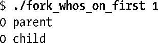
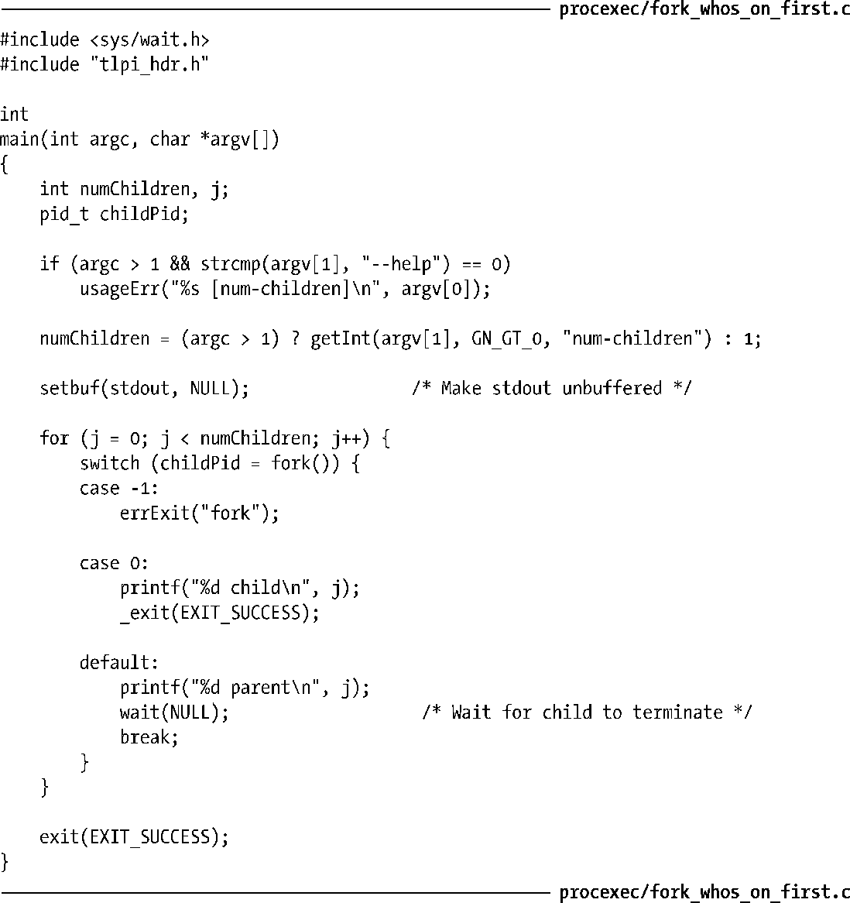

### 24.4　fork()之后的竞争条件（Race Condition）

调用 fork()后，无法确定父、子进程间谁将率先访问 CPU。（在多处理器系统中，它们可能会同时各自访问一个 CPU。）就应用程序而言，如果为了产生正确的结果而或明或暗（implicitly or explicitly）地依赖于特定的执行序列，那么将可能因竞争条件（5.1节曾论及）而导致失败。由于此类问题的发生取决于内核根据系统当时的负载而做出的调度决定，故而往往难以发现。

可以用程序清单 24-5 中程序来验证这种不确定性。该程序循环使用 fork()来创建多个子进程。在每个 fork()调用后，父、子进程都会打印一条信息，其中包含循环计数器值以及标识父/子进程身份的字符串。例如，如果要求程序只产生一个子进程，其结果可能如下：

可以使用该程序来生成大量子进程，并且分析其输出，观察父、子进程间每次到底由谁率先输出了结果。在某一Linux/x86-32 2.2.19系统上令此程序生成一百万个子进程，其分析结果表明，除去332次之外，都是由父进程先行输出结果（占总数的99.97%）。

> 对程序清单24-5运行结果进行分析的脚本为procexec/fork_whos_on_first.count.swk，在随本书发布的源代码中提供。

依据这一结果可以推测，在Linux 2.2.19中，fork()之后总是继续执行父进程。而子进程之所以在0.03%的情况中首先输出结果，是因为父进程在有机会输出消息之前，其CPU时间片（CPU time slice）就到期了。换言之，如果该程序所代表的情况总是依赖于如下假设，即fork()之后总是调度父进程，那么程序通常可以正常运行，不过每3000次将会出现一次错误。当然，如果希望父进程能在调度子进程前执行大量工作，那么出错的可能性将会大增。在一个复杂程序中调试这样的错误会很困难。

程序清单24-5：fork()之后，父、子进程竞争输出信息

虽然Linux 2.2.19总是在fork()之后继续运行父进程，但在其他UNIX实现上，甚至不同版本的Linux内核之间，却不能视其为理所当然。在内核稳定版2.4系列中，一度曾试验性地推出了一个“fork()之后由子进程先运行”的补丁，其调度结果与内核2.2.19完全相反。虽然这一改变之后又为2.4系列内核所舍弃，不过后来还是在Linux 2.6中采用，因此，程序假定于2.2.19内核的行为会在内核2.6中遭到推翻。

fork()之后对父、子进程的调度谁先谁后？其结果孰优孰劣？最近的一些实验又推翻了内核开发者关于这一问题的评估。从Linux 2.6.32开始，父进程再度成为fork()之后，默认情况下率先调度的对象。将Linux专有文件/proc/sys/kernel/sched_child_runs_first设为非0值可以改变该默认设置。

> 要了解支持“fork()之后先调度子进程”行为的理由，可考虑当fork()产生的子进程立即执行exec()时“写时复制”所发生的情况。此时，一方面父进程在fork()之后继续修改数据页和栈页，另一方面内核要为子进程复制那些“将要修改”的页。由于子进程一旦获得调度会立即执行exec()，故而这一页复制动作纯属浪费。基于这一论点，先调度子进程的决策更佳。如此一来，等到下次调度到父进程时，就无需复制内存页了。在一个繁忙的Linux/X86-32系统上（内核版本为2.6.30），利用程序清单24-5中程序创建一百万个子进程，结果表明子进程率先输出的情况占总数的99.98%。（这一百分比的精确值取决于诸如系统负载之类的因素。）在其他UNIX实现中测试该程序的结果则表明，对于由哪一进程在fork()之后率先获得调度的问题，各系统的处理规则差异巨大。
> Linux 2.6.32改回“fork()之后先调度父进程”，其论据则基于如下发现：fork()之后，父进程在CPU中正处于活跃状态，并且其内存管理信息也被置于硬件内存管理单元的转译后备缓冲器（TLB, translation look-aside buffer）中。所以，先运行父进程将提高性能。在非正式场合下，针对分别采取上述两种行为的内核构建版本进行了时间度量，其结果也证实了这一点。
> 总之，值得强调的是：两种行为间的性能差异很小，对于大部分应用程序并无影响。

上述讨论清楚地阐明，不应对fork()之后执行父、子进程的特定顺序做任何假设。若确需保证某一特定执行顺序，则必须采用某种同步技术。后续各章将会介绍多种同步技术，其中包括信号量（semaphore）、文件锁（file lock）以及进程间经由管道（pipe）的消息发送。接下来会描述另一种方法，那就是使用信号（signal）。

