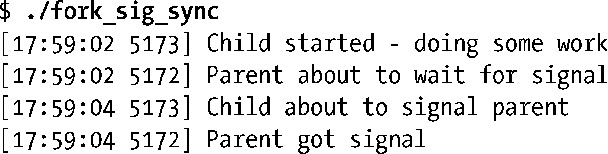
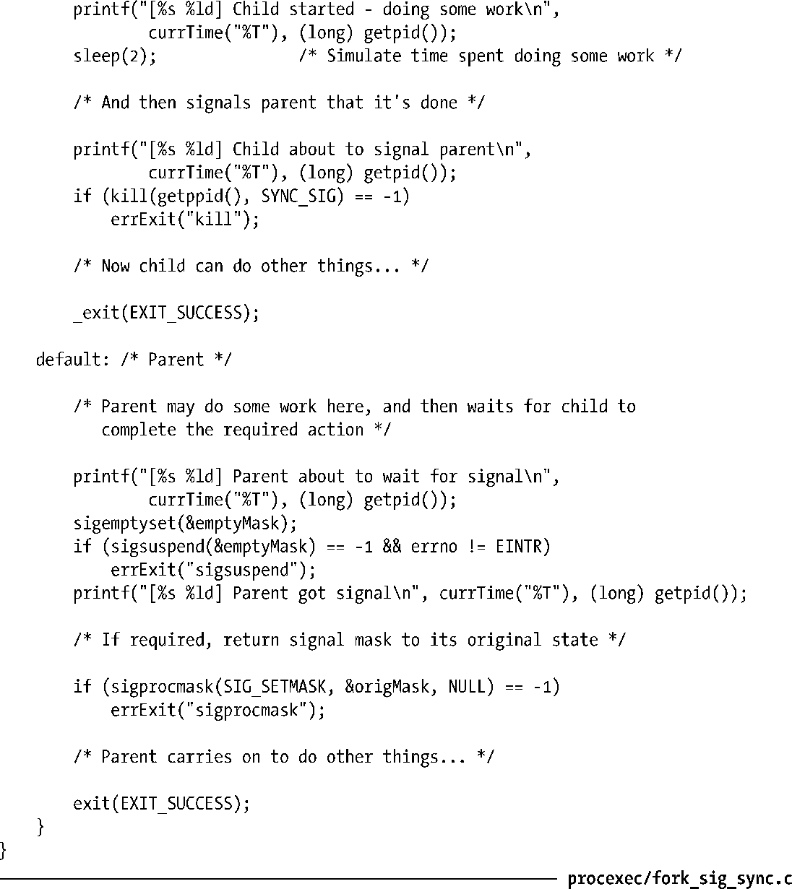

### 24.5　同步信号以规避竞争条件

调用fork()之后，如果进程某甲需等待进程某乙完成某一动作，那么某乙（即活动进程）可在动作完成后向某甲发送信号；某甲则等待即可。

程序清单24-6演示了这一技术。该程序假设父进程必须等待子进程完成某些动作。如果是子进程反过来要等待父进程，那么将父、子进程中与信号相关的调用对掉即可。父、子进程甚至可能多次互发信号以协调彼此行为，尽管实际上更有可能采用信号量、文件锁或消息传递等技术来进行此类协调。

> [Stevens & Rago, 2005] 建议将此类同步方法（阻塞信号，发送信号，捕获信号）封装为一组标准的进程同步函数。这一做法的优点在于，如果有意，后续可以其他进程间通信（IPC）机制替换信号的使用。

需要注意：程序清单24-6在fork()之前就阻塞了同步信号（SIGUSR1）。若父进程试图在fork()之后阻塞该信号，则避之唯恐不及的竞争条件恐怕将不期而遇。（此程序假设与子进程的信号掩码状态无关；如有必要，可以在fork()之后的子进程中解除对SIGUSR1的阻塞。）

如下shell会话日志（log）则展示了程序清单24-6的运行情况：

程序清单24-6：利用信号来同步进程间动作

