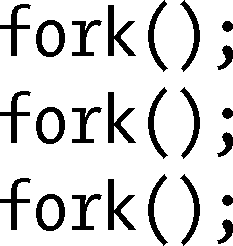

### 24.7　练习

**24-1.** 　程序在执行完如下一系列fork()调用后会产生多少新进程（假定没有调用失败）？

**24-2.** 　编写一个程序以便验证调用vfork()之后，子进程可以关闭一文件描述符（例如：描述符0）而不影响对应父进程中的文件描述符。

**24-3.** 　假设可以修改程序源代码，如何在某一特定时刻生成一核心转储（core dump）文件，而同时进程得以继续执行？

**24-4.** 　在其他UNIX实现上实验程序清单24-5（fork_whos_on_first.c）中的程序，并判断在执行fork()后这些系统是如何调度父子进程的。

**24-5.** 　假定在程序清单24-6的程序中，子进程也需要等待父进程完成某些操作。为确保达成这一目的，应如何修改程序？

①译者注：针对游戏程序的分析结果而言。

