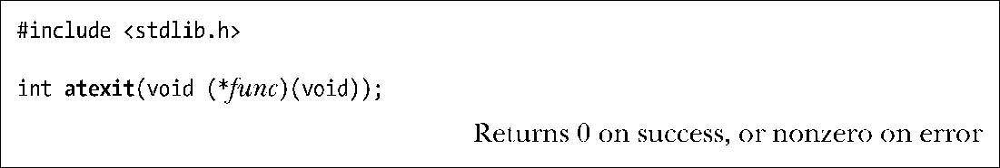
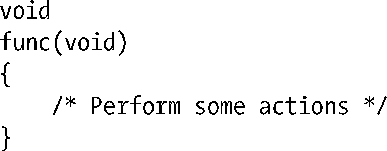
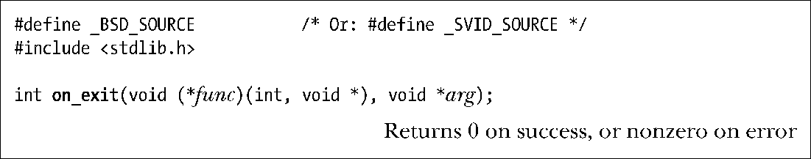
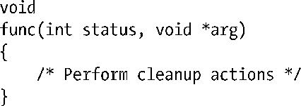
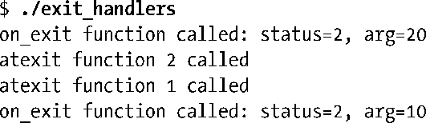
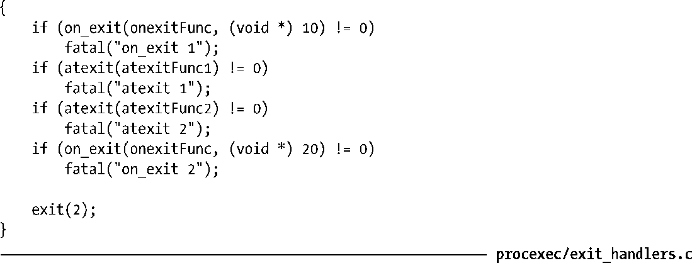

### 25.3　退出处理程序

有时，应用程序需要在进程终止时自动执行一些操作。试以一个应用程序库为例，如果进程使用了该程序库，那么在进程终止前该库需要自动执行一些清理动作。因为库本身对于进程何时以及如何退出并无控制权，也无法要求主程序在退出前调用库中特定的清理函数，故而也不能保证一定会执行清理动作。解决这一问题的方法之一是使用退出处理程序（exit handler）。老版 System V 手册则使用术语“程序终止过程”（program termination routine）。

退出处理程序是一个由程序设计者提供的函数，可于进程生命周期的任意时点注册，并在该进程调用exit()正常终止时自动执行。如果程序直接调用_exit()或因信号而异常终止，则不会调用退出处理程序。

> 当进程收到信号而终止时，将不会调用退出处理程序。这一事实一定程度上限制了它们的效用。此时最佳的应对方式莫若为可能发送给进程的信号建立信号处理程序，并于其中设置标志位，令主程序据此来调用 exit()。因为 exit()不属于表 21-1 所列的异步信号安全（async- signal-safe）函数，所以通常不能在信号处理程序中对其发起调用。即便如此，还是无法处理SIGKILL信号，因为无法改变SIGKILL的默认行为。这也是应该避免使用SIGKILL来终止进程的另一原因（如20.2节所述）。建议使用信号SIGTERM，这也是kill命令默认发送的信号。

#### 注册退出处理程序

GNU C语言函数库提供两种方式来注册退出处理程序。第一种方法是使用由SUSv3定义的atexit()函数。

函数atexit()将func加到一个函数列表中，进程终止时会调用该函数列表的所有函数。应将函数func定义为不接受任何参数，也无返回值，一般格式如下：

注意atexit()在出错时返回非0值（不一定是-1）。

可以注册多个退出处理程序（甚至可以将同一函数注册多次）。当应用程序调用 exit()时，这些函数的执行顺序与注册顺序相反。这一设计很符合逻辑，因为，一般情况下较早注册的函数所执行的是更为基本的清理动作，可能需要在调用后续注册的函数后再执行。

本质上，可以在退出处理程序中执行任何希望的动作，包括注册附加的退出处理程序，并将其置于留待调用的剩余函数列表的头部。不过，一旦有任一退出处理程序无法返回——无论因为调用了_exit()还是进程因收到信号而终止（例如，退出处理程序调用函数raise()），那么就不会再调用剩余的处理程序。此外，调用exit()时通常需要执行的剩余动作也将不再执行。

> SUSv3规定，若退出处理程序自身调用exit()，其结果未定义。在Linux上，会照常调用剩余的退出处理程序。不过，在某些系统上，这将导致对所有退出处理程序的再次调用，并引发无限循环调用（直至栈溢出将该进程杀死）。为保障可移植性，应用程序应避免在退出处理程序内部调用exit()。

SUSv3要求系统实现应允许一个进程能够注册至少32个退出处理程序。使用系统调用sysconf(_SC_ATEXIT_MAX)，应用程序即可确定由实现所定义的可注册退出处理程序的数量上限。（但是，并无方法获知有多少已注册的处理程序。）通过运用动态分配链表将已注册的处理程序串接起来，glibc允许注册的退出处理程序数量近乎于无限。对于Linux，sysonf(_SC_ATEXIT_MAX)返回 2147482647（即，32 位有符号整型数的最大值）。换言之，在触及可注册函数数量的这一上限前，总会有其他原因（例如，内存不足）导致程序崩溃。

通过fork()创建的子进程会继承父进程注册的退出处理函数。而进程调用exec()时，会移除所有已注册的退出处理程序。（这是结果势所必然，因为exec()会替换包括退出处理程序在内的所有原程序代码段。）

> 无法取消经由atexit()或on_exit()（见稍后的描述）注册的退出处理程序。不过，可以令退出处理程序在执行动作之前检查全局执行标志是否置位，或者清除该标志来屏蔽退出处理程序。

经由atexit()注册的退出处理程序会受到两种限制。其一，退出处理程序在执行时无法获知传递给exit()的状态。有时候，知道状态是必要的；例如，退出处理程序会视进程退出成功与否而执行不同的动作。其二，无法给退出处理程序指定参数。如果拥有这一特性，退出处理程序能根据传入参数的不同而执行不同动作，或使用不同参数多次注册同一个函数。

为摆脱这些限制，glibc提供了一个（非标准的）替代方法：on_exit()。

函数on_exit()的参数func是一个指针，指向如下类型的函数:

调用时，会传递两个参数给func()：提供给exit()的 status 参数和注册时供给 on_exit()的一份 arg 参数拷贝。虽然定义为指针类型，参数 arg 的意义仍然可由设计者支配。可将其用作指向结构的指针，同样，通过审慎地强制转换，也可将其作为整型或其他标量类型使用。

类似于atexit()，on_exit()出错时返回非0值（不一定是-1）。

如同atexit()一样，通过on_exit()可以注册多个退出处理程序。使用atexit()和on_exit()注册的函数位于同一函数列表。如果在程序中同时用到了这两种方式，则会按照使用这两个方法注册的相反顺序来执行相应的退出处理程序。

虽然比atexit()更灵活，但对于要保障可移植性的程序来说，还是应避免使用on_exit()。因为并无标准涵盖到它，并且几乎也没有其他UNIX实现支持这一用法。

#### 程序范例

程序清单25-1展示了如何利用atexit()和on_exit()注册退出处理程序的例子。运行程序会得到如下输出结果：

程序清单25-1：使用退出处理程序

