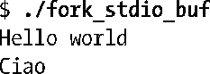
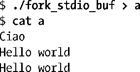
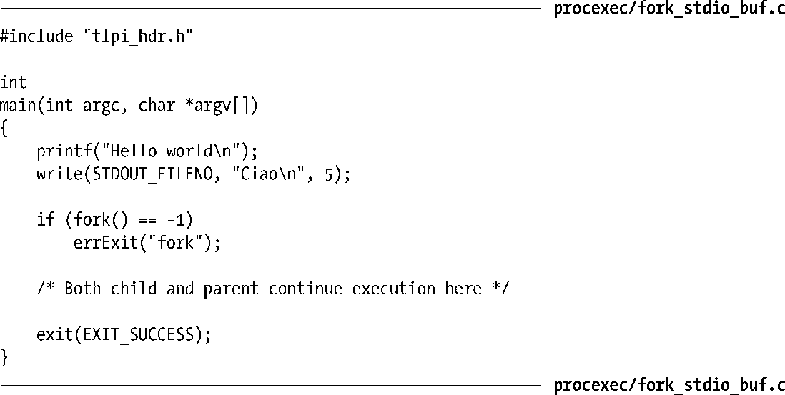

### 25.4　fork()、stdio缓冲区以及_exit()之间的交互

程序清单25-2生成的输出结果乍看颇令人费解。当程序标准输出定向到终端时，会看到预期的结果：

不过，当重定向标准输出到一个文件时，结果如下：

以上输出中有两件怪事：printf()的输出行出现了两次，且write()的输出先于printf()。

程序清单25-2：fork()与stdio缓冲区的交互

要理解为什么printf()的输出消息出现了两次，首先要记住，是在进程的用户空间内存中（参考 13.2节）维护 stdio 缓冲区的。因此，通过fork()创建子进程时会复制这些缓冲区。当标准输出定向到终端时，因为缺省为行缓冲，所以会立即显示函数printf()输出的包含换行符的字符串。不过，当标准输出重定向到文件时，由于缺省为块缓冲，所以在本例中，当调用 fork()时，printf()输出的字符串仍在父进程的 stdio 缓冲区中，并随子进程的创建而产生一份副本。父、子进程调用exit()时会刷新各自的 stdio 缓冲区，从而导致重复的输出结果。

可以采用以下任一方法来避免重复的输出结果。

+ 作为针对 stdio 缓冲区问题的特定解决方案，可以在调用 fork()之前使用函数 fflush()来刷新stdio缓冲区。作为另一种选择，也可以使用setvbuf()和setbuf()来关闭stdio流的缓冲功能。
+ 子进程可以调用_exit()而非 exit()，以便不再刷新stdio缓冲区。这一技术例证了一个更为通用的原则：在创建子进程的应用中，典型情况下仅有一个进程（一般为父进程）应通过调用 exit()终止，而其他进程应调用_exit()终止，从而确保只有一个进程调用退出处理程序并刷新stdio缓冲区，这也算是众望所归吧。

> 还存在其他方法，可以（有时很有必要）允许父子进程都调用exit()。例如，可以设计这样的退出处理程序，即使是从多个进程中调用，它们也能够正确地处理，或者令应用程序仅在调用fork()之后才去安装退出处理程序。此外，有时可能确实希望所有的应用程序都在fork()之后刷新 stdio 缓冲区。这时，可以见机行事，要么选择使用 exit()来终止进程，要么在每个进程中均显式调用fflush()。

程序清单25-2中write()的输出并未出现两次，这是因为write()会将数据直接传给内核缓冲区，fork()不会复制这一缓冲区。

程序输出重定向到文件时出的第二件怪事，原因现在也清楚了。write()的输出结果先于printf()而出现，是因为write()会将数据立即传给内核高速缓存，而printf()的输出则需要等到调用exit ()刷新stdio缓冲区时。（如13.7节所述，通常，在混合使用stdio函数和系统调用对同一文件进行I/O处理时，需要特别谨慎。）

