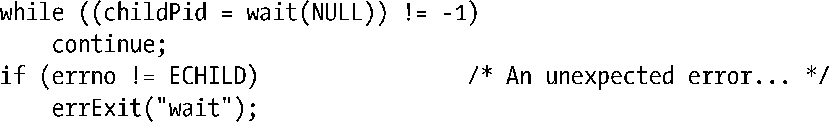
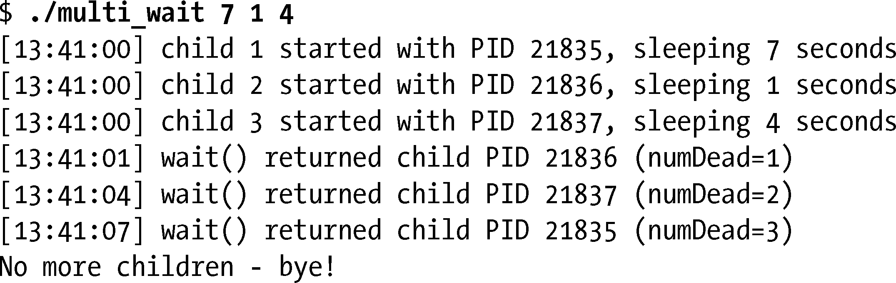
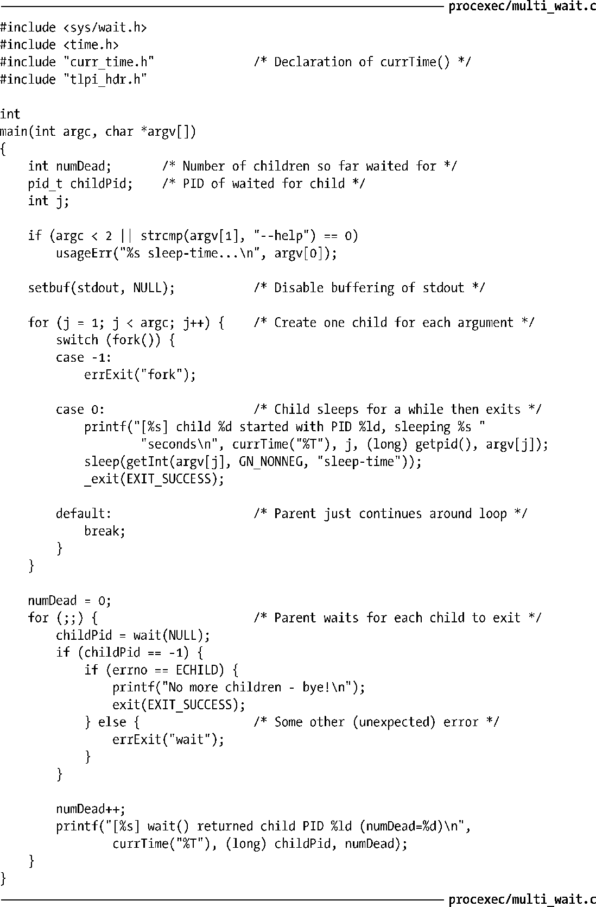

### 26.1.1　系统调用wait()

系统调用wait()等待调用进程的任一子进程终止，同时在参数status所指向的缓冲区中返回该子进程的终止状态。

系统调用wait()执行如下动作。

**1．** 如果调用进程并无之前未被等待的子进程终止①，调用将一直阻塞，直至某个子进程终止。如果调用时已有子进程终止，wait()则立即返回。

**2．** 如果status非空，那么关于子进程如何终止的信息则会通过status指向的整型变量返回。26.1.3节将讨论自status返回的信息。

**3．** 内核将会为父进程下所有子进程的运行总量追加进程CPU时间（10.7节）以及资源使用数据。

**4．** 将终止子进程的ID作为wait()的结果返回。

出错时，wait()返回-1。可能的错误原因之一是调用进程并无之前未被等待的②子进程，此时会将errno置为ECHILD。换言之，可使用如下代码中的循环来等待调用进程的所有子进程退出。

程序清单26-1演示了wait()的用法。该程序创建多个子进程，每个子进程对应于一个（整型）命令行参数。每个子进程休眠若干秒后退出，休眠时间分别由相应各命令行参数指定。与此同时，在创建所有的子进程之后，父进程循环调用wait()来监控这些子进程的终止。而直到wait()返回-1时才会退出循环。（这并非唯一的手段，另一种退出循环的方法是当记录终止子进程数量的变量numDead与创建的子进程数目相同时，也会退出循环。）以下shell会话日志显示了使用该程序创建3个子进程时的情况。

> 如果于同一时点存在多个子进程退出，SUSv3 并未对 wait()处理这些子进程的顺序加以规定，换言之，该顺序取决于具体实现。即使不同的Linux内核版本之间，行为也有所不同。

程序清单26-1：创建并等待多个子进程

