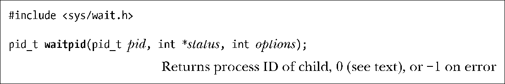

### 26.1.2　系统调用waitpid()

系统调用wait()存在诸多限制，而设计waitpid()则意在突破这些限制。

+ 如果父进程已经创建了多个子进程，使用 wait()将无法等待某个特定子进程的完成，只能按顺序等待下一个子进程的终止。
+ 如果没有子进程退出，wait()总是保持阻塞。有时候会希望执行非阻塞的等待：是否有子进程退出，立判可知。
+ 使用wait()只能发现那些已经终止的子进程。对于子进程因某个信号（如SIGSTOP或SIG TTIN）而停止，或是已停止子进程收到SIGCONT信号后恢复执行的情况就无能为力了。

waitpid()与 wait()的返回值以及参数 status 的意义相同。（对 status 中返回值的解释请参考26.1.3节。）参数pid用来表示需要等待的具体子进程，意义如下：

+ 如果pid大于0，表示等待进程ID为pid的子进程。
+ 如果pid等于0，则等待与调用进程（父进程）同一个进程组（process group）的所有子进程。34.2节将描述进程组的概念。
+ 如果pid小于-1，则会等待进程组标识符与pid绝对值相等的所有子进程。
+ 如果pid等于-1，则等待任意子进程。wait(&status)的调用与waitpid(-1, &status, 0)等价。

参数options是一个位掩码（bit mask），可以包含（按位或操作）0个或多个如下标志（均在SUSv3中加以规范）。

##### WUNTRACED

除了返回终止子进程的信息外，还返回因信号而停止的子进程信息。

##### WCONTINUED (自Linux2.6.10以来)

返回那些因收到SIGCONT信号而恢复执行的已停止子进程的状态信息。

##### WNOHANG

如果参数pid所指定的子进程并未发生状态改变，则立即返回，而不会阻塞，亦即poll（轮询）。在这种情况下，waitpid()返回0。如果调用进程并无与pid匹配的子进程，则waitpid()报错，将错误号置为ECHILD。

程序清单26-3演示了waitpid()的使用。

> SUSv3 在其对 waitpid()的原理阐述中特别指出，WUNTRACED 的名称是源于 BSD的历史产物。BSD 有两种停止进程的方法：作为系统调用ptrace()追踪的结果，或者因收到一个信号而停止。当通过 ptrace()追踪一个子进程时，那么（除 SIGKILL 之外的）任何信号都会造成子进程停止，接着会将信号 SIGCHLD 发给父进程。即使子进程忽略这些信号，这一行为仍会发生。不过，如果子进程阻塞了这些信号（除非是无法阻塞的SIGSTOP信号），子进程就不会停止。

