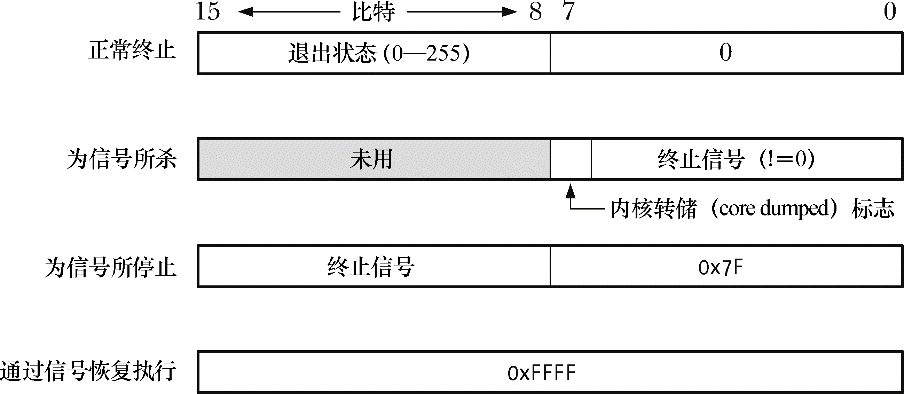
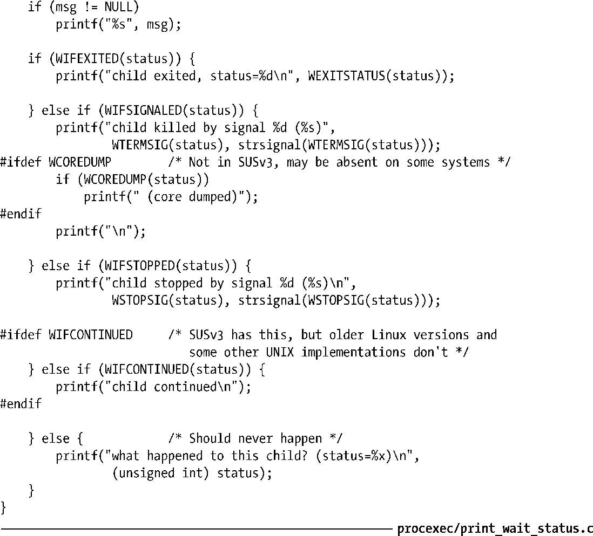
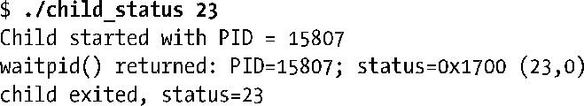
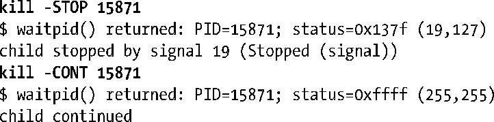
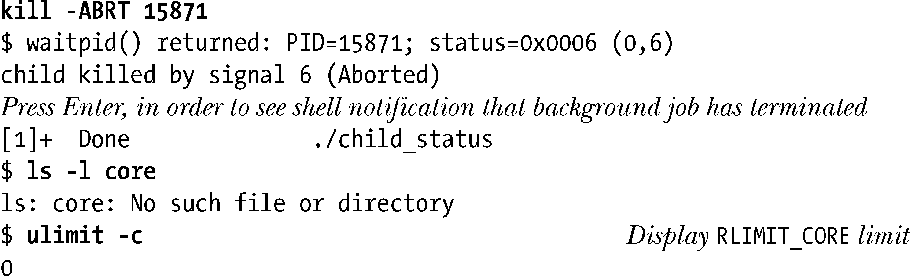
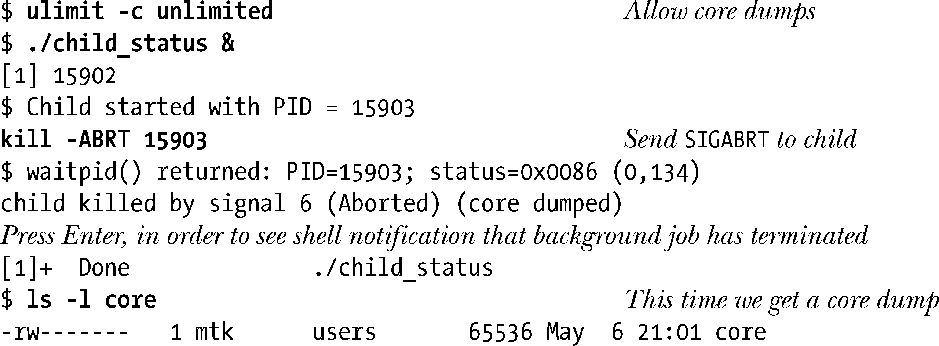
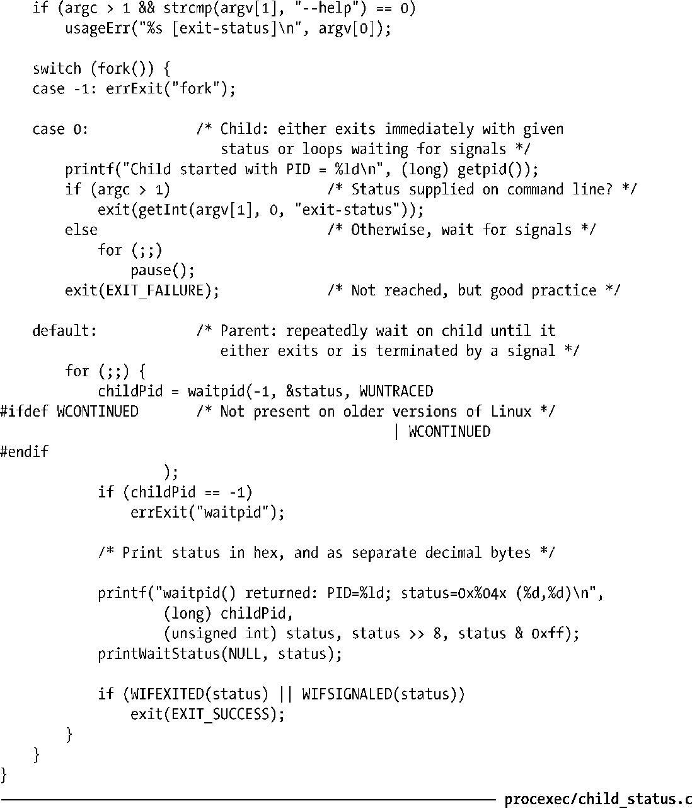

### 26.1.3　等待状态值

由wait()和waitpid()返回的status的值，可用来区分以下子进程事件。

+ 子进程调用_exit()（或exit()）而终止，并指定一个整型值作为退出状态。
+ 子进程收到未处理信号而终止。
+ 子进程因为信号而停止，并以WUNTRACED标志调用waitpid()。
+ 子进程因收到信号SIGCONT而恢复，并以WCONTINUED标志调用waitpid()。

此处用术语“等待状态”（wait status）来涵盖上述所有情况，而使用“终止状态”（termination status）的称谓来指代前两种情况。（在shell中，可通过读取$?变量值来获取上次执行命令的终止状态。）

虽然将变量status定义为整型（int），但实际上仅使用了其最低的2个字节。对这2个字节的填充方式取决于子进程所发生的具体事件，如图26-1所示。

<b class="my_markdown">图26-1：自wait()和waitpid()的status参数所返回的值</b>

> 图26-1所示为Linux/x86-32下等待状态值的格式。不同的实现版本细节会有所不同。SUSv3并未对信息格式做出具体规定，也未规定只能使用status变量的最低2个字节。要保证应用程序的可移植性，应总是使用本节介绍的宏（macro）来获取相应的值，而不应直接按位读取其内容。

头文件<sys/wait.h>定义了用于解析等待状态值的一组标准宏。对自 wait()或 waitpid()返回的status值进行处理时，以下列表中各宏只有一个会返回真（true）值。如列表所示，另有其他宏可对 status 值做进一步分析。

##### WIFEXITED (status)

若子进程正常结束则返回真（true）。此时，宏WEXITSTATUS(status)返回子进程的退出状态。（如25.1节所述，父进程仅关注子进程退出状态的最低8位。）

##### WIFSIGNALED (status)

若通过信号杀掉子进程则返回真（true）。此时，宏WTERMSIG(status)返回导致子进程终止的信号编号。若子进程产生内核转储文件，则宏WCOREDUMP(status)返回真值（true）。SUSv3并未规范宏WCOREDUMP()，不过大部分UNIX实现均支持该宏。

##### WIFSTOPPED (status)

若子进程因信号而停止，则此宏返回为真值（true）。此时，宏WSTOPSIG(status)返回导致子进程停止的信号编号。

##### WIFCONTINUED (status)

若子进程收到SIGCONT而恢复执行，则此宏返回真值（true)。自Linux 2.6.10之后开始支持该宏。

注意：尽管上述宏的参数也以status命名，不过此处所指只是简单的整型变量，而非像wait()和waitpid()所要求的那样是指向整型的指针。

#### 示例程序

程序清单 26-2 中的函数 printWaitStatus()使用了上述所有宏。此函数分析并输出了等待状态值的内容。

程序清单26-2：输出wait()及相关调用返回的状态值

程序清单26-3使用了printWaitStatus()函数。该程序创建了一个子进程，该子进程会循环调用pause()（在此期间可以向子进程发送信号），但如果在命令行中指定了整型参数，则子进程会立即退出，并以该整型值作为退出状态。同时，父进程通过waitpid()监控子进程，打印子进程返回的状态值并将其作为参数传递给printWaitStatus()。一旦发现子进程已正常退出，亦或因某一信号而终止，父进程会随即退出。

如下shell会话展示了执行程序清单26-3程序的几个例子。首先，创建一子进程并立即退出，且其状态值为23：

接下来，在后台运行该程序，并向子进程发送SIGSTOP和SIGCONT信号。

输出的最后两行只会在Linux 2.6.10及其之后的内核版本中出现，因为早期内核并不支持waitpid()的WCONTINUED选项。（由于后台运行程序的输出有时会与shell提示符混在一起，故而该shell会话稍微有些难以阅读。）

接着，再发送SIGABRT信号来终止子进程：

虽然 SIGABRT 的默认行为是产生一个内核转储文件并终止进程，但这里并未产生转储文件。这是由于屏蔽内核转储所致，如以上命令ulimit的输出所示，将RLIMIT_CORE资源软限制（见36.3节）置为0，该限制规定了转储文件大小的最大值。

再次重复同一实验，不过这次在发送信号SIGABRT给子进程之前，放开了对转储文件大小的限制。

程序清单26-3：使用waitpid()获取子进程状态

