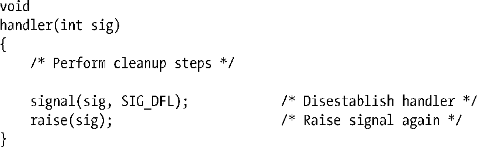

### 26.1.4　从信号处理程序中终止进程

如表20-1所列，默认情况下某些信号会终止进程。有时，可能希望在进程终止之前执行一些清理步骤。为此，可以设置一个处理程序（handler）来捕获这些信号，随即执行清理步骤，再终止进程。如果这么做，需要牢记的是：通过wait()和waitpid()调用，父进程依然可以获取子进程的终止状态。例如，如果在信号处理程序中调用_exit(EXIT_SUCCESS)，父进程会认为子进程是正常终止。

如果需要通知父进程自己因某个信号而终止，那么子进程的信号处理程序应首先将自己废除，然后再次发出相同信号，该信号这次将终止这一子进程。信号处理程序需包含如下代码：

