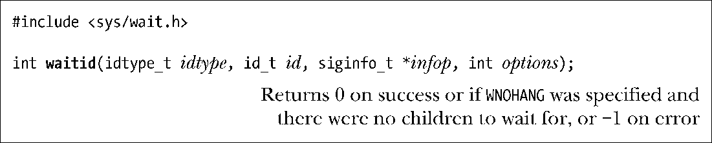
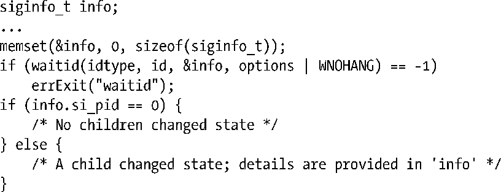

### 26.1.5　系统调用waitid()

与 waitpid()类似，waitid()返回子进程的状态。不过，waitid()提供了 waitpid()所没有的扩展功能。该系统调用源于系统V（System V），不过现在已获SUSv3采用，并从版本2.6.9开始，将其加入Linux内核。

> 在 Linux 2.6.9 之前，通过 glibc 实现提供了一版 waitid()。然而，由于完全实现该接口需要内核的支持，因此glibc版实现并未提供比waitpid()更多的功能。

参数idtype和id指定需要等待哪些子进程，如下所示。

+ 如果idtype为P_ALL，则等待任何子进程，同时忽略id值。
+ 如果idtype为P_PID，则等待进程ID为id进程的子进程。
+ 如果idtype为P_PGID，则等待进程组ID为id各进程的所有子进程。

> 请注意，与 waitpid()不同，不能靠指定id为0来表示与调用者属于同一进程组的所有进程。相反，必须以getpgrp()的返回值来显式指定调用者的进程组ID。

waitpid()与 waitid()最显著的区别在于，对于应该等待的子进程事件，waitid()可以更为精确地控制。可通过在options中指定一个或多个如下标识（按位或运算）来实现这种控制。

##### WEXITED

等待已终止的子进程，而无论其是否正常返回。

##### WSTOPPED

等待已通过信号而停止的子进程。

##### WCONTINUED

等待经由信号SIGCONT而恢复的子进程。

以下附加标识也可以通过按位或运算加入options中。

##### WNOHANG

与其在waitpid()中的意义相同。如果匹配id值的子进程中并无状态信息需要返回，则立即返回（一个轮询）。此时，waitid()返回 0。如果调用进程并无子进程与 id 的值相匹配，则waitid调用失败，且错误号为ECHILD。

##### WNOWAIT

通常，一旦通过waitid()来等待子进程，那么必然会去处理所谓“状态事件”。不过，如果指定了WNOWAIT，则会返回子进程状态，但子进程依然处于可等待的（waitable）状态，稍后可再次等待并获取相同信息。

执行成功，waitid()返回0，且会更新指针infop所指向的siginfo_t结构，以包含子进程的相关信息。以下是结构siginfo_t的字段情况。

##### 
  si_code

该字段包含以下值之一：CLD_EXITED，表示子进程已通过调用_exit()而终止；CLD_KILLED，表示子进程为某个信号所杀；CLD_STOPPED，表示子进程因某个信号而停止；CLD_CONTINUED，表示（之前停止的）子进程因接收到（SIGCONT）信号而恢复执行。

##### 
  si_pid

该字段包含状态发生变化子进程的进程ID。

##### 
  si_signo

总是将该字段置为SIGCHLD。

##### 
  si_status

该字段要么包含传递给_exit()的子进程退出状态，要么包含导致子进程停止、继续或终止的信号值。可以通过读取si_code值来判定具体包含的是哪一种类型的信息。

##### 
  si_uid

该字段包含子进程的真正用户ID。大部分其他UNIX实现不会设置该字段。

> 在 Solaris 系统中，此结构还包含两个附加字段：si_stime和si_utime，分别包含子进程使用的系统和用户CPU时间。SUSv3并不要求waitid()处理这两个字段。

waitid()操作的一处细节需要进一步澄清。如果在options中指定了WNOHANG，那么waitid()返回0意味着以下两种情况之一：在调用时子进程的状态已经改变（关于子进程的相关信息保存在infop指针所指向的结构 siginfo_t中），或者没有任何子进程的状态有所改变。对于没有任何子进程改变状态的情况，一些UNIX实现（包括Linux）会将siginfo_t结构内容清0。这也是区分两种情况的方法之一：检查si_pid的值是否为0。不幸的是，SUSv3并未规范这一行为，一些UNIX实现此时会保持结构siginfo_t原封不动。（未来针对SUSv4的勘误表可能会增加在这种情况下将si_pid和si_signo置0的要求。）区分这两种情况唯一可移植的方法是：在调用waitid()之前就将结构siginfo_t的内容置为0，正如以下代码所示：

