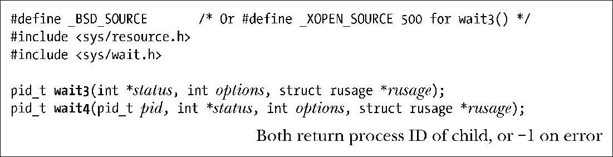

### 26.1.6　系统调用wait3()和wait4()

系统调用wait3()和wait4()执行与waitpid()类似的工作。主要的语义差别在于，wait3()和wait4()在参数rusage所指向的结构中返回终止子进程的资源使用情况。其中包括进程使用的CPU时间总量以及内存管理的统计数据。36.1节将在介绍系统调用getrusage()时详细讨论rusage结构。

除了对参数rusage的使用之外，调用wait3()等同于以如下方式调用waitpid()：

与之相类似，对wait4()的调用等同于对waitpid()的如下调用：

换言之，wait3()等待的是任意子进程，而wait4()则可以用于等待选定的一个或多个子进程。

在一些UNIX实现中，wait3()和wait4()仅返回已终止子进程的资源使用情况。而对于Linux系统，如果在options中指定了WUNTRACED选项，则还可以获取到停止子进程的资源使用信息。

这两个系统调用的名称来自于它们所使用参数的个数。虽然源自BSD系统，不过现在大部分的 UNIX 实现都支持它们。这两个系统调用均未获得 SUSv3 标准的接纳。（SUSv2 标准纳入了wait3()，但将其标记为“已过时”。）

本书一般会避免使用wait3()和wait4()。通常情况下，此类调用所返回的额外信息没有什么价值。此外，未获业界标准的接纳也会限制其可移植性。

